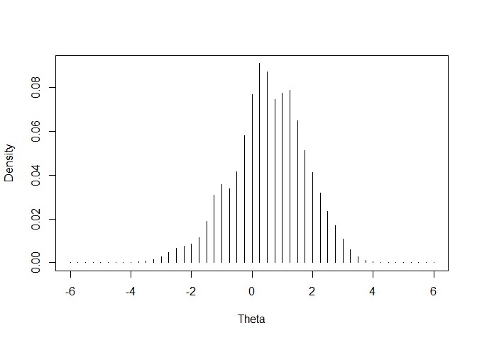
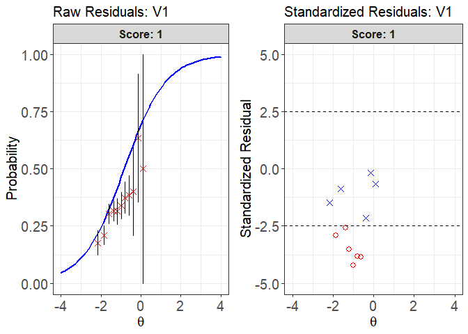
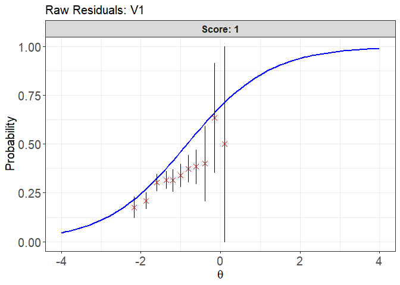
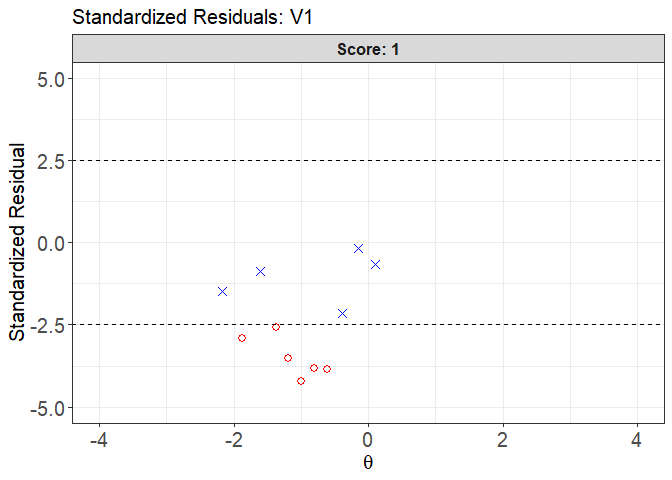
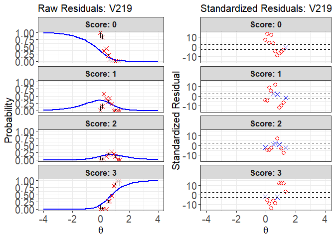
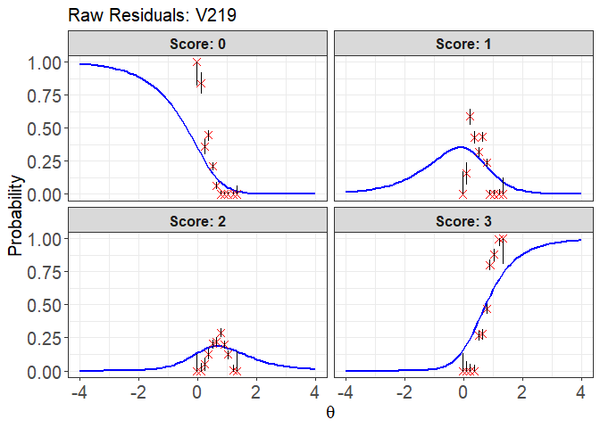
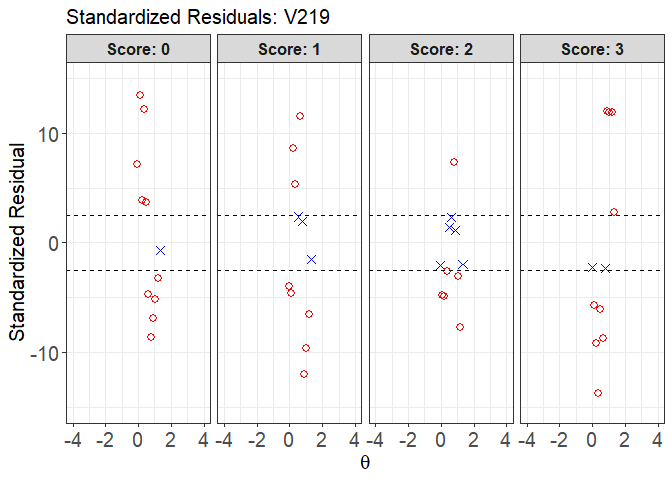

<!-- README.md is generated from README.Rmd. Please edit that file -->

# irtQ 

<!-- badges: start -->

[](https://CRAN.R-project.org/package=irtQ)
<!-- badges: end -->

The goal of `irtQ` is to fit unidimensional item response theory (IRT)
models to data that may include both dichotomous and polytomous items.
The package enables:

- Typical item parameters estimation
- Pretest item calibration
- Multiple-group item calibration
- Estimation of examinees' latent abilities
- Evaluation of model-data fit at the item level

Item parameter estimation is conducted using marginal maximum likelihood
estimation via the expectation-maximization (MMLE-EM) algorithm (Bock &
Aitkin, 1981).\
For pretest item calibration, `irtQ` supports:

- Fixed item parameter calibration (FIPC; Kim, 2006),
- Fixed ability parameter calibration (FAPC; Ban et al., 2001; Stocking,
  1988).

For ability estimation, several widely used scoring methods are
available, including:

- Maximum likelihood estimation (ML)
- Maximum likelihood estimation with fences (MLF; Han, 2016)
- Weighted likelihood estimation (WL; Warm, 1989)
- Maximum a posteriori estimation (MAP; Hambleton et al., 1991)
- Expected a posteriori estimation (EAP; Bock & Mislevy, 1982)
- EAP summed scoring (Thissen et al., 1995; Thissen & Orlando, 2001)
- Inverse test characteristic curve (TCC) scoring (e.g., Kolen &
  Brennan, 2004; Kolen & Tong, 2010; Stocking, 1996)

Also, model fit assessment includes item fit statistics such as:

- Chi-square (X^2; Bock, 1960; Yen, 1981),
- Likelihood ratio chi-square (G^2; McKinley & Mills, 1985),
- Infit and outfit statistics (Ames & Penfield, 2015)
- Graphical residual diagnostics (Hambleton et al., 1991)
- S-X^2 (Orlando & Thissen, 2000, 2003)

In addition, the package offers a variety of utilities for IRT analysis,
including:

- Detecting differential item functioning (DIF) using RDIF, RDIF-CR
  (categorical residuals), GRDIF (multiple groups), and CATSIB
- Detecting item parameter drift (IPD) using the RIPD framework and the
  Pseudo-count D^2 statistic
- Computing classification accuracy and consistency indices
- Designing, evaluating, and simulating multistage-adaptive test (MST)
  panels, including TIF-crossing cut-score selection, recursion-based
  analytical evaluation, and Monte Carlo simulation of full MST
  administrations
- Simulating response data
- Computing the conditional distribution of observed scores using the
  Lord-Wingersky recursion
- Calculating item and test information and characteristic functions
- Visualizing item and test characteristic and information curves
- Importing item or ability parameters from popular IRT software (e.g.,
  BILOG-MG, PARSCALE, flexMIRT, and the `mirt` R package; the latter
  requires the suggested **mirt** package)
- Running flexMIRT (Cai, 2017) directly from R
- Supporting additional tools for flexible and practical IRT analyses

Beyond these IRT-based analyses, the package also provides a small set
of classical test theory (CTT) functions (`ctt()`, `freq_score()`,
`ctt_distr()`, and `score_resp()`) for computing traditional item- and
test-level statistics and for scoring selected-response item data.

For full documentation, including function references and tutorial
articles, visit the package website: <https://hwangQ.github.io/irtQ/>. A
short introduction is available with
`vignette("irtQ", package = "irtQ")`.

## Installation

You can install the released version of irtQ from
[CRAN](https://CRAN.R-project.org) with:

``` r
install.packages("irtQ")
```

You can also install the latest development version of `irtQ` from
GitHub using the **devtools** package:

``` r
install.packages("devtools")
devtools::install_github("hwangQ/irtQ")
```

## 1. Item Calibration for a Linear Test Form

Item parameter estimation for a linear test form can be performed using
the `irtQ::est_irt()` function, which implements marginal maximum
likelihood estimation via the expectation-maximization (MMLE-EM)
algorithm (Bock & Aitkin, 1981). The function returns item parameter
estimates along with their standard errors, computed using the
cross-product approximation method (Meilijson, 1989).

The `irtQ` package supports calibration for mixed-format tests
containing both dichotomous and polytomous items. It also provides a
flexible set of options to address various practical calibration needs.
For example, users can:

- Specify prior distributions for item parameters
- Fix specific parameters (e.g., the guessing parameter in the 3PL
  model)
- Estimate the latent ability distribution using a nonparametric
  histogram method (Woods, 2007)

In the `irtQ` package, item calibration for a linear test form typically
involves two main steps:

1.  Prepare the examinees' response data set for the linear test form

    To estimate item parameters using the `irtQ::est_irt()` function, a
    response data set for the linear test form must first be prepared.
    The data should be provided in either a matrix or data frame format,
    where rows represent examinees and columns represent items. If there
    are missing responses, they should be properly coded (e.g., `NA`).

2.  Estimate item parameters using the `irtQ::est_irt()` function

    To estimate item parameters, several key input arguments must be
    specified in the `irtQ::est_irt()` function:

    - `data`: A matrix or data frame containing examinees' item
      responses.
    - `model`: A character vector specifying the IRT model for each item
      (e.g., `"1PLM"`, `"2PLM"`, `"3PLM"`, `"GRM"`, `"GPCM"`).
    - `cats`: A numeric vector indicating the number of score categories
      for each item. For dichotomous items, use 2.
    - `D`: A scaling constant; the default, 1, gives the logistic
      metric, and 1.702 approximates the normal ogive.

    Optionally, you may incorporate prior distributions for item
    parameters:

    - `use.aprior`, `use.bprior`, `use.gprior`: Logical indicators
      specifying whether to apply prior distributions to the
      discrimination (`a`), difficulty (`b`), and guessing (`g`)
      parameters, respectively.
    - `aprior`, `bprior`, `gprior`: Lists specifying the distributional
      form and corresponding parameters for each prior. Supported
      distributions include Beta, Log-normal, and Normal.

    If the response data contain missing values, you must specify the
    missing value code via the `missing` argument.

    By default, the latent ability distribution is assumed to follow a
    standard normal distribution (i.e., N(0, 1)). However, users can
    estimate the empirical histogram of the latent distribution by
    setting `EmpHist = TRUE`, based on the nonparametric method proposed
    by Woods (2007).

## 2. Pretest Item Calibration with the Fixed Item Parameter Calibration (FIPC) Method (e.g., Kim, 2006)

The fixed item parameter calibration (FIPC) method is a widely used
approach for calibrating pretest items in computerized adaptive testing
(CAT). It enables the placement of parameter estimates for newly
developed items onto the same scale as the operational item parameters
(i.e., the scale of the item bank), without the need for post hoc
linking or rescaling procedures (Ban et al., 2001; Chen & Wang, 2016).

In FIPC, the parameters of the operational items are fixed, and the
prior distribution of the latent ability variable is estimated during
the calibration process. This estimated prior is used to place the
pretest item parameters on the same scale as the fixed operational items
(Kim, 2006).

In the `irtQ` package, FIPC is implemented through the following three
steps:

1.  Prepare the item metadata, including both the operational items (to
    be fixed) and the pretest items.

    To perform FIPC using the `irtQ::est_irt()` function, the item
    metadata must first be prepared. The item metadata is a structured
    data frame that includes essential information for each item, such
    as the number of score categories and the IRT model type. For more
    details, refer to the **Details** section of the `irtQ::est_irt()`
    documentation.

    In the FIPC procedure, the metadata must contain both:

    - Operational items (whose parameters will be fixed), and
    - Pretest items (whose parameters will be freely estimated).

    For the pretest items, the `cats` (number of score categories) and
    `model` (IRT model type) must be accurately specified. However, the
    item parameter values (e.g., `par.1`, `par.2`, `par.3`) in the
    metadata serve only as placeholders and can be arbitrary, since the
    actual parameter estimates will be obtained during calibration.

    To facilitate creation of the metadata for FIPC, the helper function
    `irtQ::shape_df_fipc()` can be used.

2.  Prepare the response data set from examinees who answered both the
    operational and pretest items.

    To implement FIPC using the `irtQ::est_irt()` function, examinees'
    response data for the test form must be provided, including both
    operational and pretest items. The response data should be in a
    matrix or data frame format, where rows represent examinees and
    columns represent items. Note that the column order of the response
    data must exactly match the row order of the item metadata.

3.  Perform FIPC using the `irtQ::est_irt()` function to calibrate the
    pretest items.

    When FIPC is performed using the `irtQ::est_irt()` function, the
    parameters of pretest items are estimated while the parameters of
    operational items are fixed.

    To implement FIPC, you must provide the following arguments to
    `irtQ::est_irt()`:

    - `x`: The item metadata, including both operational and pretest
      items.
    - `data`: The examinee response data corresponding to the item
      metadata.
    - `fipc = TRUE`: Enables fixed item parameter calibration.
    - `fipc.method`: Specifies the FIPC method to be used (e.g.,
      `"MEM"`).
    - `fix.loc`: A vector indicating the positions of the operational
      items to be fixed.

    Optionally, you may estimate the empirical histogram and scale of
    the latent ability distribution by setting `EmpHist = TRUE`. If
    `EmpHist = FALSE`, a normal prior is assumed and its scale is
    updated iteratively during the EM algorithm.

    For additional details on implementing FIPC, refer to the
    documentation for `irtQ::est_irt()`.

## 3. Pretest Item Calibration with the Fixed Ability Parameter Calibration (FAPC) Method (e.g., Stocking, 1988)

In computerized adaptive testing (CAT), the fixed ability parameter
calibration (FAPC) method - also known as Stocking's Method A (Stocking,
1988) - is one of the simplest and most straightforward approaches for
calibrating pretest items. It involves estimating item parameters using
maximum likelihood estimation, conditional on known or estimated
proficiency values.

FAPC is primarily used to place the parameter estimates of pretest items
onto the same scale as the operational item parameters. It can also be
used to recalibrate operational items when evaluating potential item
parameter drift (Chen & Wang, 2016; Stocking, 1988). This method is
known to produce accurate and unbiased item parameter estimates when
items are randomly administered to examinees, rather than adaptively,
which is often the case for pretest items (Ban et al., 2001; Chen &
Wang, 2016).

In the `irtQ` package, FAPC can be conducted in two main steps:

1.  Prepare a data set containing both the item response data and the
    corresponding ability (proficiency) estimates.

    To use the `irtQ::est_item()` function, two input data sets are
    required:

    - Ability estimates: A numeric vector containing examinees' ability
      (or proficiency) estimates.
    - Item response data: A matrix or data frame containing item
      responses, where rows represent examinees and columns represent
      items. The order of examinees in the response data must exactly
      match the order of the ability estimates.

2.  Estimate the item parameters using the `irtQ::est_item()` function.

    The `irtQ::est_item()` function estimates pretest item parameters
    based on provided ability estimates. To use this function, you must
    specify the following arguments:

    - `data`: A matrix or data frame containing examinees' item
      responses.
    - `score`: A numeric vector of examinees' ability (proficiency)
      estimates.
    - `model`: A character vector specifying the IRT model for each item
      (e.g., `"1PLM"`, `"2PLM"`, `"3PLM"`, `"GRM"`, `"GPCM"`).
    - `cats`: A numeric vector indicating the number of score categories
      for each item. For dichotomous items, use 2.
    - `D`: A scaling constant; the default, 1, gives the logistic
      metric, and 1.702 approximates the normal ogive.

    For additional details on implementing FAPC, refer to the
    documentation for `irtQ::est_item()`.

## 4. The Process of Evaluating the IRT Model-Data Fit

Evaluating how well an item response theory (IRT) model fits observed
response data is a critical step in psychometric analysis. The `irtQ`
package provides both statistical and graphical tools for evaluating
item-level model fit. These include traditional fit statistics (e.g.,
X^2, G^2, infit, outfit, and S-X^2) and diagnostic residual plots.

Model fit evaluation using `irtQ` typically involves the following three
steps:

### 1. Prepare a data set for model fit analysis

Before conducting the IRT model fit analysis, three key data sets must
be prepared:

1.  **Item metadata**: A data frame containing item-level information,
    including:

    - Item ID
    - Number of score categories
    - IRT model specification
    - Calibrated item parameters

    You can either construct this data frame manually or generate it
    using the `irtQ::shape_df()` function. Additionally, if item
    parameters were estimated using other IRT software (e.g., BILOG-MG
    3, PARSCALE 4, flexMIRT, or the `mirt` R package), you can import
    them using the corresponding `irtQ::bring.*()` functions (e.g.,
    `irtQ::bring.flexmirt()`, `irtQ::bring.bilog()`).

2.  **Ability estimates**: A numeric vector of examinees' estimated
    proficiency values.

3.  **Response data**: A matrix or data frame in which rows represent
    examinees and columns represent items. The order of examinees in
    this matrix must exactly match that of the ability estimates, and
    the column order must match the item metadata.

### 2. Compute IRT item fit statistics using `irtQ::irtfit()`

The `irtQ::irtfit()` function calculates widely used item fit
statistics, including:

- Chi-square (X^2)
- Likelihood-ratio chi-square (G^2)
- Infit and outfit statistics

To compute X^2 and G^2 statistics, the latent ability scale must be
divided into several groups. Two grouping methods are available:

- `"equal.width"`: Divides the scale into intervals of equal length
- `"equal.freq"`: Divides the scale into groups with equal numbers of
  examinees

You must also specify where the expected probabilities of item responses
are calculated within each group. Two options are available:

- `"average"`: Uses the average ability estimate within each group
- `"middle"`: Uses the midpoint of each interval

To implement this step, specify the item metadata (`x`), ability
estimates (`score`), and response data (`data`) as arguments in the
`irtQ::irtfit()` function. If you want to use more or fewer than ten
ability groups, adjust the `n.width` argument accordingly. If the
response data contain missing values, specify the missing value code
using the `missing` argument.

Upon execution, the function returns item fit statistics and contingency
tables used to compute the X^2 and G^2 statistics.

Note that the model-fit evaluation using the S-X^2 statistic can be
implemented using the `irtQ::sx2_fit()` function.

### 3. Draw residual plots using the `plot()` method

After obtaining fit statistics using the `irtQ::irtfit()` function, you
can use the `plot()` method to visualize residuals for individual items.
Two types of plots are available: raw residual plot and standardized
residual plot.

To generate a plot, specify the item to be examined using the `item.loc`
argument. Only one item can be plotted at a time.

The `ci.method` argument controls how confidence intervals are computed
in the raw residual plots. Supported methods include:

- `"wald"`: Wald interval based on the normal approximation (Laplace,
  1812)
- `"wilson"`: Wilson score interval (Wilson, 1927)
- `"wilson.cr"`: Wilson score interval with continuity correction
  (Newcombe, 1998)

These graphical diagnostics complement the statistical fit measures,
allowing for deeper investigation into the adequacy of model fit for
individual items.

## 5. Examples of implementing online calibration and evaluating the IRT model-data fit

``` r

# Attach the packages
library(irtQ)

##---------------------------------------------------------------------------
## 1. Item parameter estimation for a linear test form
##---------------------------------------------------------------------------

## Step 1: Prepare response data for the reference group
## Import the "-prm.txt" output file from flexMIRT
meta_true <- system.file("extdata", "flexmirt_sample-prm.txt", package = "irtQ")

# Extract item metadata using `irtQ::bring.flexmirt()`
# This will serve as the base test form for later pretest item examples
x_new <- irtQ::bring.flexmirt(file = meta_true, "par")$Group1$full_df

# Extract items 1 to 40 to define the linear test form used in this illustration
x_ref <- x_new[1:40, ]

# Generate true ability values (N = 2,000) from N(0, 1) for the reference group
set.seed(20)
theta_ref <- rnorm(2000, mean = 0, sd = 1)

# Simulate response data for the linear test form
# Scaling factor D = 1 assumes a logistic IRT model
data_ref <- irtQ::simdat(x = x_ref, theta = theta_ref, D = 1)

## Step 2: Estimate item parameters for the linear test form
## using the following arguments:
# data       = data_ref                              # Response data
# D          = 1                                     # Scaling factor
# model      = c(rep("3PLM", 38), rep("GRM", 2))     # Item models
# cats       = c(rep(2, 38), rep(5, 2))              # Score categories per item
# item.id    = paste0("Ref_I", 1:40)                 # Item IDs
# use.gprior = TRUE                                  # Use prior for guessing parameter
# gprior     = list(dist = "beta", params = c(5, 16))# Prior: Beta(5,16) for g
# Quadrature = c(49, 6)                              # 49 quadrature points from -6 to 6
# group.mean = 0
# group.var  = 1                                     # Fix the latent scale: N(0, 1)
# EmpHist    = TRUE                                  # Estimate empirical ability distribution
# Etol       = 1e-3                                  # E-step convergence tolerance
# MaxE       = 500                                   # Max EM iterations
mod_ref <- irtQ::est_irt(
  data       = data_ref,                             
  D          = 1,                                     
  model      = c(rep("3PLM", 38), rep("GRM", 2)),    
  cats       = c(rep(2, 38), rep(5, 2)),             
  item.id    = paste0("Ref_I", 1:40),                 
  use.gprior = TRUE,                                  
  gprior     = list(dist = "beta", params = c(5, 16)),
  Quadrature = c(49, 6),                              
  group.mean = 0,
  group.var  = 1,                                    
  EmpHist    = TRUE,                                 
  Etol       = 1e-3,                                 
  MaxE       = 500)                                  
#> Parsing input... 
#> Estimating item parameters... 
#>  EM iteration: 1, Loglike: -53907.8298, Max-Change: 1.917401 EM iteration: 2, Loglike: -47810.7610, Max-Change: 0.333348 EM iteration: 3, Loglike: -47780.1401, Max-Change: 0.130911 EM iteration: 4, Loglike: -47777.7493, Max-Change: 0.064179 EM iteration: 5, Loglike: -47776.9296, Max-Change: 0.038227 EM iteration: 6, Loglike: -47776.4542, Max-Change: 0.026209 EM iteration: 7, Loglike: -47776.1402, Max-Change: 0.019566 EM iteration: 8, Loglike: -47775.9185, Max-Change: 0.015306 EM iteration: 9, Loglike: -47775.7539, Max-Change: 0.012285 EM iteration: 10, Loglike: -47775.6263, Max-Change: 0.01001 EM iteration: 11, Loglike: -47775.5239, Max-Change: 0.008238 EM iteration: 12, Loglike: -47775.4394, Max-Change: 0.006834 EM iteration: 13, Loglike: -47775.3679, Max-Change: 0.005706 EM iteration: 14, Loglike: -47775.3064, Max-Change: 0.004795 EM iteration: 15, Loglike: -47775.2525, Max-Change: 0.004052 EM iteration: 16, Loglike: -47775.2048, Max-Change: 0.003444 EM iteration: 17, Loglike: -47775.1621, Max-Change: 0.002944 EM iteration: 18, Loglike: -47775.1234, Max-Change: 0.002529 EM iteration: 19, Loglike: -47775.0882, Max-Change: 0.002184 EM iteration: 20, Loglike: -47775.0558, Max-Change: 0.001895 EM iteration: 21, Loglike: -47775.0259, Max-Change: 0.001652 EM iteration: 22, Loglike: -47774.9980, Max-Change: 0.001446 EM iteration: 23, Loglike: -47774.9719, Max-Change: 0.001271 EM iteration: 24, Loglike: -47774.9473, Max-Change: 0.001121 EM iteration: 25, Loglike: -47774.9241, Max-Change: 0.000993 
#> Computing item parameter var-covariance matrix... 
#> Estimation is finished in 1.32 seconds.

# Summarize estimation results
irtQ::summary(mod_ref)
#> 
#> Call:
#> irtQ::est_irt(data = data_ref, D = 1, model = c(rep("3PLM", 38), 
#>     rep("GRM", 2)), cats = c(rep(2, 38), rep(5, 2)), item.id = paste0("Ref_I", 
#>     1:40), use.gprior = TRUE, gprior = list(dist = "beta", params = c(5, 
#>     16)), Quadrature = c(49, 6), group.mean = 0, group.var = 1, 
#>     EmpHist = TRUE, Etol = 0.001, MaxE = 500)
#> 
#> Summary of the Data 
#>  Number of Items: 40
#>  Number of Cases: 2000
#> 
#> Summary of Estimation Process 
#>  Maximum number of EM cycles: 500
#>  Convergence criterion of E-step: 0.001
#>  Number of rectangular quadrature points: 49
#>  Minimum & Maximum quadrature points: -6, 6
#>  Number of free parameters: 124
#>  Number of fixed items: 0
#>  Number of E-step cycles completed: 25
#>  Maximum parameter change: 0.0009933655
#> 
#> Processing time (in seconds) 
#>  EM algorithm: 1.2
#>  Standard error computation: 0.06
#>  Total computation: 1.32
#> 
#> Convergence and Stability of Solution 
#>  First-order test: Convergence criteria are satisfied.
#>  Second-order test: Solution is a possible local maximum.
#>  Computation of variance-covariance matrix: 
#>   Variance-covariance matrix of item parameter estimates is obtainable.
#> 
#> Summary of Estimation Results 
#>  -2loglikelihood: 95549.84
#>  Akaike Information Criterion (AIC): 95797.84
#>  Bayesian Information Criterion (BIC): 96492.35
#>  Item Parameters: 
#>          id  cats  model  par.1  se.1  par.2  se.2  par.3  se.3  par.4  se.4
#> 1    Ref_I1     2   3PLM   0.69  0.15   1.14  0.27   0.19  0.07     NA    NA
#> 2    Ref_I2     2   3PLM   1.77  0.17  -1.02  0.14   0.20  0.07     NA    NA
#> 3    Ref_I3     2   3PLM   1.52  0.21   0.71  0.10   0.24  0.03     NA    NA
#> 4    Ref_I4     2   3PLM   1.05  0.12  -0.44  0.20   0.18  0.07     NA    NA
#> 5    Ref_I5     2   3PLM   0.92  0.16   0.27  0.26   0.26  0.07     NA    NA
#> 6    Ref_I6     2   3PLM   1.87  0.20   0.73  0.06   0.09  0.02     NA    NA
#> 7    Ref_I7     2   3PLM   1.06  0.19   1.20  0.13   0.18  0.04     NA    NA
#> 8    Ref_I8     2   3PLM   0.97  0.16   0.95  0.15   0.16  0.05     NA    NA
#> 9    Ref_I9     2   3PLM   1.30  0.22   0.73  0.13   0.28  0.04     NA    NA
#> 10  Ref_I10     2   3PLM   1.86  0.20   0.19  0.08   0.16  0.03     NA    NA
#> 11  Ref_I11     2   3PLM   0.99  0.12  -0.27  0.19   0.16  0.06     NA    NA
#> 12  Ref_I12     2   3PLM   1.04  0.16   1.16  0.12   0.12  0.04     NA    NA
#> 13  Ref_I13     2   3PLM   1.22  0.21   1.33  0.11   0.15  0.03     NA    NA
#> 14  Ref_I14     2   3PLM   1.54  0.19   0.24  0.11   0.24  0.04     NA    NA
#> 15  Ref_I15     2   3PLM   1.48  0.16   0.01  0.11   0.17  0.05     NA    NA
#> 16  Ref_I16     2   3PLM   2.35  0.19   0.01  0.05   0.07  0.02     NA    NA
#> 17  Ref_I17     2   3PLM   1.48  0.17  -0.03  0.12   0.21  0.05     NA    NA
#> 18  Ref_I18     2   3PLM   1.70  0.30   1.24  0.09   0.27  0.02     NA    NA
#> 19  Ref_I19     2   3PLM   2.15  0.19  -1.01  0.10   0.15  0.06     NA    NA
#> 20  Ref_I20     2   3PLM   1.76  0.20  -1.28  0.19   0.30  0.09     NA    NA
#> 21  Ref_I21     2   3PLM   1.73  0.20  -0.94  0.16   0.26  0.08     NA    NA
#> 22  Ref_I22     2   3PLM   0.90  0.14  -0.23  0.29   0.25  0.08     NA    NA
#> 23  Ref_I23     2   3PLM   0.96  0.10  -0.27  0.17   0.13  0.06     NA    NA
#> 24  Ref_I24     2   3PLM   1.05  0.25   1.54  0.15   0.23  0.04     NA    NA
#> 25  Ref_I25     2   3PLM   0.71  0.09  -1.60  0.37   0.22  0.09     NA    NA
#> 26  Ref_I26     2   3PLM   0.88  0.10  -1.98  0.31   0.22  0.10     NA    NA
#> 27  Ref_I27     2   3PLM   1.41  0.16   0.13  0.11   0.16  0.04     NA    NA
#> 28  Ref_I28     2   3PLM   2.73  0.30   0.12  0.06   0.25  0.03     NA    NA
#> 29  Ref_I29     2   3PLM   1.27  0.13  -1.38  0.21   0.22  0.09     NA    NA
#> 30  Ref_I30     2   3PLM   1.69  0.27   0.89  0.10   0.35  0.03     NA    NA
#> 31  Ref_I31     2   3PLM   1.04  0.16   0.84  0.13   0.14  0.04     NA    NA
#> 32  Ref_I32     2   3PLM   1.69  0.19  -0.70  0.16   0.30  0.07     NA    NA
#> 33  Ref_I33     2   3PLM   1.24  0.11  -1.38  0.18   0.17  0.07     NA    NA
#> 34  Ref_I34     2   3PLM   1.38  0.18   0.37  0.12   0.21  0.04     NA    NA
#> 35  Ref_I35     2   3PLM   1.68  0.21   0.01  0.12   0.28  0.05     NA    NA
#> 36  Ref_I36     2   3PLM   1.02  0.19   1.35  0.13   0.16  0.04     NA    NA
#> 37  Ref_I37     2   3PLM   1.92  0.19  -0.21  0.09   0.17  0.04     NA    NA
#> 38  Ref_I38     2   3PLM   0.72  0.10  -0.43  0.34   0.21  0.09     NA    NA
#> 39  Ref_I39     5    GRM   1.96  0.09  -1.83  0.08  -1.17  0.05  -0.62  0.04
#> 40  Ref_I40     5    GRM   1.33  0.06  -0.73  0.06  -0.07  0.05   0.58  0.05
#>     par.5  se.5
#> 1      NA    NA
#> 2      NA    NA
#> 3      NA    NA
#> 4      NA    NA
#> 5      NA    NA
#> 6      NA    NA
#> 7      NA    NA
#> 8      NA    NA
#> 9      NA    NA
#> 10     NA    NA
#> 11     NA    NA
#> 12     NA    NA
#> 13     NA    NA
#> 14     NA    NA
#> 15     NA    NA
#> 16     NA    NA
#> 17     NA    NA
#> 18     NA    NA
#> 19     NA    NA
#> 20     NA    NA
#> 21     NA    NA
#> 22     NA    NA
#> 23     NA    NA
#> 24     NA    NA
#> 25     NA    NA
#> 26     NA    NA
#> 27     NA    NA
#> 28     NA    NA
#> 29     NA    NA
#> 30     NA    NA
#> 31     NA    NA
#> 32     NA    NA
#> 33     NA    NA
#> 34     NA    NA
#> 35     NA    NA
#> 36     NA    NA
#> 37     NA    NA
#> 38     NA    NA
#> 39  -0.17  0.04
#> 40   1.10  0.06
#>  Group Parameters: 
#>            mu  sigma2  sigma
#> estimates   0       1      1
#> se         NA      NA     NA

# Extract item parameter estimates
est_ref <- mod_ref$par.est
print(est_ref)
#>         id cats model     par.1       par.2       par.3      par.4      par.5
#> 1   Ref_I1    2  3PLM 0.6919957  1.14484402  0.18976499         NA         NA
#> 2   Ref_I2    2  3PLM 1.7724464 -1.02099189  0.19616040         NA         NA
#> 3   Ref_I3    2  3PLM 1.5150979  0.70966856  0.23867404         NA         NA
#> 4   Ref_I4    2  3PLM 1.0524673 -0.43526130  0.17728798         NA         NA
#> 5   Ref_I5    2  3PLM 0.9167739  0.26820573  0.26351619         NA         NA
#> 6   Ref_I6    2  3PLM 1.8666135  0.72927989  0.08652424         NA         NA
#> 7   Ref_I7    2  3PLM 1.0562015  1.19815132  0.18056280         NA         NA
#> 8   Ref_I8    2  3PLM 0.9748064  0.94777748  0.15848887         NA         NA
#> 9   Ref_I9    2  3PLM 1.3025729  0.73175285  0.28029919         NA         NA
#> 10 Ref_I10    2  3PLM 1.8639741  0.18640838  0.16366457         NA         NA
#> 11 Ref_I11    2  3PLM 0.9939469 -0.26792404  0.15892792         NA         NA
#> 12 Ref_I12    2  3PLM 1.0372451  1.16353752  0.11695580         NA         NA
#> 13 Ref_I13    2  3PLM 1.2190362  1.33299399  0.15362908         NA         NA
#> 14 Ref_I14    2  3PLM 1.5357356  0.23646403  0.23961503         NA         NA
#> 15 Ref_I15    2  3PLM 1.4824881  0.01278565  0.16718700         NA         NA
#> 16 Ref_I16    2  3PLM 2.3536532  0.01021881  0.06936722         NA         NA
#> 17 Ref_I17    2  3PLM 1.4812118 -0.02787402  0.21368590         NA         NA
#> 18 Ref_I18    2  3PLM 1.7011526  1.23768149  0.26906305         NA         NA
#> 19 Ref_I19    2  3PLM 2.1548402 -1.01143124  0.14829321         NA         NA
#> 20 Ref_I20    2  3PLM 1.7590705 -1.27947219  0.30164290         NA         NA
#> 21 Ref_I21    2  3PLM 1.7311826 -0.93888503  0.26145478         NA         NA
#> 22 Ref_I22    2  3PLM 0.8950656 -0.23309090  0.24895260         NA         NA
#> 23 Ref_I23    2  3PLM 0.9604247 -0.27453531  0.13157552         NA         NA
#> 24 Ref_I24    2  3PLM 1.0475077  1.53775301  0.22975399         NA         NA
#> 25 Ref_I25    2  3PLM 0.7093919 -1.60381822  0.21525701         NA         NA
#> 26 Ref_I26    2  3PLM 0.8782582 -1.97974491  0.22367121         NA         NA
#> 27 Ref_I27    2  3PLM 1.4142228  0.12900789  0.16073407         NA         NA
#> 28 Ref_I28    2  3PLM 2.7271259  0.11722864  0.24875028         NA         NA
#> 29 Ref_I29    2  3PLM 1.2736643 -1.38227009  0.22190752         NA         NA
#> 30 Ref_I30    2  3PLM 1.6924004  0.89383796  0.35473129         NA         NA
#> 31 Ref_I31    2  3PLM 1.0382178  0.83916998  0.14081448         NA         NA
#> 32 Ref_I32    2  3PLM 1.6949111 -0.69941722  0.30436382         NA         NA
#> 33 Ref_I33    2  3PLM 1.2377865 -1.38353599  0.16635813         NA         NA
#> 34 Ref_I34    2  3PLM 1.3780871  0.37216894  0.20560614         NA         NA
#> 35 Ref_I35    2  3PLM 1.6786172  0.01343367  0.28045264         NA         NA
#> 36 Ref_I36    2  3PLM 1.0208415  1.35077167  0.16012085         NA         NA
#> 37 Ref_I37    2  3PLM 1.9186509 -0.21446010  0.17043569         NA         NA
#> 38 Ref_I38    2  3PLM 0.7239630 -0.42947088  0.21019599         NA         NA
#> 39 Ref_I39    5   GRM 1.9602130 -1.83262071 -1.16744768 -0.6208679 -0.1692025
#> 40 Ref_I40    5   GRM 1.3329010 -0.72583244 -0.06982294  0.5783162  1.1047434

##------------------------------------------------------------------------------
## 2. Pretest item calibration using Fixed Item Parameter Calibration (FIPC)
##------------------------------------------------------------------------------

## Step 1: Prepare item metadata for both fixed operational items and pretest items
# Define anchor item positions (items to be fixed)
fixed_pos <- c(1:40)

# Specify IDs, models, and categories for 15 pretest items
# Includes 12 3PLM and 3 GRM items (each GRM has 5 categories)
new_ids <- paste0("New_I", 1:15)
new_models <- c(rep("3PLM", 12), rep("GRM", 3))
new_cats <- c(rep(2, 12), rep(5, 3))

# Construct item metadata using `shape_df_fipc()`. See Details of `shape_df_fipc()`
# for more information
# First 40 items are anchor items (fixed); last 15 are pretest (freely estimated)
meta_fipc <- irtQ::shape_df_fipc(x = est_ref, fix.loc = fixed_pos, item.id = new_ids,
                                 cats = new_cats, model = new_models)

## Step 2: Prepare response data for the new test form
# Generate latent abilities for 2,000 new examinees from N(0.5, 1.3^2)
set.seed(21)
theta_new <- rnorm(2000, mean = 0.5, sd = 1.3)

# Simulate response data using true item parameters and true abilities
data_new <- irtQ::simdat(x = x_new, theta = theta_new, D = 1)

## Step 3: Calibrate pretest items using FIPC
##  Fit 3PLM to dichotomous and GRM to polytomous items
## Fix first 40 items and freely estimate the remaining 15 pretest items
## using the following arguments:
# x           = meta_fipc                     # Combined item metadata
# data        = data_new                      # Response data
# D           = 1                             # Scaling constant
# use.gprior  = TRUE                          # Use prior for guessing parameter
# gprior      = list(dist = "beta", params = c(5, 16))  # Prior: Beta(5,16) for g
# Quadrature  = c(49, 6)                      # 49 quadrature points from -6 to 6
# EmpHist     = TRUE                          # Estimate empirical ability distribution
# Etol        = 1e-3                          # E-step convergence tolerance
# MaxE        = 500                           # Max EM iterations
# fipc        = TRUE                          # Enable FIPC
# fipc.method = "MEM"                         # Use Multiple EM cycles
# fix.loc     = c(1:40)                       # Anchor item positions to fix
mod_fipc <- irtQ::est_irt(
  x           = meta_fipc,                    
  data        = data_new,                   
  D           = 1,                            
  use.gprior  = TRUE,                          
  gprior      = list(dist = "beta", params = c(5, 16)),  
  Quadrature  = c(49, 6),                      
  EmpHist     = TRUE,                         
  Etol        = 1e-3,                         
  MaxE        = 500,                           
  fipc        = TRUE,                         
  fipc.method = "MEM",                         
  fix.loc     = c(1:40))                       
#> Parsing input... 
#> Estimating item parameters... 
#>  EM iteration: 1, Loglike: -41799.5018, Max-Change: 2.177366 EM iteration: 2, Loglike: -60177.8990, Max-Change: 0.660102 EM iteration: 3, Loglike: -60143.0624, Max-Change: 0.22625 EM iteration: 4, Loglike: -60141.1866, Max-Change: 0.082367 EM iteration: 5, Loglike: -60140.7281, Max-Change: 0.031397 EM iteration: 6, Loglike: -60140.4860, Max-Change: 0.012555 EM iteration: 7, Loglike: -60140.3168, Max-Change: 0.005361 EM iteration: 8, Loglike: -60140.1888, Max-Change: 0.002513 EM iteration: 9, Loglike: -60140.0888, Max-Change: 0.001386 EM iteration: 10, Loglike: -60140.0086, Max-Change: 0.001119 EM iteration: 11, Loglike: -60139.9427, Max-Change: 0.000908 
#> Computing item parameter var-covariance matrix... 
#> Estimation is finished in 0.51 seconds.

# Summarize estimation results
irtQ::summary(mod_fipc)
#> 
#> Call:
#> irtQ::est_irt(x = meta_fipc, data = data_new, D = 1, use.gprior = TRUE, 
#>     gprior = list(dist = "beta", params = c(5, 16)), Quadrature = c(49, 
#>         6), EmpHist = TRUE, Etol = 0.001, MaxE = 500, fipc = TRUE, 
#>     fipc.method = "MEM", fix.loc = c(1:40))
#> 
#> Summary of the Data 
#>  Number of Items: 55
#>  Number of Cases: 2000
#> 
#> Summary of Estimation Process 
#>  Maximum number of EM cycles: 500
#>  Convergence criterion of E-step: 0.001
#>  Number of rectangular quadrature points: 49
#>  Minimum & Maximum quadrature points: -6, 6
#>  Number of free parameters: 53
#>  Number of fixed items: 40
#>  Number of E-step cycles completed: 11
#>  Maximum parameter change: 0.0009076875
#> 
#> Processing time (in seconds) 
#>  EM algorithm: 0.44
#>  Standard error computation: 0.02
#>  Total computation: 0.51
#> 
#> Convergence and Stability of Solution 
#>  First-order test: Convergence criteria are satisfied.
#>  Second-order test: Solution is a possible local maximum.
#>  Computation of variance-covariance matrix: 
#>   Variance-covariance matrix of item parameter estimates is obtainable.
#> 
#> Summary of Estimation Results 
#>  -2loglikelihood: 120279.9
#>  Akaike Information Criterion (AIC): 120385.9
#>  Bayesian Information Criterion (BIC): 120682.7
#>  Item Parameters: 
#>          id  cats  model  par.1  se.1  par.2  se.2  par.3  se.3  par.4  se.4
#> 1    Ref_I1     2   3PLM   0.69    NA   1.14    NA   0.19    NA     NA    NA
#> 2    Ref_I2     2   3PLM   1.77    NA  -1.02    NA   0.20    NA     NA    NA
#> 3    Ref_I3     2   3PLM   1.52    NA   0.71    NA   0.24    NA     NA    NA
#> 4    Ref_I4     2   3PLM   1.05    NA  -0.44    NA   0.18    NA     NA    NA
#> 5    Ref_I5     2   3PLM   0.92    NA   0.27    NA   0.26    NA     NA    NA
#> 6    Ref_I6     2   3PLM   1.87    NA   0.73    NA   0.09    NA     NA    NA
#> 7    Ref_I7     2   3PLM   1.06    NA   1.20    NA   0.18    NA     NA    NA
#> 8    Ref_I8     2   3PLM   0.97    NA   0.95    NA   0.16    NA     NA    NA
#> 9    Ref_I9     2   3PLM   1.30    NA   0.73    NA   0.28    NA     NA    NA
#> 10  Ref_I10     2   3PLM   1.86    NA   0.19    NA   0.16    NA     NA    NA
#> 11  Ref_I11     2   3PLM   0.99    NA  -0.27    NA   0.16    NA     NA    NA
#> 12  Ref_I12     2   3PLM   1.04    NA   1.16    NA   0.12    NA     NA    NA
#> 13  Ref_I13     2   3PLM   1.22    NA   1.33    NA   0.15    NA     NA    NA
#> 14  Ref_I14     2   3PLM   1.54    NA   0.24    NA   0.24    NA     NA    NA
#> 15  Ref_I15     2   3PLM   1.48    NA   0.01    NA   0.17    NA     NA    NA
#> 16  Ref_I16     2   3PLM   2.35    NA   0.01    NA   0.07    NA     NA    NA
#> 17  Ref_I17     2   3PLM   1.48    NA  -0.03    NA   0.21    NA     NA    NA
#> 18  Ref_I18     2   3PLM   1.70    NA   1.24    NA   0.27    NA     NA    NA
#> 19  Ref_I19     2   3PLM   2.15    NA  -1.01    NA   0.15    NA     NA    NA
#> 20  Ref_I20     2   3PLM   1.76    NA  -1.28    NA   0.30    NA     NA    NA
#> 21  Ref_I21     2   3PLM   1.73    NA  -0.94    NA   0.26    NA     NA    NA
#> 22  Ref_I22     2   3PLM   0.90    NA  -0.23    NA   0.25    NA     NA    NA
#> 23  Ref_I23     2   3PLM   0.96    NA  -0.27    NA   0.13    NA     NA    NA
#> 24  Ref_I24     2   3PLM   1.05    NA   1.54    NA   0.23    NA     NA    NA
#> 25  Ref_I25     2   3PLM   0.71    NA  -1.60    NA   0.22    NA     NA    NA
#> 26  Ref_I26     2   3PLM   0.88    NA  -1.98    NA   0.22    NA     NA    NA
#> 27  Ref_I27     2   3PLM   1.41    NA   0.13    NA   0.16    NA     NA    NA
#> 28  Ref_I28     2   3PLM   2.73    NA   0.12    NA   0.25    NA     NA    NA
#> 29  Ref_I29     2   3PLM   1.27    NA  -1.38    NA   0.22    NA     NA    NA
#> 30  Ref_I30     2   3PLM   1.69    NA   0.89    NA   0.35    NA     NA    NA
#> 31  Ref_I31     2   3PLM   1.04    NA   0.84    NA   0.14    NA     NA    NA
#> 32  Ref_I32     2   3PLM   1.69    NA  -0.70    NA   0.30    NA     NA    NA
#> 33  Ref_I33     2   3PLM   1.24    NA  -1.38    NA   0.17    NA     NA    NA
#> 34  Ref_I34     2   3PLM   1.38    NA   0.37    NA   0.21    NA     NA    NA
#> 35  Ref_I35     2   3PLM   1.68    NA   0.01    NA   0.28    NA     NA    NA
#> 36  Ref_I36     2   3PLM   1.02    NA   1.35    NA   0.16    NA     NA    NA
#> 37  Ref_I37     2   3PLM   1.92    NA  -0.21    NA   0.17    NA     NA    NA
#> 38  Ref_I38     2   3PLM   0.72    NA  -0.43    NA   0.21    NA     NA    NA
#> 39  Ref_I39     5    GRM   1.96    NA  -1.83    NA  -1.17    NA  -0.62    NA
#> 40  Ref_I40     5    GRM   1.33    NA  -0.73    NA  -0.07    NA   0.58    NA
#> 41   New_I1     2   3PLM   1.75  0.17   0.61  0.08   0.25  0.03     NA    NA
#> 42   New_I2     2   3PLM   1.85  0.17  -1.21  0.14   0.20  0.07     NA    NA
#> 43   New_I3     2   3PLM   1.61  0.13   0.49  0.08   0.14  0.03     NA    NA
#> 44   New_I4     2   3PLM   1.06  0.10  -0.24  0.17   0.15  0.06     NA    NA
#> 45   New_I5     2   3PLM   1.09  0.17   2.21  0.12   0.15  0.03     NA    NA
#> 46   New_I6     2   3PLM   2.85  0.35   1.54  0.05   0.20  0.02     NA    NA
#> 47   New_I7     2   3PLM   1.38  0.11   0.10  0.11   0.17  0.04     NA    NA
#> 48   New_I8     2   3PLM   1.72  0.15   0.15  0.09   0.18  0.04     NA    NA
#> 49   New_I9     2   3PLM   1.34  0.10   0.32  0.08   0.09  0.03     NA    NA
#> 50  New_I10     2   3PLM   1.53  0.14   1.24  0.06   0.09  0.02     NA    NA
#> 51  New_I11     2   3PLM   1.90  0.18  -0.99  0.13   0.21  0.06     NA    NA
#> 52  New_I12     2   3PLM   1.35  0.16  -0.16  0.19   0.38  0.06     NA    NA
#> 53  New_I13     5    GRM   1.25  0.05  -0.39  0.05   0.19  0.05   0.77  0.04
#> 54  New_I14     5    GRM   1.28  0.06  -2.17  0.11  -1.46  0.08  -0.74  0.06
#> 55  New_I15     5    GRM   0.91  0.05  -0.76  0.08  -0.04  0.06   0.61  0.05
#>     par.5  se.5
#> 1      NA    NA
#> 2      NA    NA
#> 3      NA    NA
#> 4      NA    NA
#> 5      NA    NA
#> 6      NA    NA
#> 7      NA    NA
#> 8      NA    NA
#> 9      NA    NA
#> 10     NA    NA
#> 11     NA    NA
#> 12     NA    NA
#> 13     NA    NA
#> 14     NA    NA
#> 15     NA    NA
#> 16     NA    NA
#> 17     NA    NA
#> 18     NA    NA
#> 19     NA    NA
#> 20     NA    NA
#> 21     NA    NA
#> 22     NA    NA
#> 23     NA    NA
#> 24     NA    NA
#> 25     NA    NA
#> 26     NA    NA
#> 27     NA    NA
#> 28     NA    NA
#> 29     NA    NA
#> 30     NA    NA
#> 31     NA    NA
#> 32     NA    NA
#> 33     NA    NA
#> 34     NA    NA
#> 35     NA    NA
#> 36     NA    NA
#> 37     NA    NA
#> 38     NA    NA
#> 39  -0.17    NA
#> 40   1.10    NA
#> 41     NA    NA
#> 42     NA    NA
#> 43     NA    NA
#> 44     NA    NA
#> 45     NA    NA
#> 46     NA    NA
#> 47     NA    NA
#> 48     NA    NA
#> 49     NA    NA
#> 50     NA    NA
#> 51     NA    NA
#> 52     NA    NA
#> 53   1.22  0.05
#> 54  -0.13  0.05
#> 55   1.13  0.06
#>  Group Parameters: 
#>              mu  sigma2  sigma
#> estimates  0.55    1.50   1.22
#> se         0.03    0.05   0.02

# Extract item parameter estimates
est_new_fipc <- mod_fipc$par.est
print(est_new_fipc)
#>         id cats model     par.1       par.2       par.3      par.4      par.5
#> 1   Ref_I1    2  3PLM 0.6919957  1.14484402  0.18976499         NA         NA
#> 2   Ref_I2    2  3PLM 1.7724464 -1.02099189  0.19616040         NA         NA
#> 3   Ref_I3    2  3PLM 1.5150979  0.70966856  0.23867404         NA         NA
#> 4   Ref_I4    2  3PLM 1.0524673 -0.43526130  0.17728798         NA         NA
#> 5   Ref_I5    2  3PLM 0.9167739  0.26820573  0.26351619         NA         NA
#> 6   Ref_I6    2  3PLM 1.8666135  0.72927989  0.08652424         NA         NA
#> 7   Ref_I7    2  3PLM 1.0562015  1.19815132  0.18056280         NA         NA
#> 8   Ref_I8    2  3PLM 0.9748064  0.94777748  0.15848887         NA         NA
#> 9   Ref_I9    2  3PLM 1.3025729  0.73175285  0.28029919         NA         NA
#> 10 Ref_I10    2  3PLM 1.8639741  0.18640838  0.16366457         NA         NA
#> 11 Ref_I11    2  3PLM 0.9939469 -0.26792404  0.15892792         NA         NA
#> 12 Ref_I12    2  3PLM 1.0372451  1.16353752  0.11695580         NA         NA
#> 13 Ref_I13    2  3PLM 1.2190362  1.33299399  0.15362908         NA         NA
#> 14 Ref_I14    2  3PLM 1.5357356  0.23646403  0.23961503         NA         NA
#> 15 Ref_I15    2  3PLM 1.4824881  0.01278565  0.16718700         NA         NA
#> 16 Ref_I16    2  3PLM 2.3536532  0.01021881  0.06936722         NA         NA
#> 17 Ref_I17    2  3PLM 1.4812118 -0.02787402  0.21368590         NA         NA
#> 18 Ref_I18    2  3PLM 1.7011526  1.23768149  0.26906305         NA         NA
#> 19 Ref_I19    2  3PLM 2.1548402 -1.01143124  0.14829321         NA         NA
#> 20 Ref_I20    2  3PLM 1.7590705 -1.27947219  0.30164290         NA         NA
#> 21 Ref_I21    2  3PLM 1.7311826 -0.93888503  0.26145478         NA         NA
#> 22 Ref_I22    2  3PLM 0.8950656 -0.23309090  0.24895260         NA         NA
#> 23 Ref_I23    2  3PLM 0.9604247 -0.27453531  0.13157552         NA         NA
#> 24 Ref_I24    2  3PLM 1.0475077  1.53775301  0.22975399         NA         NA
#> 25 Ref_I25    2  3PLM 0.7093919 -1.60381822  0.21525701         NA         NA
#> 26 Ref_I26    2  3PLM 0.8782582 -1.97974491  0.22367121         NA         NA
#> 27 Ref_I27    2  3PLM 1.4142228  0.12900789  0.16073407         NA         NA
#> 28 Ref_I28    2  3PLM 2.7271259  0.11722864  0.24875028         NA         NA
#> 29 Ref_I29    2  3PLM 1.2736643 -1.38227009  0.22190752         NA         NA
#> 30 Ref_I30    2  3PLM 1.6924004  0.89383796  0.35473129         NA         NA
#> 31 Ref_I31    2  3PLM 1.0382178  0.83916998  0.14081448         NA         NA
#> 32 Ref_I32    2  3PLM 1.6949111 -0.69941722  0.30436382         NA         NA
#> 33 Ref_I33    2  3PLM 1.2377865 -1.38353599  0.16635813         NA         NA
#> 34 Ref_I34    2  3PLM 1.3780871  0.37216894  0.20560614         NA         NA
#> 35 Ref_I35    2  3PLM 1.6786172  0.01343367  0.28045264         NA         NA
#> 36 Ref_I36    2  3PLM 1.0208415  1.35077167  0.16012085         NA         NA
#> 37 Ref_I37    2  3PLM 1.9186509 -0.21446010  0.17043569         NA         NA
#> 38 Ref_I38    2  3PLM 0.7239630 -0.42947088  0.21019599         NA         NA
#> 39 Ref_I39    5   GRM 1.9602130 -1.83262071 -1.16744768 -0.6208679 -0.1692025
#> 40 Ref_I40    5   GRM 1.3329010 -0.72583244 -0.06982294  0.5783162  1.1047434
#> 41  New_I1    2  3PLM 1.7543402  0.60768748  0.24512492         NA         NA
#> 42  New_I2    2  3PLM 1.8507316 -1.20642098  0.20158480         NA         NA
#> 43  New_I3    2  3PLM 1.6143166  0.49324431  0.13562223         NA         NA
#> 44  New_I4    2  3PLM 1.0553544 -0.23865064  0.15287748         NA         NA
#> 45  New_I5    2  3PLM 1.0900633  2.21190002  0.15223745         NA         NA
#> 46  New_I6    2  3PLM 2.8521623  1.54040816  0.19668704         NA         NA
#> 47  New_I7    2  3PLM 1.3791948  0.09594720  0.17338939         NA         NA
#> 48  New_I8    2  3PLM 1.7222468  0.15443907  0.17622375         NA         NA
#> 49  New_I9    2  3PLM 1.3362979  0.32068908  0.08720578         NA         NA
#> 50 New_I10    2  3PLM 1.5308617  1.24212064  0.08671002         NA         NA
#> 51 New_I11    2  3PLM 1.9021076 -0.98959007  0.21130200         NA         NA
#> 52 New_I12    2  3PLM 1.3469003 -0.16129939  0.37842809         NA         NA
#> 53 New_I13    5   GRM 1.2493662 -0.38617153  0.18897747  0.7711592  1.2172181
#> 54 New_I14    5   GRM 1.2823294 -2.16859443 -1.45652159 -0.7445505 -0.1294246
#> 55 New_I15    5   GRM 0.9145699 -0.76032211 -0.03746317  0.6086947  1.1283965

# Plot estimated empirical distribution of ability
emphist <- irtQ::getirt(mod_fipc, what="weights")
plot(emphist$weight ~ emphist$theta, xlab="Theta", ylab="Density", type = "h")
```



``` r

##------------------------------------------------------------------------------
## 3. Pretest item calibration using Fixed Ability Parameter Calibration (FAPC)
##------------------------------------------------------------------------------

## Step 1: Prepare response data and ability estimates
# In FAPC, ability estimates are assumed known and fixed.
# Estimate abilities for new examinees using the first 40 fixed operational (anchor) items only.
# Pretest items are not used for scoring, as their parameters are not yet calibrated.

# Estimate abilities using ML method via `irtQ::est_score()`
# Based on fixed anchor item parameters and corresponding responses
# using the following arguments:
# x      = est_ref            # Metadata with operational item parameters
# data   = data_new[, 1:40]   # Responses to anchor items
# D      = 1                  # Scaling constant
# method = "ML"               # Scoring method: Maximum Likelihood
# range  = c(-5, 5)           # Scoring bounds
score_ml <- irtQ::est_score(
  x      = est_ref,            
  data   = data_new[, 1:40],   
  D      = 1,                  
  method = "ML",               
  range  = c(-5, 5))           

# Extract estimated abilities
theta_est <- score_ml$est.theta

## Step 2: Calibrate pretest items using FAPC
# Only the 15 pretest items are included in the calibration
# using the following arguments:
# data       = data_new[, 41:55]                      # Responses to pretest items
# score      = theta_est                              # Fixed ability estimates
# D          = 1                                       # Scaling constant
# model      = c(rep("3PLM", 12), rep("GRM", 3))       # Item models
# cats       = c(rep(2, 12), rep(5, 3))                # Score categories
# item.id    = paste0("New_I", 1:15)                   # Item IDs
# use.gprior = TRUE                                    # Use prior for guessing parameter
# gprior     = list(dist = "beta", params = c(5, 16))   # Prior: Beta(5,16) for g
mod_fapc <- irtQ::est_item(
  data       = data_new[, 41:55],                     
  score      = theta_est,                            
  D          = 1,                                      
  model      = c(rep("3PLM", 12), rep("GRM", 3)),      
  cats       = c(rep(2, 12), rep(5, 3)),                
  item.id    = paste0("New_I", 1:15),                  
  use.gprior = TRUE,                                    
  gprior     = list(dist = "beta", params = c(5, 16))   
)
#> Starting... 
#> Parsing input... 
#> Estimating item parameters... 
#> Estimation is finished.

# Summarize estimation results
irtQ::summary(mod_fapc)
#> 
#> Call:
#> irtQ::est_item(data = data_new[, 41:55], score = theta_est, D = 1, 
#>     model = c(rep("3PLM", 12), rep("GRM", 3)), cats = c(rep(2, 
#>         12), rep(5, 3)), item.id = paste0("New_I", 1:15), use.gprior = TRUE, 
#>     gprior = list(dist = "beta", params = c(5, 16)))
#> 
#> Summary of the Data 
#>  Number of Items in Response Data: 15
#>  Number of Excluded Items: 0
#>  Number of free parameters: 51
#>  Number of Responses for Each Item: 
#>          id     n
#> 1    New_I1  2000
#> 2    New_I2  2000
#> 3    New_I3  2000
#> 4    New_I4  2000
#> 5    New_I5  2000
#> 6    New_I6  2000
#> 7    New_I7  2000
#> 8    New_I8  2000
#> 9    New_I9  2000
#> 10  New_I10  2000
#> 11  New_I11  2000
#> 12  New_I12  2000
#> 13  New_I13  2000
#> 14  New_I14  2000
#> 15  New_I15  2000
#> 
#> Processing time (in seconds) 
#>  Total computation: 0.54
#> 
#> Convergence of Solution 
#>  All item parameters were successfully converged.
#> 
#> Summary of Estimation Results 
#>  -2loglikelihood: 36901.01
#>  Item Parameters: 
#>          id  cats  model  par.1  se.1  par.2  se.2  par.3  se.3  par.4  se.4
#> 1    New_I1     2   3PLM   1.41  0.12   0.58  0.09   0.23  0.03     NA    NA
#> 2    New_I2     2   3PLM   1.73  0.16  -1.17  0.15   0.28  0.06     NA    NA
#> 3    New_I3     2   3PLM   1.34  0.10   0.46  0.08   0.12  0.03     NA    NA
#> 4    New_I4     2   3PLM   0.94  0.08  -0.27  0.16   0.16  0.05     NA    NA
#> 5    New_I5     2   3PLM   0.72  0.09   2.58  0.17   0.12  0.03     NA    NA
#> 6    New_I6     2   3PLM   1.73  0.15   1.66  0.06   0.18  0.02     NA    NA
#> 7    New_I7     2   3PLM   1.15  0.09   0.04  0.12   0.17  0.04     NA    NA
#> 8    New_I8     2   3PLM   1.46  0.11   0.10  0.09   0.17  0.03     NA    NA
#> 9    New_I9     2   3PLM   1.14  0.07   0.29  0.08   0.08  0.03     NA    NA
#> 10  New_I10     2   3PLM   1.17  0.09   1.32  0.07   0.07  0.02     NA    NA
#> 11  New_I11     2   3PLM   1.75  0.18  -0.97  0.16   0.28  0.06     NA    NA
#> 12  New_I12     2   3PLM   1.15  0.12  -0.22  0.19   0.38  0.05     NA    NA
#> 13  New_I13     5    GRM   1.04  0.04  -0.50  0.06   0.16  0.05   0.83  0.05
#> 14  New_I14     5    GRM   1.06  0.05  -2.59  0.13  -1.75  0.10  -0.92  0.07
#> 15  New_I15     5    GRM   0.77  0.04  -0.94  0.09  -0.10  0.07   0.65  0.06
#>     par.5  se.5
#> 1      NA    NA
#> 2      NA    NA
#> 3      NA    NA
#> 4      NA    NA
#> 5      NA    NA
#> 6      NA    NA
#> 7      NA    NA
#> 8      NA    NA
#> 9      NA    NA
#> 10     NA    NA
#> 11     NA    NA
#> 12     NA    NA
#> 13   1.34  0.06
#> 14  -0.21  0.05
#> 15   1.25  0.07
#> 
#>  Group Parameters: 
#>    mu  sigma  
#>  0.58   1.42

# Extract item parameter estimates
est_new_fapc <- mod_fapc$par.est
print(est_new_fapc)
#>         id cats model     par.1      par.2       par.3      par.4      par.5
#> 1   New_I1    2  3PLM 1.4108912  0.5752356  0.22780986         NA         NA
#> 2   New_I2    2  3PLM 1.7292652 -1.1664492  0.28099633         NA         NA
#> 3   New_I3    2  3PLM 1.3445775  0.4589801  0.11966233         NA         NA
#> 4   New_I4    2  3PLM 0.9392278 -0.2741224  0.16246450         NA         NA
#> 5   New_I5    2  3PLM 0.7187061  2.5813126  0.12067576         NA         NA
#> 6   New_I6    2  3PLM 1.7274273  1.6586861  0.17543426         NA         NA
#> 7   New_I7    2  3PLM 1.1541765  0.0407375  0.16859783         NA         NA
#> 8   New_I8    2  3PLM 1.4568544  0.1037810  0.16684661         NA         NA
#> 9   New_I9    2  3PLM 1.1397906  0.2946300  0.08121185         NA         NA
#> 10 New_I10    2  3PLM 1.1743444  1.3207411  0.07014496         NA         NA
#> 11 New_I11    2  3PLM 1.7464945 -0.9654624  0.27579057         NA         NA
#> 12 New_I12    2  3PLM 1.1510321 -0.2226698  0.38023720         NA         NA
#> 13 New_I13    5   GRM 1.0422956 -0.5008251  0.15722021  0.8253882  1.3390717
#> 14 New_I14    5   GRM 1.0561218 -2.5854106 -1.75056858 -0.9230562 -0.2103185
#> 15 New_I15    5   GRM 0.7683113 -0.9434727 -0.10444162  0.6454301  1.2493058

## ----------------------------------------------------------------------------
## 4. IRT model-data fit evaluation using `irtQ::irtfit()`
## ----------------------------------------------------------------------------

## Step 1: Prepare the data set for IRT model fit analysis
## In this example, we use a simulated mixed-format CAT data set.
## Only items with more than 1,000 non-missing responses are evaluated.

# Identify items with more than 1,000 valid responses
over1000 <- which(colSums(!is.na(simCAT_MX$res.dat)) > 1000)

# (1) Item metadata
x <- simCAT_MX$item.prm[over1000, ]
dim(x)
#> [1] 122   7
print(x[1:10, ])
#>     id cats model     par.1      par.2 par.3 par.4
#> 1   V1    2  2PLM 0.9664715 -0.8408555    NA    NA
#> 2   V2    2  2PLM 0.9152754  1.3843593    NA    NA
#> 3   V3    2  2PLM 1.3454796 -1.2554919    NA    NA
#> 5   V5    2  2PLM 1.0862914  1.7114409    NA    NA
#> 6   V6    2  2PLM 1.1311496 -0.6029080    NA    NA
#> 7   V7    2  2PLM 1.2012407 -0.4721664    NA    NA
#> 8   V8    2  2PLM 1.3244155 -0.6353713    NA    NA
#> 10 V10    2  2PLM 1.2487125  0.1381082    NA    NA
#> 11 V11    2  2PLM 1.4413208  1.2276303    NA    NA
#> 12 V12    2  2PLM 1.2077273 -0.8017795    NA    NA

# (2) Examinees' ability estimates
score <- simCAT_MX$score
length(score)
#> [1] 30000
print(score[1:100])
#>   [1] -0.30311440 -0.67224807 -0.73474583  1.76935738 -0.91017203 -0.28448278
#>   [7]  0.81656431 -1.66434615  0.59312008 -0.35182937  0.23129679 -0.93107524
#>  [13] -0.29971993 -0.32700449 -0.22271651  1.48912121 -0.92927809  0.43453041
#>  [19] -0.01795450 -0.28365286  0.01115173 -0.76101441  0.12144273  0.83096135
#>  [25]  1.96600585 -0.83510402 -0.40268865 -0.05605526  0.72398446 -0.16026059
#>  [31] -1.09011778  1.22126764 -0.13340360 -1.28230720 -1.05581980  0.83484173
#>  [37] -0.52136360 -0.66913590 -1.08580804  1.73214834  0.56950387  0.48016332
#>  [43] -0.03472720 -2.17577824  0.44127032  0.98913071  1.43861714 -1.08133809
#>  [49] -0.69016072  0.19325797  0.89998383  1.25383167 -1.09600809  0.50519143
#>  [55] -0.51707395 -0.39474484 -0.45031102  1.85675021  1.50768131  1.06011811
#>  [61] -0.41064797  1.10960278 -0.68853387 -0.59397660 -0.65326436  0.29147751
#>  [67] -1.86787473  1.04838050 -1.14582092  1.07395234 -0.03828693  0.08445559
#>  [73]  0.34582524  0.72300905  0.84448992 -1.86488055  0.77121937  1.66573208
#>  [79]  0.10311673 -0.50768866 -1.60992457 -0.23074682  0.16162326  0.26091160
#>  [85]  0.60682182  0.65415304 -0.69923141  1.07545766  0.24060267 -0.93542383
#>  [91]  1.24988766 -0.01826940  1.27403936  0.10985621 -1.19092047  0.79614598
#>  [97]  0.62302338 -0.89455596 -0.03472720  0.20250837

# (3) Response data
data <- simCAT_MX$res.dat[, over1000]
dim(data)
#> [1] 30000   122
print(data[1:20, 1:6])
#>       Item.dc.1 Item.dc.2 Item.dc.3 Item.dc.5 Item.dc.6 Item.dc.7
#>  [1,]        NA        NA        NA        NA        NA         0
#>  [2,]        NA        NA        NA        NA        NA         0
#>  [3,]        NA        NA        NA        NA        NA         1
#>  [4,]        NA        NA        NA         0        NA        NA
#>  [5,]        NA        NA         1        NA         0         1
#>  [6,]        NA        NA         0        NA         0         1
#>  [7,]        NA        NA        NA        NA        NA        NA
#>  [8,]         1        NA         1        NA         1         1
#>  [9,]        NA        NA        NA         0        NA        NA
#> [10,]        NA        NA         0        NA         1         1
#> [11,]        NA        NA        NA         0        NA        NA
#> [12,]        NA        NA         1        NA         0         1
#> [13,]        NA        NA         0        NA         1         1
#> [14,]        NA        NA        NA        NA        NA         1
#> [15,]        NA        NA        NA        NA         1         1
#> [16,]        NA         1        NA         0        NA        NA
#> [17,]        NA        NA         0        NA         0         1
#> [18,]        NA        NA        NA        NA        NA        NA
#> [19,]        NA        NA         0        NA         0         1
#> [20,]        NA        NA        NA        NA        NA        NA

## Step 2: Compute IRT model-data fit statistics
# (1) Using the "equal.width" method to form ability groups
fit1 <- irtfit(
  x = x, score = score, data = data, group.method = "equal.width",
  n.width = 11, loc.theta = "average", range.score = c(-4, 4), 
  D = 1, alpha = 0.05, missing = NA, overSR = 2.5
)

# Inspect the structure of the returned object
names(fit1)
#> [1] "fit_stat"            "contingency.fitstat" "contingency.plot"   
#> [4] "item_df"             "individual.info"     "ancillary"          
#> [7] "call"

# View the first 10 rows of fit statistics
fit1$fit_stat[1:10, ]
#>     id      X2      G2 df.X2 df.G2 crit.val.X2 crit.val.G2 p.X2 p.G2 outfit
#> 1   V1  82.646  84.105     8    10       15.51       18.31    0    0  0.940
#> 2   V2  75.070  75.209     8    10       15.51       18.31    0    0  1.018
#> 3   V3 186.880 168.082     8    10       15.51       18.31    0    0  1.124
#> 4   V5 151.329 139.213     8    10       15.51       18.31    0    0  1.133
#> 5   V6 178.409 157.911     8    10       15.51       18.31    0    0  1.056
#> 6   V7 185.438 170.360     9    11       16.92       19.68    0    0  1.078
#> 7   V8 209.653 193.001     8    10       15.51       18.31    0    0  1.098
#> 8  V10 267.444 239.563     9    11       16.92       19.68    0    0  1.097
#> 9  V11 148.896 133.209     7     9       14.07       16.92    0    0  1.129
#> 10 V12 139.295 125.647     9    11       16.92       19.68    0    0  1.065
#>    infit     N overSR.prop
#> 1  0.945  2558       0.545
#> 2  1.016  2018       0.364
#> 3  1.090 11041       0.636
#> 4  1.111  5181       0.727
#> 5  1.045 13599       0.545
#> 6  1.059 18293       0.455
#> 7  1.075 16163       0.636
#> 8  1.073 19702       0.727
#> 9  1.083 13885       0.455
#> 10 1.051 12118       0.636

# View the contingency table for the first item (dichotomous)
fit1$contingency.fitstat[[1]]
#>    total obs.freq.0 obs.freq.1 exp.freq.0 exp.freq.1 obs.prop.0 obs.prop.1
#> 1    238        196         42 186.633670  51.366330  0.8235294  0.1764706
#> 2    445        352         93 324.652889 120.347111  0.7910112  0.2089888
#> 3    455        317        138 308.205375 146.794625  0.6967033  0.3032967
#> 4    458        313        145 286.290084 171.709916  0.6834061  0.3165939
#> 5    299        205         94 174.952852 124.047148  0.6856187  0.3143813
#> 6    297        196        101 159.760191 137.239809  0.6599327  0.3400673
#> 7    203        127         76  99.726943 103.273057  0.6256158  0.3743842
#> 8    125         77         48  55.552477  69.447523  0.6160000  0.3840000
#> 9     25         15         10   9.782949  15.217051  0.6000000  0.4000000
#> 10    13          5          8   4.319149   8.680851  0.3846154  0.6153846
#>    exp.prob.0 exp.prob.1  raw.rsd.0   raw.rsd.1
#> 1   0.7841751  0.2158249 0.03935433 -0.03935433
#> 2   0.7295571  0.2704429 0.06145418 -0.06145418
#> 3   0.6773745  0.3226255 0.01932885 -0.01932885
#> 4   0.6250875  0.3749125 0.05831859 -0.05831859
#> 5   0.5851266  0.4148734 0.10049213 -0.10049213
#> 6   0.5379131  0.4620869 0.12201956 -0.12201956
#> 7   0.4912657  0.5087343 0.13435004 -0.13435004
#> 8   0.4444198  0.5555802 0.17158019 -0.17158019
#> 9   0.3913179  0.6086821 0.20868206 -0.20868206
#> 10  0.3322423  0.6677577 0.05237312 -0.05237312

# (2) Using the "equal.freq" method to form ability groups
fit2 <- irtfit(
  x = x, score = score, data = data, group.method = "equal.freq",
  n.width = 11, loc.theta = "average", range.score = c(-4, 4), 
  D = 1, alpha = 0.05, missing = NA
)

# View the first 10 rows of fit statistics
fit2$fit_stat[1:10, ]
#>     id      X2      G2 df.X2 df.G2 crit.val.X2 crit.val.G2 p.X2 p.G2 outfit
#> 1   V1  83.193  85.029     8    10       15.51       18.31    0    0  0.940
#> 2   V2  79.629  79.941     9    11       16.92       19.68    0    0  1.018
#> 3   V3 200.266 180.620     9    11       16.92       19.68    0    0  1.124
#> 4   V5 148.742 138.244     9    11       16.92       19.68    0    0  1.133
#> 5   V6 141.905 135.027     9    11       16.92       19.68    0    0  1.056
#> 6   V7 189.680 178.200     9    11       16.92       19.68    0    0  1.078
#> 7   V8 214.014 198.621     9    11       16.92       19.68    0    0  1.098
#> 8  V10 258.335 237.874     9    11       16.92       19.68    0    0  1.097
#> 9  V11 162.225 146.413     9    11       16.92       19.68    0    0  1.129
#> 10 V12 147.600 136.192     9    11       16.92       19.68    0    0  1.065
#>    infit     N overSR.prop
#> 1  0.945  2558       0.600
#> 2  1.016  2018       0.636
#> 3  1.090 11041       0.636
#> 4  1.111  5181       0.727
#> 5  1.045 13599       0.636
#> 6  1.059 18293       0.455
#> 7  1.075 16163       0.545
#> 8  1.073 19702       0.636
#> 9  1.083 13885       0.636
#> 10 1.051 12118       0.455

# View the contingency table for the 113th item (polytomous)
fit2$contingency.fitstat[[113]]
#>    total obs.freq.0 obs.freq.1 obs.freq.2 obs.freq.3 exp.freq.0 exp.freq.1
#> 1    398        226        172          0          0  111.87605  135.75420
#> 2    404        161        177         66          0   84.44214  125.75188
#> 3    421        122         96         91        112   70.71786  120.13631
#> 4    406         63        202         74         67   58.60545  108.32861
#> 5    378         35        125         70        148   47.42153   94.39910
#> 6    438          1        168        122        147   46.19867  100.34772
#> 7    391          0        115         96        180   34.59119   81.74650
#> 8    422          0          0        111        311   31.61964   80.66715
#> 9    369          0          0         79        290   24.10207   65.37509
#> 10   443          0          0         61        382   22.68985   68.35441
#> 11   421          0          0          3        418   13.81829   49.97358
#>    exp.freq.2 exp.freq.3  obs.prop.0 obs.prop.1  obs.prop.2 obs.prop.3
#> 1    61.89381   88.47593 0.567839196  0.4321608 0.000000000  0.0000000
#> 2    70.36352  123.44246 0.398514851  0.4381188 0.163366337  0.0000000
#> 3    76.68267  153.46316 0.289786223  0.2280285 0.216152019  0.2660333
#> 4    75.23608  163.82986 0.155172414  0.4975369 0.182266010  0.1650246
#> 5    70.60541  165.57396 0.092592593  0.3306878 0.185185185  0.3915344
#> 6    81.89613  209.55747 0.002283105  0.3835616 0.278538813  0.3356164
#> 7    72.58564  202.07667 0.000000000  0.2941176 0.245524297  0.4603581
#> 8    77.32401  232.38920 0.000000000  0.0000000 0.263033175  0.7369668
#> 9    66.62667  212.89617 0.000000000  0.0000000 0.214092141  0.7859079
#> 10   77.37120  274.58454 0.000000000  0.0000000 0.137697517  0.8623025
#> 11   67.90543  289.30270 0.000000000  0.0000000 0.007125891  0.9928741
#>    exp.prob.0 exp.prob.1 exp.prob.2 exp.prob.3   raw.rsd.0   raw.rsd.1
#> 1  0.28109561  0.3410910  0.1555121  0.2223013  0.28674359  0.09106984
#> 2  0.20901519  0.3112670  0.1741671  0.3055507  0.18949966  0.12685179
#> 3  0.16797592  0.2853594  0.1821441  0.3645206  0.12181030 -0.05733089
#> 4  0.14434840  0.2668192  0.1853105  0.4035218  0.01082401  0.23071771
#> 5  0.12545378  0.2497331  0.1867868  0.4380263 -0.03286119  0.08095476
#> 6  0.10547642  0.2291044  0.1869775  0.4784417 -0.10319332  0.15445725
#> 7  0.08846851  0.2090703  0.1856410  0.5168201 -0.08846851  0.08504731
#> 8  0.07492806  0.1911544  0.1832322  0.5506853 -0.07492806 -0.19115439
#> 9  0.06531726  0.1771683  0.1805601  0.5769544 -0.06531726 -0.17716827
#> 10 0.05121861  0.1542989  0.1746528  0.6198297 -0.05121861 -0.15429889
#> 11 0.03282254  0.1187021  0.1612956  0.6871798 -0.03282254 -0.11870210
#>       raw.rsd.2   raw.rsd.3
#> 1  -0.155512095 -0.22230134
#> 2  -0.010800794 -0.30555065
#> 3   0.034007906 -0.09848731
#> 4  -0.003044527 -0.23849719
#> 5  -0.001601613 -0.04649195
#> 6   0.091561350 -0.14282528
#> 7   0.059883275 -0.05646208
#> 8   0.079800926  0.18628152
#> 9   0.033532060  0.20895346
#> 10 -0.036955308  0.24247281
#> 11 -0.154169672  0.30569431

## Step 3: Draw residual plots for IRT model-data fit diagnostics
# 1. Dichotomous item
# (1) Both raw and standardized residual plots
plot(x = fit1, item.loc = 1, type = "both", ci.method = "wald", 
     ylim.sr.adjust = TRUE)
```



    #>                    interval       point total obs.freq.0 obs.freq.1 obs.prop.0
    #> 1     [-2.175778,-1.961629) -2.17577824   238        196         42  0.8235294
    #> 2     [-1.961629,-1.747479) -1.86765906   445        352         93  0.7910112
    #> 3     [-1.747479,-1.533329) -1.60831924   455        317        138  0.6967033
    #> 4      [-1.533329,-1.31918) -1.36978887   458        313        145  0.6834061
    #> 5       [-1.31918,-1.10503) -1.19663917   299        205         94  0.6856187
    #> 6     [-1.10503,-0.8908802) -0.99807073   297        196        101  0.6599327
    #> 7   [-0.8908802,-0.6767305) -0.80470269   203        127         76  0.6256158
    #> 8   [-0.6767305,-0.4625808) -0.60986749   125         77         48  0.6160000
    #> 9   [-0.4625808,-0.2484312) -0.38375387    25         15         10  0.6000000
    #> 10 [-0.2484312,-0.03428149) -0.15648039    11          4          7  0.3636364
    #> 11  [-0.03428149,0.1798682]  0.09933816     2          1          1  0.5000000
    #>    obs.prop.1 exp.prob.0 exp.prob.1  raw.rsd.0   raw.rsd.1       se.0
    #> 1   0.1764706  0.7841751  0.2158249 0.03935433 -0.03935433 0.02666667
    #> 2   0.2089888  0.7295571  0.2704429 0.06145418 -0.06145418 0.02105656
    #> 3   0.3032967  0.6773745  0.3226255 0.01932885 -0.01932885 0.02191584
    #> 4   0.3165939  0.6250875  0.3749125 0.05831859 -0.05831859 0.02262052
    #> 5   0.3143813  0.5851266  0.4148734 0.10049213 -0.10049213 0.02849359
    #> 6   0.3400673  0.5379131  0.4620869 0.12201956 -0.12201956 0.02892942
    #> 7   0.3743842  0.4912657  0.5087343 0.13435004 -0.13435004 0.03508777
    #> 8   0.3840000  0.4444198  0.5555802 0.17158019 -0.17158019 0.04444420
    #> 9   0.4000000  0.3913179  0.6086821 0.20868206 -0.20868206 0.09760906
    #> 10  0.6363636  0.3404187  0.6595813 0.02321769 -0.02321769 0.14287114
    #> 11  0.5000000  0.2872720  0.7127280 0.21272800 -0.21272800 0.31995843
    #>          se.1 std.rsd.0  std.rsd.1
    #> 1  0.02666667 1.4757869 -1.4757869
    #> 2  0.02105656 2.9185289 -2.9185289
    #> 3  0.02191584 0.8819579 -0.8819579
    #> 4  0.02262052 2.5781277 -2.5781277
    #> 5  0.02849359 3.5268334 -3.5268334
    #> 6  0.02892942 4.2178369 -4.2178369
    #> 7  0.03508777 3.8289710 -3.8289710
    #> 8  0.04444420 3.8605756 -3.8605756
    #> 9  0.09760906 2.1379374 -2.1379374
    #> 10 0.14287114 0.1625079 -0.1625079
    #> 11 0.31995843 0.6648614 -0.6648614

    # (2) Raw residual plot only
    plot(x = fit1, item.loc = 1, type = "icc", ci.method = "wald", 
         ylim.sr.adjust = TRUE)



    #>                    interval       point total obs.freq.0 obs.freq.1 obs.prop.0
    #> 1     [-2.175778,-1.961629) -2.17577824   238        196         42  0.8235294
    #> 2     [-1.961629,-1.747479) -1.86765906   445        352         93  0.7910112
    #> 3     [-1.747479,-1.533329) -1.60831924   455        317        138  0.6967033
    #> 4      [-1.533329,-1.31918) -1.36978887   458        313        145  0.6834061
    #> 5       [-1.31918,-1.10503) -1.19663917   299        205         94  0.6856187
    #> 6     [-1.10503,-0.8908802) -0.99807073   297        196        101  0.6599327
    #> 7   [-0.8908802,-0.6767305) -0.80470269   203        127         76  0.6256158
    #> 8   [-0.6767305,-0.4625808) -0.60986749   125         77         48  0.6160000
    #> 9   [-0.4625808,-0.2484312) -0.38375387    25         15         10  0.6000000
    #> 10 [-0.2484312,-0.03428149) -0.15648039    11          4          7  0.3636364
    #> 11  [-0.03428149,0.1798682]  0.09933816     2          1          1  0.5000000
    #>    obs.prop.1 exp.prob.0 exp.prob.1  raw.rsd.0   raw.rsd.1       se.0
    #> 1   0.1764706  0.7841751  0.2158249 0.03935433 -0.03935433 0.02666667
    #> 2   0.2089888  0.7295571  0.2704429 0.06145418 -0.06145418 0.02105656
    #> 3   0.3032967  0.6773745  0.3226255 0.01932885 -0.01932885 0.02191584
    #> 4   0.3165939  0.6250875  0.3749125 0.05831859 -0.05831859 0.02262052
    #> 5   0.3143813  0.5851266  0.4148734 0.10049213 -0.10049213 0.02849359
    #> 6   0.3400673  0.5379131  0.4620869 0.12201956 -0.12201956 0.02892942
    #> 7   0.3743842  0.4912657  0.5087343 0.13435004 -0.13435004 0.03508777
    #> 8   0.3840000  0.4444198  0.5555802 0.17158019 -0.17158019 0.04444420
    #> 9   0.4000000  0.3913179  0.6086821 0.20868206 -0.20868206 0.09760906
    #> 10  0.6363636  0.3404187  0.6595813 0.02321769 -0.02321769 0.14287114
    #> 11  0.5000000  0.2872720  0.7127280 0.21272800 -0.21272800 0.31995843
    #>          se.1 std.rsd.0  std.rsd.1
    #> 1  0.02666667 1.4757869 -1.4757869
    #> 2  0.02105656 2.9185289 -2.9185289
    #> 3  0.02191584 0.8819579 -0.8819579
    #> 4  0.02262052 2.5781277 -2.5781277
    #> 5  0.02849359 3.5268334 -3.5268334
    #> 6  0.02892942 4.2178369 -4.2178369
    #> 7  0.03508777 3.8289710 -3.8289710
    #> 8  0.04444420 3.8605756 -3.8605756
    #> 9  0.09760906 2.1379374 -2.1379374
    #> 10 0.14287114 0.1625079 -0.1625079
    #> 11 0.31995843 0.6648614 -0.6648614

    # (3) Standardized residual plot only
    plot(x = fit1, item.loc = 1, type = "sr", ci.method = "wald", 
         ylim.sr.adjust = TRUE)



    #>                    interval       point total obs.freq.0 obs.freq.1 obs.prop.0
    #> 1     [-2.175778,-1.961629) -2.17577824   238        196         42  0.8235294
    #> 2     [-1.961629,-1.747479) -1.86765906   445        352         93  0.7910112
    #> 3     [-1.747479,-1.533329) -1.60831924   455        317        138  0.6967033
    #> 4      [-1.533329,-1.31918) -1.36978887   458        313        145  0.6834061
    #> 5       [-1.31918,-1.10503) -1.19663917   299        205         94  0.6856187
    #> 6     [-1.10503,-0.8908802) -0.99807073   297        196        101  0.6599327
    #> 7   [-0.8908802,-0.6767305) -0.80470269   203        127         76  0.6256158
    #> 8   [-0.6767305,-0.4625808) -0.60986749   125         77         48  0.6160000
    #> 9   [-0.4625808,-0.2484312) -0.38375387    25         15         10  0.6000000
    #> 10 [-0.2484312,-0.03428149) -0.15648039    11          4          7  0.3636364
    #> 11  [-0.03428149,0.1798682]  0.09933816     2          1          1  0.5000000
    #>    obs.prop.1 exp.prob.0 exp.prob.1  raw.rsd.0   raw.rsd.1       se.0
    #> 1   0.1764706  0.7841751  0.2158249 0.03935433 -0.03935433 0.02666667
    #> 2   0.2089888  0.7295571  0.2704429 0.06145418 -0.06145418 0.02105656
    #> 3   0.3032967  0.6773745  0.3226255 0.01932885 -0.01932885 0.02191584
    #> 4   0.3165939  0.6250875  0.3749125 0.05831859 -0.05831859 0.02262052
    #> 5   0.3143813  0.5851266  0.4148734 0.10049213 -0.10049213 0.02849359
    #> 6   0.3400673  0.5379131  0.4620869 0.12201956 -0.12201956 0.02892942
    #> 7   0.3743842  0.4912657  0.5087343 0.13435004 -0.13435004 0.03508777
    #> 8   0.3840000  0.4444198  0.5555802 0.17158019 -0.17158019 0.04444420
    #> 9   0.4000000  0.3913179  0.6086821 0.20868206 -0.20868206 0.09760906
    #> 10  0.6363636  0.3404187  0.6595813 0.02321769 -0.02321769 0.14287114
    #> 11  0.5000000  0.2872720  0.7127280 0.21272800 -0.21272800 0.31995843
    #>          se.1 std.rsd.0  std.rsd.1
    #> 1  0.02666667 1.4757869 -1.4757869
    #> 2  0.02105656 2.9185289 -2.9185289
    #> 3  0.02191584 0.8819579 -0.8819579
    #> 4  0.02262052 2.5781277 -2.5781277
    #> 5  0.02849359 3.5268334 -3.5268334
    #> 6  0.02892942 4.2178369 -4.2178369
    #> 7  0.03508777 3.8289710 -3.8289710
    #> 8  0.04444420 3.8605756 -3.8605756
    #> 9  0.09760906 2.1379374 -2.1379374
    #> 10 0.14287114 0.1625079 -0.1625079
    #> 11 0.31995843 0.6648614 -0.6648614

    # 2. Polytomous item
    # (1) Both raw and standardized residual plots
    plot(x = fit1, item.loc = 113, type = "both", ci.method = "wald", 
         ylim.sr.adjust = TRUE)



    #>                   interval       point total obs.freq.0 obs.freq.1 obs.freq.2
    #> 1  [-0.1202983,0.01795651) -0.03804602    29         29          0          0
    #> 2   [0.01795651,0.1562113)  0.09936557   133        112         21          0
    #> 3    [0.1562113,0.2944662)  0.22102526   257         93        151         13
    #> 4     [0.2944662,0.432721)  0.36224032   420        187        180         53
    #> 5     [0.432721,0.5709758)  0.50694958   671        141        214        137
    #> 6    [0.5709758,0.7092307)  0.63423837   709         46        308        157
    #> 7    [0.7092307,0.8474855)  0.77733968   755          0        181        219
    #> 8    [0.8474855,0.9857403)  0.89421166   653          0          0        130
    #> 9     [0.9857403,1.123995)  1.02377099   516          0          0         63
    #> 10      [1.123995,1.26225)  1.19789074   326          0          0          1
    #> 11      [1.26225,1.400505]  1.32465982    22          0          0          0
    #>    obs.freq.3 obs.prop.0 obs.prop.1  obs.prop.2 obs.prop.3 exp.prob.0
    #> 1           0 1.00000000  0.0000000 0.000000000  0.0000000 0.36102600
    #> 2           0 0.84210526  0.1578947 0.000000000  0.0000000 0.30481458
    #> 3           0 0.36186770  0.5875486 0.050583658  0.0000000 0.25690066
    #> 4           0 0.44523810  0.4285714 0.126190476  0.0000000 0.20519378
    #> 5         179 0.21013413  0.3189270 0.204172876  0.2667660 0.15821250
    #> 6         198 0.06488011  0.4344147 0.221438646  0.2792666 0.12283649
    #> 7         355 0.00000000  0.2397351 0.290066225  0.4701987 0.09007484
    #> 8         523 0.00000000  0.0000000 0.199081164  0.8009188 0.06863423
    #> 9         453 0.00000000  0.0000000 0.122093023  0.8779070 0.04990471
    #> 10        325 0.00000000  0.0000000 0.003067485  0.9969325 0.03172799
    #> 11         22 0.00000000  0.0000000 0.000000000  1.0000000 0.02247920
    #>    exp.prob.1 exp.prob.2 exp.prob.3   raw.rsd.0   raw.rsd.1   raw.rsd.2
    #> 1  0.35529236  0.1313745  0.1523071  0.63897400 -0.35529236 -0.13137450
    #> 2  0.34719988  0.1485940  0.1993916  0.53729068 -0.18930514 -0.14859398
    #> 3  0.33306323  0.1622430  0.2477931  0.10496704  0.25448540 -0.11165935
    #> 4  0.30915739  0.1750140  0.3106348  0.24004431  0.11941404 -0.04882356
    #> 5  0.27805125  0.1836059  0.3801303  0.05192163  0.04087573  0.02056694
    #> 6  0.24718962  0.1869007  0.4430732 -0.05795638  0.18722504  0.03453796
    #> 7  0.21107263  0.1858396  0.5130130 -0.09007484  0.02866247  0.10422667
    #> 8  0.18212707  0.1815875  0.5676512 -0.06863423 -0.18212707  0.01749362
    #> 9  0.15199988  0.1739493  0.6241461 -0.04990471 -0.15199988 -0.05185631
    #> 10 0.11630628  0.1601923  0.6917735 -0.03172799 -0.11630628 -0.15712479
    #> 11 0.09430184  0.1486405  0.7345784 -0.02247920 -0.09430184 -0.14864051
    #>      raw.rsd.3        se.0       se.1       se.2       se.3  std.rsd.0
    #> 1  -0.15230713 0.089189111 0.08887413 0.06272965 0.06672374  7.1642602
    #> 2  -0.19939157 0.039915574 0.04128137 0.03084204 0.03464477 13.4606780
    #> 3  -0.24779310 0.027254580 0.02939944 0.02299723 0.02693064  3.8513542
    #> 4  -0.31063479 0.019705528 0.02255042 0.01854108 0.02258006 12.1815722
    #> 5  -0.11336430 0.014088358 0.01729635 0.01494624 0.01873938  3.6854278
    #> 6  -0.16380663 0.012327666 0.01620074 0.01464044 0.01865579 -4.7013261
    #> 7  -0.04281429 0.010419122 0.01485118 0.01415633 0.01819070 -8.6451471
    #> 8   0.23326768 0.009894046 0.01510336 0.01508595 0.01938659 -6.9369226
    #> 9   0.25376091 0.009585825 0.01580501 0.01668745 0.02132199 -5.2060944
    #> 10  0.30515905 0.009707584 0.01775594 0.02031430 0.02557456 -3.2683714
    #> 11  0.26542156 0.031604006 0.06230752 0.07584269 0.09414036 -0.7112771
    #>     std.rsd.1 std.rsd.2  std.rsd.3
    #> 1   -3.997703 -2.094297  -2.282653
    #> 2   -4.585728 -4.817903  -5.755315
    #> 3    8.656130 -4.855340  -9.201158
    #> 4    5.295423 -2.633264 -13.757040
    #> 5    2.363258  1.376061  -6.049523
    #> 6   11.556575  2.359080  -8.780471
    #> 7    1.929979  7.362550  -2.353637
    #> 8  -12.058712  1.159597  12.032427
    #> 9   -9.617197 -3.107504  11.901368
    #> 10  -6.550274 -7.734688  11.932133
    #> 11  -1.513490 -1.959853   2.819424

    # (2) Raw residual plot only, with two columns in layout
    plot(x = fit1, item.loc = 113, type = "icc", ci.method = "wald", 
         layout.col = 2, ylim.sr.adjust = TRUE)



    #>                   interval       point total obs.freq.0 obs.freq.1 obs.freq.2
    #> 1  [-0.1202983,0.01795651) -0.03804602    29         29          0          0
    #> 2   [0.01795651,0.1562113)  0.09936557   133        112         21          0
    #> 3    [0.1562113,0.2944662)  0.22102526   257         93        151         13
    #> 4     [0.2944662,0.432721)  0.36224032   420        187        180         53
    #> 5     [0.432721,0.5709758)  0.50694958   671        141        214        137
    #> 6    [0.5709758,0.7092307)  0.63423837   709         46        308        157
    #> 7    [0.7092307,0.8474855)  0.77733968   755          0        181        219
    #> 8    [0.8474855,0.9857403)  0.89421166   653          0          0        130
    #> 9     [0.9857403,1.123995)  1.02377099   516          0          0         63
    #> 10      [1.123995,1.26225)  1.19789074   326          0          0          1
    #> 11      [1.26225,1.400505]  1.32465982    22          0          0          0
    #>    obs.freq.3 obs.prop.0 obs.prop.1  obs.prop.2 obs.prop.3 exp.prob.0
    #> 1           0 1.00000000  0.0000000 0.000000000  0.0000000 0.36102600
    #> 2           0 0.84210526  0.1578947 0.000000000  0.0000000 0.30481458
    #> 3           0 0.36186770  0.5875486 0.050583658  0.0000000 0.25690066
    #> 4           0 0.44523810  0.4285714 0.126190476  0.0000000 0.20519378
    #> 5         179 0.21013413  0.3189270 0.204172876  0.2667660 0.15821250
    #> 6         198 0.06488011  0.4344147 0.221438646  0.2792666 0.12283649
    #> 7         355 0.00000000  0.2397351 0.290066225  0.4701987 0.09007484
    #> 8         523 0.00000000  0.0000000 0.199081164  0.8009188 0.06863423
    #> 9         453 0.00000000  0.0000000 0.122093023  0.8779070 0.04990471
    #> 10        325 0.00000000  0.0000000 0.003067485  0.9969325 0.03172799
    #> 11         22 0.00000000  0.0000000 0.000000000  1.0000000 0.02247920
    #>    exp.prob.1 exp.prob.2 exp.prob.3   raw.rsd.0   raw.rsd.1   raw.rsd.2
    #> 1  0.35529236  0.1313745  0.1523071  0.63897400 -0.35529236 -0.13137450
    #> 2  0.34719988  0.1485940  0.1993916  0.53729068 -0.18930514 -0.14859398
    #> 3  0.33306323  0.1622430  0.2477931  0.10496704  0.25448540 -0.11165935
    #> 4  0.30915739  0.1750140  0.3106348  0.24004431  0.11941404 -0.04882356
    #> 5  0.27805125  0.1836059  0.3801303  0.05192163  0.04087573  0.02056694
    #> 6  0.24718962  0.1869007  0.4430732 -0.05795638  0.18722504  0.03453796
    #> 7  0.21107263  0.1858396  0.5130130 -0.09007484  0.02866247  0.10422667
    #> 8  0.18212707  0.1815875  0.5676512 -0.06863423 -0.18212707  0.01749362
    #> 9  0.15199988  0.1739493  0.6241461 -0.04990471 -0.15199988 -0.05185631
    #> 10 0.11630628  0.1601923  0.6917735 -0.03172799 -0.11630628 -0.15712479
    #> 11 0.09430184  0.1486405  0.7345784 -0.02247920 -0.09430184 -0.14864051
    #>      raw.rsd.3        se.0       se.1       se.2       se.3  std.rsd.0
    #> 1  -0.15230713 0.089189111 0.08887413 0.06272965 0.06672374  7.1642602
    #> 2  -0.19939157 0.039915574 0.04128137 0.03084204 0.03464477 13.4606780
    #> 3  -0.24779310 0.027254580 0.02939944 0.02299723 0.02693064  3.8513542
    #> 4  -0.31063479 0.019705528 0.02255042 0.01854108 0.02258006 12.1815722
    #> 5  -0.11336430 0.014088358 0.01729635 0.01494624 0.01873938  3.6854278
    #> 6  -0.16380663 0.012327666 0.01620074 0.01464044 0.01865579 -4.7013261
    #> 7  -0.04281429 0.010419122 0.01485118 0.01415633 0.01819070 -8.6451471
    #> 8   0.23326768 0.009894046 0.01510336 0.01508595 0.01938659 -6.9369226
    #> 9   0.25376091 0.009585825 0.01580501 0.01668745 0.02132199 -5.2060944
    #> 10  0.30515905 0.009707584 0.01775594 0.02031430 0.02557456 -3.2683714
    #> 11  0.26542156 0.031604006 0.06230752 0.07584269 0.09414036 -0.7112771
    #>     std.rsd.1 std.rsd.2  std.rsd.3
    #> 1   -3.997703 -2.094297  -2.282653
    #> 2   -4.585728 -4.817903  -5.755315
    #> 3    8.656130 -4.855340  -9.201158
    #> 4    5.295423 -2.633264 -13.757040
    #> 5    2.363258  1.376061  -6.049523
    #> 6   11.556575  2.359080  -8.780471
    #> 7    1.929979  7.362550  -2.353637
    #> 8  -12.058712  1.159597  12.032427
    #> 9   -9.617197 -3.107504  11.901368
    #> 10  -6.550274 -7.734688  11.932133
    #> 11  -1.513490 -1.959853   2.819424

    # (3) Standardized residual plot only, with four columns in layout
    plot(x = fit1, item.loc = 113, type = "sr", ci.method = "wald", 
         layout.col = 4, ylim.sr.adjust = TRUE)



    #>                   interval       point total obs.freq.0 obs.freq.1 obs.freq.2
    #> 1  [-0.1202983,0.01795651) -0.03804602    29         29          0          0
    #> 2   [0.01795651,0.1562113)  0.09936557   133        112         21          0
    #> 3    [0.1562113,0.2944662)  0.22102526   257         93        151         13
    #> 4     [0.2944662,0.432721)  0.36224032   420        187        180         53
    #> 5     [0.432721,0.5709758)  0.50694958   671        141        214        137
    #> 6    [0.5709758,0.7092307)  0.63423837   709         46        308        157
    #> 7    [0.7092307,0.8474855)  0.77733968   755          0        181        219
    #> 8    [0.8474855,0.9857403)  0.89421166   653          0          0        130
    #> 9     [0.9857403,1.123995)  1.02377099   516          0          0         63
    #> 10      [1.123995,1.26225)  1.19789074   326          0          0          1
    #> 11      [1.26225,1.400505]  1.32465982    22          0          0          0
    #>    obs.freq.3 obs.prop.0 obs.prop.1  obs.prop.2 obs.prop.3 exp.prob.0
    #> 1           0 1.00000000  0.0000000 0.000000000  0.0000000 0.36102600
    #> 2           0 0.84210526  0.1578947 0.000000000  0.0000000 0.30481458
    #> 3           0 0.36186770  0.5875486 0.050583658  0.0000000 0.25690066
    #> 4           0 0.44523810  0.4285714 0.126190476  0.0000000 0.20519378
    #> 5         179 0.21013413  0.3189270 0.204172876  0.2667660 0.15821250
    #> 6         198 0.06488011  0.4344147 0.221438646  0.2792666 0.12283649
    #> 7         355 0.00000000  0.2397351 0.290066225  0.4701987 0.09007484
    #> 8         523 0.00000000  0.0000000 0.199081164  0.8009188 0.06863423
    #> 9         453 0.00000000  0.0000000 0.122093023  0.8779070 0.04990471
    #> 10        325 0.00000000  0.0000000 0.003067485  0.9969325 0.03172799
    #> 11         22 0.00000000  0.0000000 0.000000000  1.0000000 0.02247920
    #>    exp.prob.1 exp.prob.2 exp.prob.3   raw.rsd.0   raw.rsd.1   raw.rsd.2
    #> 1  0.35529236  0.1313745  0.1523071  0.63897400 -0.35529236 -0.13137450
    #> 2  0.34719988  0.1485940  0.1993916  0.53729068 -0.18930514 -0.14859398
    #> 3  0.33306323  0.1622430  0.2477931  0.10496704  0.25448540 -0.11165935
    #> 4  0.30915739  0.1750140  0.3106348  0.24004431  0.11941404 -0.04882356
    #> 5  0.27805125  0.1836059  0.3801303  0.05192163  0.04087573  0.02056694
    #> 6  0.24718962  0.1869007  0.4430732 -0.05795638  0.18722504  0.03453796
    #> 7  0.21107263  0.1858396  0.5130130 -0.09007484  0.02866247  0.10422667
    #> 8  0.18212707  0.1815875  0.5676512 -0.06863423 -0.18212707  0.01749362
    #> 9  0.15199988  0.1739493  0.6241461 -0.04990471 -0.15199988 -0.05185631
    #> 10 0.11630628  0.1601923  0.6917735 -0.03172799 -0.11630628 -0.15712479
    #> 11 0.09430184  0.1486405  0.7345784 -0.02247920 -0.09430184 -0.14864051
    #>      raw.rsd.3        se.0       se.1       se.2       se.3  std.rsd.0
    #> 1  -0.15230713 0.089189111 0.08887413 0.06272965 0.06672374  7.1642602
    #> 2  -0.19939157 0.039915574 0.04128137 0.03084204 0.03464477 13.4606780
    #> 3  -0.24779310 0.027254580 0.02939944 0.02299723 0.02693064  3.8513542
    #> 4  -0.31063479 0.019705528 0.02255042 0.01854108 0.02258006 12.1815722
    #> 5  -0.11336430 0.014088358 0.01729635 0.01494624 0.01873938  3.6854278
    #> 6  -0.16380663 0.012327666 0.01620074 0.01464044 0.01865579 -4.7013261
    #> 7  -0.04281429 0.010419122 0.01485118 0.01415633 0.01819070 -8.6451471
    #> 8   0.23326768 0.009894046 0.01510336 0.01508595 0.01938659 -6.9369226
    #> 9   0.25376091 0.009585825 0.01580501 0.01668745 0.02132199 -5.2060944
    #> 10  0.30515905 0.009707584 0.01775594 0.02031430 0.02557456 -3.2683714
    #> 11  0.26542156 0.031604006 0.06230752 0.07584269 0.09414036 -0.7112771
    #>     std.rsd.1 std.rsd.2  std.rsd.3
    #> 1   -3.997703 -2.094297  -2.282653
    #> 2   -4.585728 -4.817903  -5.755315
    #> 3    8.656130 -4.855340  -9.201158
    #> 4    5.295423 -2.633264 -13.757040
    #> 5    2.363258  1.376061  -6.049523
    #> 6   11.556575  2.359080  -8.780471
    #> 7    1.929979  7.362550  -2.353637
    #> 8  -12.058712  1.159597  12.032427
    #> 9   -9.617197 -3.107504  11.901368
    #> 10  -6.550274 -7.734688  11.932133
    #> 11  -1.513490 -1.959853   2.819424
