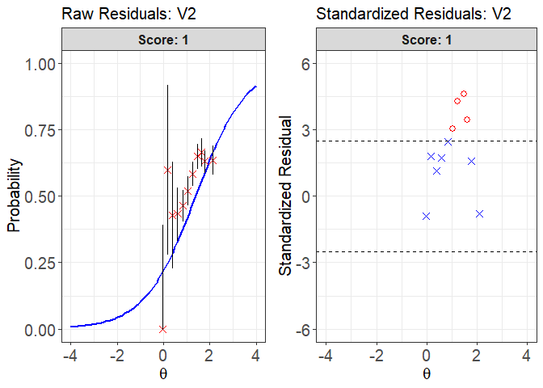

irtQ
================

<!-- README.md is generated from README.Rmd. Please edit that file -->

The goal of `irtQ` is to fit unidimensional item response theory (IRT)
models to data that may include both dichotomous and polytomous items.
The package enables:

- Typical item parameters estimation
- Pretest item calibration
- Multiple-group item calibration
- Estimation of examinees’ latent abilities,
- Evaluation of model-data fit at the item level

Item parameter estimation is conducted using marginal maximum likelihood
estimation via the expectation-maximization (MMLE-EM) algorithm (Bock &
Aitkin, 1981).  
For pretest item calibration, `irtQ` supports:

- Fixed item parameter calibration (FIPC; Kim, 2006),
- Fixed ability parameter calibration (FAPC; Ban et al., 2001; Stocking,
  1988).

For ability estimation, several widely used scoring methods are
available, including:

- Maximum likelihood estimation (ML)
- Maximum likelihood estimation with fences (MLF; Han, 2016)
- Weighted likelihood estimation (WL; Warm, 1989)
- Maximum a posteriori estimation (MAP; Hambleton et al., 1991)
- Expected a posteriori estimation (EAP; Bock & Mislevy, 1982)
- EAP summed scoring (Thissen et al., 1995; Thissen & Orlando, 2001)
- Inverse test characteristic curve (TCC) scoring (e.g., Kolen &
  Brennan, 2004; Kolen & Tong, 2010; Stocking, 1996)

Also, model fit assessment includes item fit statistics such as:

- Chi-square (X²; Bock, 1960; Yen, 1981),
- Likelihood ratio chi-square (G²; McKinley & Mills, 1985),
- Infit and outfit statistics (Ames et al., 2015),
- Graphical residual diagnostics (Hambleton et al., 1991).
- S-X² (Orlando & Thissen, 2000, 2003),

In addition, the package offers a variety of utilities for IRT analysis,
including:

- Evaluating model-data fit
- Detecting DIF
- Computing classification accuracy and consistency indices
- Simulating response data
- Computing the conditional distribution of observed scores using the
  Lord-Wingersky recursion
- Calculating item and test information and characteristic functions
- Visualizing item and test characteristic and information curves
- Importing item or ability parameters from popular IRT software
- Running flexMIRT (Cai, 2017) directly from R
- Supporting additional tools for flexible and practical IRT analyses

## Installation

You can install the released version of irtQ from
[CRAN](https://CRAN.R-project.org) with:

``` r
install.packages("irtQ")
```

## 1. Item Calibration for a Linear Test Form

Item parameter estimation for a linear test form can be performed using
the `irtQ::est_irt()` function, which implements marginal maximum
likelihood estimation via the expectation-maximization (MMLE-EM)
algorithm (Bock & Aitkin, 1981). The function returns item parameter
estimates along with their standard errors, computed using the
cross-product approximation method (Meilijson, 1989).

The `irtQ` package supports calibration for mixed-format tests
containing both dichotomous and polytomous items. It also provides a
flexible set of options to address various practical calibration needs.
For example, users can:

- Specify prior distributions for item parameters
- Fix specific parameters (e.g., the guessing parameter in the 3PL
  model)
- Estimate the latent ability distribution using a nonparametric
  histogram method (Woods, 2007)

In the `irtQ` package, item calibration for a linear test form typically
involves two main steps:

1.  Prepare the examinees’ response data set for the linear test form

    To estimate item parameters using the `irtQ::est_irt()` function, a
    response data set for the linear test form must first be prepared.
    The data should be provided in either a matrix or data frame format,
    where rows represent examinees and columns represent items. If there
    are missing responses, they should be properly coded (e.g., `NA`).

2.  Estimate item parameters using the `irtQ::est_irt()` function

    To estimate item parameters, several key input arguments must be
    specified in the `irtQ::est_irt()` function:

    - `data`: A matrix or data frame containing examinees’ item
      responses.
    - `model`: A character vector specifying the IRT model for each item
      (e.g., `"1PLM"`, `"2PLM"`, `"3PLM"`, `"GRM"`, `"GPCM"`).
    - `cats`: A numeric vector indicating the number of score categories
      for each item. For dichotomous items, use 2.
    - `D`: A scaling constant (typically 1.702) to align the logistic
      function with the normal ogive model.

    Optionally, you may incorporate prior distributions for item
    parameters:

    - `use.aprior`, `use.bprior`, `use.gprior`: Logical indicators
      specifying whether to apply prior distributions to the
      discrimination (`a`), difficulty (`b`), and guessing (`g`)
      parameters, respectively.
    - `aprior`, `bprior`, `gprior`: Lists specifying the distributional
      form and corresponding parameters for each prior. Supported
      distributions include Beta, Log-normal, and Normal.

    If the response data contain missing values, you must specify the
    missing value code via the `missing` argument.

    By default, the latent ability distribution is assumed to follow a
    standard normal distribution (i.e., N(0, 1)). However, users can
    estimate the empirical histogram of the latent distribution by
    setting `EmpHist = TRUE`, based on the nonparametric method proposed
    by Woods (2007).

## 2. Pretest Item Calibration with the Fixed Item Parameter Calibration (FIPC) Method (e.g., Kim, 2006)

The fixed item parameter calibration (FIPC) method is a widely used
approach for calibrating pretest items in computerized adaptive testing
(CAT). It enables the placement of parameter estimates for newly
developed items onto the same scale as the operational item parameters
(i.e., the scale of the item bank), without the need for post hoc
linking or rescaling procedures (Ban et al., 2001; Chen & Wang, 2016).

In FIPC, the parameters of the operational items are fixed, and the
prior distribution of the latent ability variable is estimated during
the calibration process. This estimated prior is used to place the
pretest item parameters on the same scale as the fixed operational items
(Kim, 2006).

In the `irtQ` package, FIPC is implemented through the following three
steps:

1.  Prepare the item metadata, including both the operational items (to
    be fixed) and the pretest items.

    To perform FIPC using the `irtQ::est_irt()` function, the item
    metadata must first be prepared. The item metadata is a structured
    data frame that includes essential information for each item, such
    as the number of score categories and the IRT model type. For more
    details, refer to the **Details** section of the `irtQ::est_irt()`
    documentation.

    In the FIPC procedure, the metadata must contain both:

    - Operational items (whose parameters will be fixed), and
    - Pretest items (whose parameters will be freely estimated).

    For the pretest items, the `cats` (number of score categories) and
    `model` (IRT model type) must be accurately specified. However, the
    item parameter values (e.g., `par.1`, `par.2`, `par.3`) in the
    metadata serve only as placeholders and can be arbitrary, since the
    actual parameter estimates will be obtained during calibration.

    To facilitate creation of the metadata for FIPC, the helper function
    `irtQ::shape_df_fipc()` can be used.

2.  Prepare the response data set from examinees who answered both the
    operational and pretest items.

    To implement FIPC using the `irtQ::est_irt()` function, examinees’
    response data for the test form must be provided, including both
    operational and pretest items. The response data should be in a
    matrix or data frame format, where rows represent examinees and
    columns represent items. Note that the column order of the response
    data must exactly match the row order of the item metadata.

3.  Perform FIPC using the `irtQ::est_irt()` function to calibrate the
    pretest items.

    When FIPC is performed using the `irtQ::est_irt()` function, the
    parameters of pretest items are estimated while the parameters of
    operational items are fixed.

    To implement FIPC, you must provide the following arguments to
    `irtQ::est_irt()`:

    - `x`: The item metadata, including both operational and pretest
      items.
    - `data`: The examinee response data corresponding to the item
      metadata.
    - `fipc = TRUE`: Enables fixed item parameter calibration.
    - `fipc.method`: Specifies the FIPC method to be used (e.g.,
      `"MEM"`).
    - `fix.loc`: A vector indicating the positions of the operational
      items to be fixed.

    Optionally, you may estimate the empirical histogram and scale of
    the latent ability distribution by setting `EmpHist = TRUE`. If
    `EmpHist = FALSE`, a normal prior is assumed and its scale is
    updated iteratively during the EM algorithm.

    For additional details on implementing FIPC, refer to the
    documentation for `irtQ::est_irt()`.

## 3. Pretest Item Calibration with the Fixed Ability Parameter Calibration (FAPC) Method (e.g., Stocking, 1988)

In computerized adaptive testing (CAT), the fixed ability parameter
calibration (FAPC) method—also known as Stocking’s Method A (Stocking,
1988)—is one of the simplest and most straightforward approaches for
calibrating pretest items. It involves estimating item parameters using
maximum likelihood estimation, conditional on known or estimated
proficiency values.

FAPC is primarily used to place the parameter estimates of pretest items
onto the same scale as the operational item parameters. It can also be
used to recalibrate operational items when evaluating potential item
parameter drift (Chen & Wang, 2016; Stocking, 1988). This method is
known to produce accurate and unbiased item parameter estimates when
items are randomly administered to examinees, rather than adaptively,
which is often the case for pretest items (Ban et al., 2001; Chen &
Wang, 2016).

In the package, FAPC can be conducted in two main steps:

1.  Prepare a data set containing both the item response data and the
    corresponding ability (proficiency) estimates.

    To use the `irtQ::est_item()` function, two input data sets are
    required:

    - Ability estimates: A numeric vector containing examinees’ ability
      (or proficiency) estimates.
    - Item response data: A matrix or data frame containing item
      responses, where rows represent examinees and columns represent
      items. The order of examinees in the response data must exactly
      match the order of the ability estimates.

2.  Estimate the item parameters using the `irtQ::est_item()` function.

    The `irtQ::est_item()` function estimates pretest item parameters
    based on provided ability estimates. To use this function, you must
    specify the following arguments:

    - `data`: A matrix or data frame containing examinees’ item
      responses.
    - `score`: A numeric vector of examinees’ ability (proficiency)
      estimates.
    - `model`: A character vector specifying the IRT model for each item
      (e.g., `"1PLM"`, `"2PLM"`, `"3PLM"`, `"GRM"`, `"GPCM"`).
    - `cats`: A numeric vector indicating the number of score categories
      for each item. For dichotomous items, use 2.
    - `D`: A scaling constant (typically 1.702) to align the logistic
      function with the normal ogive model.

    For additional details on implementing FAPC, refer to the
    documentation for `irtQ::est_item()`.

## 4. The Process of Evaluating the IRT Model–Data Fit

Evaluating how well an item response theory (IRT) model fits observed
response data is a critical step in psychometric analysis. The `irtQ`
package provides both statistical and graphical tools for evaluating
item-level model fit. These include traditional fit statistics (e.g.,
X², G², infit, outfit, and S-X²) and diagnostic residual plots.

Model fit evaluation using `irtQ` typically involves the following three
steps:

### 1. Prepare a data set for model fit analysis

Before conducting the IRT model fit analysis, three key data sets must
be prepared:

1.  **Item metadata**: A data frame containing item-level information,
    including:

    - Item ID
    - Number of score categories
    - IRT model specification
    - Calibrated item parameters

    You can either construct this data frame manually or generate it
    using the `irtQ::shape_df()` function. Additionally, if item
    parameters were estimated using other IRT software (e.g., BILOG-MG
    3, PARSCALE 4, flexMIRT, or the `mirt` R package), you can import
    them using the corresponding `irtQ::bring.*()` functions (e.g.,
    `irtQ::bring.flexmirt()`, `irtQ::bring.bilog()`).

2.  **Ability estimates**: A numeric vector of examinees’ estimated
    proficiency values.

3.  **Response data**: A matrix or data frame in which rows represent
    examinees and columns represent items. The order of examinees in
    this matrix must exactly match that of the ability estimates, and
    the column order must match the item metadata.

### 2. Compute IRT item fit statistics using `irtQ::irtfit()`

The `irtQ::irtfit()` function calculates widely used item fit
statistics, including:

- Chi-square (X²)
- Likelihood-ratio chi-square (G²)
- Infit and outfit statistics

To compute X² and G² statistics, the latent ability scale must be
divided into several groups. Two grouping methods are available:

- `"equal.width"`: Divides the scale into intervals of equal length
- `"equal.freq"`: Divides the scale into groups with equal numbers of
  examinees

You must also specify where the expected probabilities of item responses
are calculated within each group. Two options are available:

- `"average"`: Uses the average ability estimate within each group
- `"middle"`: Uses the midpoint of each interval

To implement this step, specify the item metadata (`x`), ability
estimates (`score`), and response data (`data`) as arguments in the
`irtQ::irtfit()` function. If you want to use more or fewer than ten
ability groups, adjust the `n.width` argument accordingly. If the
response data contain missing values, specify the missing value code
using the `missing` argument.

Upon execution, the function returns item fit statistics and contingency
tables used to compute the X² and G² statistics.

Note that the model-fit evaluation using the S-X² statistic can be
implemented using the `irtQ::sx2_fit()` function.

### 3. Draw residual plots using the `plot()` method

After obtaining fit statistics using the `irtQ::irtfit()` function, you
can use the `plot()` method to visualize residuals for individual items.
Two types of plots are available: raw residual plot and standardized
residual plot.

To generate a plot, specify the item to be examined using the `item.loc`
argument. Only one item can be plotted at a time.

The `ci.method` argument controls how confidence intervals are computed
in the raw residual plots. Supported methods include:

- `"wald"`: Wald interval based on the normal approximation (Laplace,
  1812)
- `"cp"`: Clopper–Pearson interval (Clopper & Pearson, 1934)
- `"wilson"`: Wilson score interval (Wilson, 1927)
- `"wilson.cr"`: Wilson score interval with continuity correction
  (Newcombe, 1998)

These graphical diagnostics complement the statistical fit measures,
allowing for deeper investigation into the adequacy of model fit for
individual items.

## 5. Examples of implementing online calibration and evaluating the IRT model-data fit

``` r

# Attach the packages
library(irtQ)

##---------------------------------------------------------------------------
## 1. Item parameter estimation for a linear test
## form
##---------------------------------------------------------------------------

## Step 1: Prepare response data for the
## reference group Import the '-prm.txt' output
## file from flexMIRT
meta_true <- system.file("extdata", "flexmirt_sample-prm.txt",
  package = "irtQ")

# Extract item metadata using
# `irtQ::bring.flexmirt()` This will serve as the
# base test form for later pretest item examples
x_new <- irtQ::bring.flexmirt(file = meta_true, "par")$Group1$full_df

# Extract items 1 to 40 to define the linear test
# form used in this illustration
x_ref <- x_new[1:40, ]

# Generate true ability values (N = 2,000) from
# N(0, 1) for the reference group
set.seed(20)
theta_ref <- rnorm(2000, mean = 0, sd = 1)

# Simulate response data for the linear test form
# Scaling factor D = 1 assumes a logistic IRT
# model
data_ref <- irtQ::simdat(x = x_ref, theta = theta_ref,
  D = 1)

## Step 2: Estimate item parameters for the
## linear test form using the following
## arguments: data = data_ref # Response data D =
## 1 # Scaling factor model = c(rep('3PLM', 38),
## rep('GRM', 2)) # Item models cats = c(rep(2,
## 38), rep(5, 2)) # Score categories per item
## item.id = paste0('Ref_I', 1:40) # Item IDs
## use.gprior = TRUE # Use prior for guessing
## parameter gprior = list(dist = 'beta', params
## = c(5, 16))# Prior: Beta(5,16) for g
## Quadrature = c(49, 6) # 49 quadrature points
## from -6 to 6 group.mean = 0 group.var = 1 #
## Fixed latent ability: N(0,1) EmpHist = TRUE #
## Estimate empirical ability distribution Etol =
## 1e-3 # E-step convergence tolerance MaxE = 500
## # Max EM iterations
mod_ref <- irtQ::est_irt(data = data_ref, D = 1, model = c(rep("3PLM",
  38), rep("GRM", 2)), cats = c(rep(2, 38), rep(5,
  2)), item.id = paste0("Ref_I", 1:40), use.gprior = TRUE,
  gprior = list(dist = "beta", params = c(5, 16)),
  Quadrature = c(49, 6), group.mean = 0, group.var = 1,
  EmpHist = TRUE, Etol = 0.001, MaxE = 500)
#> Parsing input... 
#> Estimating item parameters... 
#>  EM iteration: 1, Loglike: -53907.8298, Max-Change: 1.476851 EM iteration: 2, Loglike: -47810.7610, Max-Change: 0.333348 EM iteration: 3, Loglike: -47780.1401, Max-Change: 0.130911 EM iteration: 4, Loglike: -47777.7493, Max-Change: 0.064179 EM iteration: 5, Loglike: -47776.9296, Max-Change: 0.038227 EM iteration: 6, Loglike: -47776.4542, Max-Change: 0.026209 EM iteration: 7, Loglike: -47776.1402, Max-Change: 0.019566 EM iteration: 8, Loglike: -47775.9185, Max-Change: 0.015306 EM iteration: 9, Loglike: -47775.7539, Max-Change: 0.012285 EM iteration: 10, Loglike: -47775.6263, Max-Change: 0.01001 EM iteration: 11, Loglike: -47775.5239, Max-Change: 0.008238 EM iteration: 12, Loglike: -47775.4394, Max-Change: 0.006834 EM iteration: 13, Loglike: -47775.3679, Max-Change: 0.005706 EM iteration: 14, Loglike: -47775.3064, Max-Change: 0.004795 EM iteration: 15, Loglike: -47775.2525, Max-Change: 0.004052 EM iteration: 16, Loglike: -47775.2048, Max-Change: 0.003444 EM iteration: 17, Loglike: -47775.1621, Max-Change: 0.002944 EM iteration: 18, Loglike: -47775.1234, Max-Change: 0.002529 EM iteration: 19, Loglike: -47775.0882, Max-Change: 0.002184 EM iteration: 20, Loglike: -47775.0558, Max-Change: 0.001895 EM iteration: 21, Loglike: -47775.0259, Max-Change: 0.001652 EM iteration: 22, Loglike: -47774.9980, Max-Change: 0.001446 EM iteration: 23, Loglike: -47774.9719, Max-Change: 0.001271 EM iteration: 24, Loglike: -47774.9473, Max-Change: 0.001121 EM iteration: 25, Loglike: -47774.9241, Max-Change: 0.000993 
#> Computing item parameter var-covariance matrix... 
#> Estimation is finished in 4.11 seconds.

# Summarize estimation results
irtQ::summary(mod_ref)
#> 
#> Call:
#> irtQ::est_irt(data = data_ref, D = 1, model = c(rep("3PLM", 38), 
#>     rep("GRM", 2)), cats = c(rep(2, 38), rep(5, 2)), item.id = paste0("Ref_I", 
#>     1:40), use.gprior = TRUE, gprior = list(dist = "beta", params = c(5, 
#>     16)), Quadrature = c(49, 6), group.mean = 0, group.var = 1, 
#>     EmpHist = TRUE, Etol = 0.001, MaxE = 500)
#> 
#> Summary of the Data 
#>  Number of Items: 40
#>  Number of Cases: 2000
#> 
#> Summary of Estimation Process 
#>  Maximum number of EM cycles: 500
#>  Convergence criterion of E-step: 0.001
#>  Number of rectangular quadrature points: 49
#>  Minimum & Maximum quadrature points: -6, 6
#>  Number of free parameters: 124
#>  Number of fixed items: 0
#>  Number of E-step cycles completed: 25
#>  Maximum parameter change: 0.0009933509
#> 
#> Processing time (in seconds) 
#>  EM algorithm: 1.69
#>  Standard error computation: 2.26
#>  Total computation: 4.11
#> 
#> Convergence and Stability of Solution 
#>  First-order test: Convergence criteria are satisfied.
#>  Second-order test: Solution is a possible local maximum.
#>  Computation of variance-covariance matrix: 
#>   Variance-covariance matrix of item parameter estimates is obtainable.
#> 
#> Summary of Estimation Results 
#>  -2loglikelihood: 95549.84
#>  Akaike Information Criterion (AIC): 95797.84
#>  Bayesian Information Criterion (BIC): 96492.35
#>  Item Parameters: 
#>          id  cats  model  par.1  se.1  par.2  se.2  par.3  se.3  par.4  se.4
#> 1    Ref_I1     2   3PLM   0.69  0.15   1.14  0.27   0.19  0.07     NA    NA
#> 2    Ref_I2     2   3PLM   1.77  0.17  -1.02  0.14   0.20  0.07     NA    NA
#> 3    Ref_I3     2   3PLM   1.52  0.21   0.71  0.10   0.24  0.03     NA    NA
#> 4    Ref_I4     2   3PLM   1.05  0.12  -0.44  0.20   0.18  0.07     NA    NA
#> 5    Ref_I5     2   3PLM   0.92  0.16   0.27  0.26   0.26  0.07     NA    NA
#> 6    Ref_I6     2   3PLM   1.87  0.20   0.73  0.06   0.09  0.02     NA    NA
#> 7    Ref_I7     2   3PLM   1.06  0.19   1.20  0.13   0.18  0.04     NA    NA
#> 8    Ref_I8     2   3PLM   0.97  0.16   0.95  0.15   0.16  0.05     NA    NA
#> 9    Ref_I9     2   3PLM   1.30  0.22   0.73  0.13   0.28  0.04     NA    NA
#> 10  Ref_I10     2   3PLM   1.86  0.20   0.19  0.08   0.16  0.03     NA    NA
#> 11  Ref_I11     2   3PLM   0.99  0.12  -0.27  0.19   0.16  0.06     NA    NA
#> 12  Ref_I12     2   3PLM   1.04  0.16   1.16  0.12   0.12  0.04     NA    NA
#> 13  Ref_I13     2   3PLM   1.22  0.21   1.33  0.11   0.15  0.03     NA    NA
#> 14  Ref_I14     2   3PLM   1.54  0.19   0.24  0.11   0.24  0.04     NA    NA
#> 15  Ref_I15     2   3PLM   1.48  0.16   0.01  0.11   0.17  0.05     NA    NA
#> 16  Ref_I16     2   3PLM   2.35  0.19   0.01  0.05   0.07  0.02     NA    NA
#> 17  Ref_I17     2   3PLM   1.48  0.17  -0.03  0.12   0.21  0.05     NA    NA
#> 18  Ref_I18     2   3PLM   1.70  0.30   1.24  0.09   0.27  0.02     NA    NA
#> 19  Ref_I19     2   3PLM   2.15  0.19  -1.01  0.10   0.15  0.06     NA    NA
#> 20  Ref_I20     2   3PLM   1.76  0.20  -1.28  0.19   0.30  0.09     NA    NA
#> 21  Ref_I21     2   3PLM   1.73  0.20  -0.94  0.16   0.26  0.08     NA    NA
#> 22  Ref_I22     2   3PLM   0.90  0.14  -0.23  0.29   0.25  0.08     NA    NA
#> 23  Ref_I23     2   3PLM   0.96  0.10  -0.27  0.17   0.13  0.06     NA    NA
#> 24  Ref_I24     2   3PLM   1.05  0.25   1.54  0.15   0.23  0.04     NA    NA
#> 25  Ref_I25     2   3PLM   0.71  0.09  -1.60  0.37   0.22  0.09     NA    NA
#> 26  Ref_I26     2   3PLM   0.88  0.10  -1.98  0.31   0.22  0.10     NA    NA
#> 27  Ref_I27     2   3PLM   1.41  0.16   0.13  0.11   0.16  0.04     NA    NA
#> 28  Ref_I28     2   3PLM   2.73  0.30   0.12  0.06   0.25  0.03     NA    NA
#> 29  Ref_I29     2   3PLM   1.27  0.13  -1.38  0.21   0.22  0.09     NA    NA
#> 30  Ref_I30     2   3PLM   1.69  0.27   0.89  0.10   0.35  0.03     NA    NA
#> 31  Ref_I31     2   3PLM   1.04  0.16   0.84  0.13   0.14  0.04     NA    NA
#> 32  Ref_I32     2   3PLM   1.69  0.19  -0.70  0.16   0.30  0.07     NA    NA
#> 33  Ref_I33     2   3PLM   1.24  0.11  -1.38  0.18   0.17  0.07     NA    NA
#> 34  Ref_I34     2   3PLM   1.38  0.18   0.37  0.12   0.21  0.04     NA    NA
#> 35  Ref_I35     2   3PLM   1.68  0.21   0.01  0.12   0.28  0.05     NA    NA
#> 36  Ref_I36     2   3PLM   1.02  0.19   1.35  0.13   0.16  0.04     NA    NA
#> 37  Ref_I37     2   3PLM   1.92  0.19  -0.21  0.09   0.17  0.04     NA    NA
#> 38  Ref_I38     2   3PLM   0.72  0.10  -0.43  0.34   0.21  0.09     NA    NA
#> 39  Ref_I39     5    GRM   1.96  0.09  -1.83  0.08  -1.17  0.05  -0.62  0.04
#> 40  Ref_I40     5    GRM   1.33  0.06  -0.73  0.06  -0.07  0.05   0.58  0.05
#>     par.5  se.5
#> 1      NA    NA
#> 2      NA    NA
#> 3      NA    NA
#> 4      NA    NA
#> 5      NA    NA
#> 6      NA    NA
#> 7      NA    NA
#> 8      NA    NA
#> 9      NA    NA
#> 10     NA    NA
#> 11     NA    NA
#> 12     NA    NA
#> 13     NA    NA
#> 14     NA    NA
#> 15     NA    NA
#> 16     NA    NA
#> 17     NA    NA
#> 18     NA    NA
#> 19     NA    NA
#> 20     NA    NA
#> 21     NA    NA
#> 22     NA    NA
#> 23     NA    NA
#> 24     NA    NA
#> 25     NA    NA
#> 26     NA    NA
#> 27     NA    NA
#> 28     NA    NA
#> 29     NA    NA
#> 30     NA    NA
#> 31     NA    NA
#> 32     NA    NA
#> 33     NA    NA
#> 34     NA    NA
#> 35     NA    NA
#> 36     NA    NA
#> 37     NA    NA
#> 38     NA    NA
#> 39  -0.17  0.04
#> 40   1.10  0.06
#>  Group Parameters: 
#>            mu  sigma2  sigma
#> estimates   0       1      1
#> se         NA      NA     NA

# Extract item parameter estimates
est_ref <- mod_ref$par.est
print(est_ref)
#>         id cats model     par.1       par.2       par.3      par.4      par.5
#> 1   Ref_I1    2  3PLM 0.6919958  1.14484428  0.18976505         NA         NA
#> 2   Ref_I2    2  3PLM 1.7724464 -1.02099195  0.19616040         NA         NA
#> 3   Ref_I3    2  3PLM 1.5150979  0.70966858  0.23867405         NA         NA
#> 4   Ref_I4    2  3PLM 1.0524674 -0.43526125  0.17728801         NA         NA
#> 5   Ref_I5    2  3PLM 0.9167739  0.26820574  0.26351619         NA         NA
#> 6   Ref_I6    2  3PLM 1.8666135  0.72927995  0.08652424         NA         NA
#> 7   Ref_I7    2  3PLM 1.0562014  1.19815134  0.18056280         NA         NA
#> 8   Ref_I8    2  3PLM 0.9748064  0.94777750  0.15848887         NA         NA
#> 9   Ref_I9    2  3PLM 1.3025729  0.73175294  0.28029921         NA         NA
#> 10 Ref_I10    2  3PLM 1.8639742  0.18640841  0.16366458         NA         NA
#> 11 Ref_I11    2  3PLM 0.9939469 -0.26792395  0.15892795         NA         NA
#> 12 Ref_I12    2  3PLM 1.0372451  1.16353762  0.11695581         NA         NA
#> 13 Ref_I13    2  3PLM 1.2190361  1.33299401  0.15362908         NA         NA
#> 14 Ref_I14    2  3PLM 1.5357357  0.23646413  0.23961506         NA         NA
#> 15 Ref_I15    2  3PLM 1.4824882  0.01278570  0.16718702         NA         NA
#> 16 Ref_I16    2  3PLM 2.3536532  0.01021882  0.06936723         NA         NA
#> 17 Ref_I17    2  3PLM 1.4812117 -0.02787403  0.21368590         NA         NA
#> 18 Ref_I18    2  3PLM 1.7011523  1.23768162  0.26906304         NA         NA
#> 19 Ref_I19    2  3PLM 2.1548401 -1.01143131  0.14829320         NA         NA
#> 20 Ref_I20    2  3PLM 1.7590704 -1.27947224  0.30164289         NA         NA
#> 21 Ref_I21    2  3PLM 1.7311825 -0.93888505  0.26145478         NA         NA
#> 22 Ref_I22    2  3PLM 0.8950656 -0.23309091  0.24895260         NA         NA
#> 23 Ref_I23    2  3PLM 0.9604247 -0.27453531  0.13157552         NA         NA
#> 24 Ref_I24    2  3PLM 1.0475076  1.53775315  0.22975399         NA         NA
#> 25 Ref_I25    2  3PLM 0.7093919 -1.60381825  0.21525701         NA         NA
#> 26 Ref_I26    2  3PLM 0.8782582 -1.97974496  0.22367120         NA         NA
#> 27 Ref_I27    2  3PLM 1.4142228  0.12900790  0.16073408         NA         NA
#> 28 Ref_I28    2  3PLM 2.7271258  0.11722864  0.24875028         NA         NA
#> 29 Ref_I29    2  3PLM 1.2736643 -1.38227009  0.22190754         NA         NA
#> 30 Ref_I30    2  3PLM 1.6924003  0.89383805  0.35473129         NA         NA
#> 31 Ref_I31    2  3PLM 1.0382177  0.83917004  0.14081449         NA         NA
#> 32 Ref_I32    2  3PLM 1.6949111 -0.69941724  0.30436382         NA         NA
#> 33 Ref_I33    2  3PLM 1.2377865 -1.38353603  0.16635813         NA         NA
#> 34 Ref_I34    2  3PLM 1.3780871  0.37216895  0.20560614         NA         NA
#> 35 Ref_I35    2  3PLM 1.6786172  0.01343367  0.28045264         NA         NA
#> 36 Ref_I36    2  3PLM 1.0208415  1.35077179  0.16012086         NA         NA
#> 37 Ref_I37    2  3PLM 1.9186508 -0.21446011  0.17043569         NA         NA
#> 38 Ref_I38    2  3PLM 0.7239630 -0.42947089  0.21019599         NA         NA
#> 39 Ref_I39    5   GRM 1.9602129 -1.83262075 -1.16744771 -0.6208679 -0.1692025
#> 40 Ref_I40    5   GRM 1.3329010 -0.72583247 -0.06982295  0.5783163  1.1047434

##------------------------------------------------------------------------------
## 2. Pretest item calibration using Fixed Item
## Parameter Calibration (FIPC)
##------------------------------------------------------------------------------

## Step 1: Prepare item metadata for both fixed
## operational items and pretest items Define
## anchor item positions (items to be fixed)
fixed_pos <- c(1:40)

# Specify IDs, models, and categories for 15
# pretest items Includes 12 3PLM and 3 GRM items
# (each GRM has 5 categories)
new_ids <- paste0("New_I", 1:15)
new_models <- c(rep("3PLM", 12), rep("GRM", 3))
new_cats <- c(rep(2, 12), rep(5, 3))

# Construct item metadata using
# `shape_df_fipc()`. See Details of
# `shape_df_fipc()` for more information First 40
# items are anchor items (fixed); last 15 are
# pretest (freely estimated)
meta_fipc <- irtQ::shape_df_fipc(x = est_ref, fix.loc = fixed_pos,
  item.id = new_ids, cats = new_cats, model = new_models)

## Step 2: Prepare response data for the new test
## form Generate latent abilities for 2,000 new
## examinees from N(0.5, 1.3²)
set.seed(21)
theta_new <- rnorm(2000, mean = 0.5, sd = 1.3)

# Simulate response data using true item
# parameters and true abilities
data_new <- irtQ::simdat(x = x_new, theta = theta_new,
  D = 1)

## Step 3: Calibrate pretest items using FIPC Fit
## 3PLM to dichotomous and GRM to polytomous
## items Fix first 40 items and freely estimate
## the remaining 15 pretest items using the
## following arguments: x = meta_fipc # Combined
## item metadata data = data_new # Response data
## D = 1 # Scaling constant use.gprior = TRUE #
## Use prior for guessing parameter gprior =
## list(dist = 'beta', params = c(5, 16)) #
## Prior: Beta(5,16) for g Quadrature = c(49, 6)
## # 49 quadrature points from -6 to 6 EmpHist =
## TRUE # Estimate empirical ability distribution
## Etol = 1e-3 # E-step convergence tolerance
## MaxE = 500 # Max EM iterations fipc = TRUE #
## Enable FIPC fipc.method = 'MEM' # Use Multiple
## EM cycles fix.loc = c(1:40) # Anchor item
## positions to fix
mod_fipc <- irtQ::est_irt(x = meta_fipc, data = data_new,
  D = 1, use.gprior = TRUE, gprior = list(dist = "beta",
    params = c(5, 16)), Quadrature = c(49, 6),
  EmpHist = TRUE, Etol = 0.001, MaxE = 500, fipc = TRUE,
  fipc.method = "MEM", fix.loc = c(1:40))
#> Parsing input... 
#> Estimating item parameters... 
#>  EM iteration: 1, Loglike: -41799.5018, Max-Change: 2.177366 EM iteration: 2, Loglike: -60177.8990, Max-Change: 0.660102 EM iteration: 3, Loglike: -60143.0624, Max-Change: 0.226251 EM iteration: 4, Loglike: -60141.1866, Max-Change: 0.082366 EM iteration: 5, Loglike: -60140.7281, Max-Change: 0.031397 EM iteration: 6, Loglike: -60140.4860, Max-Change: 0.012555 EM iteration: 7, Loglike: -60140.3168, Max-Change: 0.005361 EM iteration: 8, Loglike: -60140.1888, Max-Change: 0.002513 EM iteration: 9, Loglike: -60140.0888, Max-Change: 0.001326 EM iteration: 10, Loglike: -60140.0086, Max-Change: 0.000788 
#> Computing item parameter var-covariance matrix... 
#> Estimation is finished in 1.4 seconds.

# Summarize estimation results
irtQ::summary(mod_fipc)
#> 
#> Call:
#> irtQ::est_irt(x = meta_fipc, data = data_new, D = 1, use.gprior = TRUE, 
#>     gprior = list(dist = "beta", params = c(5, 16)), Quadrature = c(49, 
#>         6), EmpHist = TRUE, Etol = 0.001, MaxE = 500, fipc = TRUE, 
#>     fipc.method = "MEM", fix.loc = c(1:40))
#> 
#> Summary of the Data 
#>  Number of Items: 55
#>  Number of Cases: 2000
#> 
#> Summary of Estimation Process 
#>  Maximum number of EM cycles: 500
#>  Convergence criterion of E-step: 0.001
#>  Number of rectangular quadrature points: 49
#>  Minimum & Maximum quadrature points: -6, 6
#>  Number of free parameters: 53
#>  Number of fixed items: 40
#>  Number of E-step cycles completed: 10
#>  Maximum parameter change: 0.0007875898
#> 
#> Processing time (in seconds) 
#>  EM algorithm: 0.53
#>  Standard error computation: 0.58
#>  Total computation: 1.4
#> 
#> Convergence and Stability of Solution 
#>  First-order test: Convergence criteria are satisfied.
#>  Second-order test: Solution is a possible local maximum.
#>  Computation of variance-covariance matrix: 
#>   Variance-covariance matrix of item parameter estimates is obtainable.
#> 
#> Summary of Estimation Results 
#>  -2loglikelihood: 120280
#>  Akaike Information Criterion (AIC): 120386
#>  Bayesian Information Criterion (BIC): 120682.9
#>  Item Parameters: 
#>          id  cats  model  par.1  se.1  par.2  se.2  par.3  se.3  par.4  se.4
#> 1    Ref_I1     2   3PLM   0.69    NA   1.14    NA   0.19    NA     NA    NA
#> 2    Ref_I2     2   3PLM   1.77    NA  -1.02    NA   0.20    NA     NA    NA
#> 3    Ref_I3     2   3PLM   1.52    NA   0.71    NA   0.24    NA     NA    NA
#> 4    Ref_I4     2   3PLM   1.05    NA  -0.44    NA   0.18    NA     NA    NA
#> 5    Ref_I5     2   3PLM   0.92    NA   0.27    NA   0.26    NA     NA    NA
#> 6    Ref_I6     2   3PLM   1.87    NA   0.73    NA   0.09    NA     NA    NA
#> 7    Ref_I7     2   3PLM   1.06    NA   1.20    NA   0.18    NA     NA    NA
#> 8    Ref_I8     2   3PLM   0.97    NA   0.95    NA   0.16    NA     NA    NA
#> 9    Ref_I9     2   3PLM   1.30    NA   0.73    NA   0.28    NA     NA    NA
#> 10  Ref_I10     2   3PLM   1.86    NA   0.19    NA   0.16    NA     NA    NA
#> 11  Ref_I11     2   3PLM   0.99    NA  -0.27    NA   0.16    NA     NA    NA
#> 12  Ref_I12     2   3PLM   1.04    NA   1.16    NA   0.12    NA     NA    NA
#> 13  Ref_I13     2   3PLM   1.22    NA   1.33    NA   0.15    NA     NA    NA
#> 14  Ref_I14     2   3PLM   1.54    NA   0.24    NA   0.24    NA     NA    NA
#> 15  Ref_I15     2   3PLM   1.48    NA   0.01    NA   0.17    NA     NA    NA
#> 16  Ref_I16     2   3PLM   2.35    NA   0.01    NA   0.07    NA     NA    NA
#> 17  Ref_I17     2   3PLM   1.48    NA  -0.03    NA   0.21    NA     NA    NA
#> 18  Ref_I18     2   3PLM   1.70    NA   1.24    NA   0.27    NA     NA    NA
#> 19  Ref_I19     2   3PLM   2.15    NA  -1.01    NA   0.15    NA     NA    NA
#> 20  Ref_I20     2   3PLM   1.76    NA  -1.28    NA   0.30    NA     NA    NA
#> 21  Ref_I21     2   3PLM   1.73    NA  -0.94    NA   0.26    NA     NA    NA
#> 22  Ref_I22     2   3PLM   0.90    NA  -0.23    NA   0.25    NA     NA    NA
#> 23  Ref_I23     2   3PLM   0.96    NA  -0.27    NA   0.13    NA     NA    NA
#> 24  Ref_I24     2   3PLM   1.05    NA   1.54    NA   0.23    NA     NA    NA
#> 25  Ref_I25     2   3PLM   0.71    NA  -1.60    NA   0.22    NA     NA    NA
#> 26  Ref_I26     2   3PLM   0.88    NA  -1.98    NA   0.22    NA     NA    NA
#> 27  Ref_I27     2   3PLM   1.41    NA   0.13    NA   0.16    NA     NA    NA
#> 28  Ref_I28     2   3PLM   2.73    NA   0.12    NA   0.25    NA     NA    NA
#> 29  Ref_I29     2   3PLM   1.27    NA  -1.38    NA   0.22    NA     NA    NA
#> 30  Ref_I30     2   3PLM   1.69    NA   0.89    NA   0.35    NA     NA    NA
#> 31  Ref_I31     2   3PLM   1.04    NA   0.84    NA   0.14    NA     NA    NA
#> 32  Ref_I32     2   3PLM   1.69    NA  -0.70    NA   0.30    NA     NA    NA
#> 33  Ref_I33     2   3PLM   1.24    NA  -1.38    NA   0.17    NA     NA    NA
#> 34  Ref_I34     2   3PLM   1.38    NA   0.37    NA   0.21    NA     NA    NA
#> 35  Ref_I35     2   3PLM   1.68    NA   0.01    NA   0.28    NA     NA    NA
#> 36  Ref_I36     2   3PLM   1.02    NA   1.35    NA   0.16    NA     NA    NA
#> 37  Ref_I37     2   3PLM   1.92    NA  -0.21    NA   0.17    NA     NA    NA
#> 38  Ref_I38     2   3PLM   0.72    NA  -0.43    NA   0.21    NA     NA    NA
#> 39  Ref_I39     5    GRM   1.96    NA  -1.83    NA  -1.17    NA  -0.62    NA
#> 40  Ref_I40     5    GRM   1.33    NA  -0.73    NA  -0.07    NA   0.58    NA
#> 41   New_I1     2   3PLM   1.75  0.17   0.61  0.08   0.25  0.03     NA    NA
#> 42   New_I2     2   3PLM   1.85  0.17  -1.21  0.14   0.20  0.07     NA    NA
#> 43   New_I3     2   3PLM   1.61  0.13   0.49  0.08   0.14  0.03     NA    NA
#> 44   New_I4     2   3PLM   1.06  0.10  -0.24  0.17   0.15  0.06     NA    NA
#> 45   New_I5     2   3PLM   1.09  0.17   2.21  0.12   0.15  0.03     NA    NA
#> 46   New_I6     2   3PLM   2.85  0.35   1.54  0.05   0.20  0.02     NA    NA
#> 47   New_I7     2   3PLM   1.38  0.11   0.10  0.11   0.17  0.04     NA    NA
#> 48   New_I8     2   3PLM   1.72  0.15   0.15  0.09   0.18  0.04     NA    NA
#> 49   New_I9     2   3PLM   1.34  0.10   0.32  0.08   0.09  0.03     NA    NA
#> 50  New_I10     2   3PLM   1.53  0.14   1.24  0.06   0.09  0.02     NA    NA
#> 51  New_I11     2   3PLM   1.90  0.18  -0.99  0.13   0.21  0.06     NA    NA
#> 52  New_I12     2   3PLM   1.35  0.16  -0.16  0.19   0.38  0.06     NA    NA
#> 53  New_I13     5    GRM   1.25  0.05  -0.39  0.05   0.19  0.05   0.77  0.04
#> 54  New_I14     5    GRM   1.28  0.06  -2.17  0.11  -1.46  0.08  -0.74  0.06
#> 55  New_I15     5    GRM   0.91  0.05  -0.76  0.08  -0.04  0.06   0.61  0.05
#>     par.5  se.5
#> 1      NA    NA
#> 2      NA    NA
#> 3      NA    NA
#> 4      NA    NA
#> 5      NA    NA
#> 6      NA    NA
#> 7      NA    NA
#> 8      NA    NA
#> 9      NA    NA
#> 10     NA    NA
#> 11     NA    NA
#> 12     NA    NA
#> 13     NA    NA
#> 14     NA    NA
#> 15     NA    NA
#> 16     NA    NA
#> 17     NA    NA
#> 18     NA    NA
#> 19     NA    NA
#> 20     NA    NA
#> 21     NA    NA
#> 22     NA    NA
#> 23     NA    NA
#> 24     NA    NA
#> 25     NA    NA
#> 26     NA    NA
#> 27     NA    NA
#> 28     NA    NA
#> 29     NA    NA
#> 30     NA    NA
#> 31     NA    NA
#> 32     NA    NA
#> 33     NA    NA
#> 34     NA    NA
#> 35     NA    NA
#> 36     NA    NA
#> 37     NA    NA
#> 38     NA    NA
#> 39  -0.17    NA
#> 40   1.10    NA
#> 41     NA    NA
#> 42     NA    NA
#> 43     NA    NA
#> 44     NA    NA
#> 45     NA    NA
#> 46     NA    NA
#> 47     NA    NA
#> 48     NA    NA
#> 49     NA    NA
#> 50     NA    NA
#> 51     NA    NA
#> 52     NA    NA
#> 53   1.22  0.05
#> 54  -0.13  0.05
#> 55   1.13  0.06
#>  Group Parameters: 
#>              mu  sigma2  sigma
#> estimates  0.55    1.50   1.22
#> se         0.03    0.05   0.02

# Extract item parameter estimates
est_new_fipc <- mod_fipc$par.est
print(est_new_fipc)
#>         id cats model     par.1       par.2       par.3      par.4      par.5
#> 1   Ref_I1    2  3PLM 0.6919958  1.14484428  0.18976505         NA         NA
#> 2   Ref_I2    2  3PLM 1.7724464 -1.02099195  0.19616040         NA         NA
#> 3   Ref_I3    2  3PLM 1.5150979  0.70966858  0.23867405         NA         NA
#> 4   Ref_I4    2  3PLM 1.0524674 -0.43526125  0.17728801         NA         NA
#> 5   Ref_I5    2  3PLM 0.9167739  0.26820574  0.26351619         NA         NA
#> 6   Ref_I6    2  3PLM 1.8666135  0.72927995  0.08652424         NA         NA
#> 7   Ref_I7    2  3PLM 1.0562014  1.19815134  0.18056280         NA         NA
#> 8   Ref_I8    2  3PLM 0.9748064  0.94777750  0.15848887         NA         NA
#> 9   Ref_I9    2  3PLM 1.3025729  0.73175294  0.28029921         NA         NA
#> 10 Ref_I10    2  3PLM 1.8639742  0.18640841  0.16366458         NA         NA
#> 11 Ref_I11    2  3PLM 0.9939469 -0.26792395  0.15892795         NA         NA
#> 12 Ref_I12    2  3PLM 1.0372451  1.16353762  0.11695581         NA         NA
#> 13 Ref_I13    2  3PLM 1.2190361  1.33299401  0.15362908         NA         NA
#> 14 Ref_I14    2  3PLM 1.5357357  0.23646413  0.23961506         NA         NA
#> 15 Ref_I15    2  3PLM 1.4824882  0.01278570  0.16718702         NA         NA
#> 16 Ref_I16    2  3PLM 2.3536532  0.01021882  0.06936723         NA         NA
#> 17 Ref_I17    2  3PLM 1.4812117 -0.02787403  0.21368590         NA         NA
#> 18 Ref_I18    2  3PLM 1.7011523  1.23768162  0.26906304         NA         NA
#> 19 Ref_I19    2  3PLM 2.1548401 -1.01143131  0.14829320         NA         NA
#> 20 Ref_I20    2  3PLM 1.7590704 -1.27947224  0.30164289         NA         NA
#> 21 Ref_I21    2  3PLM 1.7311825 -0.93888505  0.26145478         NA         NA
#> 22 Ref_I22    2  3PLM 0.8950656 -0.23309091  0.24895260         NA         NA
#> 23 Ref_I23    2  3PLM 0.9604247 -0.27453531  0.13157552         NA         NA
#> 24 Ref_I24    2  3PLM 1.0475076  1.53775315  0.22975399         NA         NA
#> 25 Ref_I25    2  3PLM 0.7093919 -1.60381825  0.21525701         NA         NA
#> 26 Ref_I26    2  3PLM 0.8782582 -1.97974496  0.22367120         NA         NA
#> 27 Ref_I27    2  3PLM 1.4142228  0.12900790  0.16073408         NA         NA
#> 28 Ref_I28    2  3PLM 2.7271258  0.11722864  0.24875028         NA         NA
#> 29 Ref_I29    2  3PLM 1.2736643 -1.38227009  0.22190754         NA         NA
#> 30 Ref_I30    2  3PLM 1.6924003  0.89383805  0.35473129         NA         NA
#> 31 Ref_I31    2  3PLM 1.0382177  0.83917004  0.14081449         NA         NA
#> 32 Ref_I32    2  3PLM 1.6949111 -0.69941724  0.30436382         NA         NA
#> 33 Ref_I33    2  3PLM 1.2377865 -1.38353603  0.16635813         NA         NA
#> 34 Ref_I34    2  3PLM 1.3780871  0.37216895  0.20560614         NA         NA
#> 35 Ref_I35    2  3PLM 1.6786172  0.01343367  0.28045264         NA         NA
#> 36 Ref_I36    2  3PLM 1.0208415  1.35077179  0.16012086         NA         NA
#> 37 Ref_I37    2  3PLM 1.9186508 -0.21446011  0.17043569         NA         NA
#> 38 Ref_I38    2  3PLM 0.7239630 -0.42947089  0.21019599         NA         NA
#> 39 Ref_I39    5   GRM 1.9602129 -1.83262075 -1.16744771 -0.6208679 -0.1692025
#> 40 Ref_I40    5   GRM 1.3329010 -0.72583247 -0.06982295  0.5783163  1.1047434
#> 41  New_I1    2  3PLM 1.7544479  0.60773270  0.24514471         NA         NA
#> 42  New_I2    2  3PLM 1.8504109 -1.20664264  0.20151192         NA         NA
#> 43  New_I3    2  3PLM 1.6147606  0.49347601  0.13571997         NA         NA
#> 44  New_I4    2  3PLM 1.0555607 -0.23825506  0.15300057         NA         NA
#> 45  New_I5    2  3PLM 1.0904024  2.21167273  0.15226183         NA         NA
#> 46  New_I6    2  3PLM 2.8516499  1.54044411  0.19668025         NA         NA
#> 47  New_I7    2  3PLM 1.3790783  0.09572745  0.17329931         NA         NA
#> 48  New_I8    2  3PLM 1.7223299  0.15449590  0.17624706         NA         NA
#> 49  New_I9    2  3PLM 1.3362537  0.32062019  0.08717881         NA         NA
#> 50 New_I10    2  3PLM 1.5311036  1.24203918  0.08670598         NA         NA
#> 51 New_I11    2  3PLM 1.9026708 -0.98886364  0.21168998         NA         NA
#> 52 New_I12    2  3PLM 1.3468727 -0.16146770  0.37836730         NA         NA
#> 53 New_I13    5   GRM 1.2495401 -0.38606495  0.18902251  0.7711329  1.2171390
#> 54 New_I14    5   GRM 1.2827773 -2.16768681 -1.45593521 -0.7442029 -0.1292640
#> 55 New_I15    5   GRM 0.9146992 -0.76013556 -0.03738067  0.6086850  1.1283143

# Plot estimated empirical distribution of
# ability
emphist <- irtQ::getirt(mod_fipc, what = "weights")
plot(emphist$weight ~ emphist$theta, xlab = "Theta",
  ylab = "Density", type = "h")
```


``` r

##------------------------------------------------------------------------------
## 3. Pretest item calibration using Fixed
## Ability Parameter Calibration (FAPC)
##------------------------------------------------------------------------------

## Step 1: Prepare response data and ability
## estimates In FAPC, ability estimates are
## assumed known and fixed.  Estimate abilities
## for new examinees using the first 40 fixed
## operational (anchor) items only.  Pretest
## items are not used for scoring, as their
## parameters are not yet calibrated.

# Estimate abilities using ML method via
# `irtQ::est_score()` Based on fixed anchor item
# parameters and corresponding responses using
# the following arguments: x = est_ref # Metadata
# with operational item parameters data =
# data_new[, 1:40] # Responses to anchor items D
# = 1 # Scaling constant method = 'ML' # Scoring
# method: Maximum Likelihood range = c(-5, 5) #
# Scoring bounds
score_ml <- irtQ::est_score(x = est_ref, data = data_new[,
  1:40], D = 1, method = "ML", range = c(-5, 5))

# Extract estimated abilities
theta_est <- score_ml$est.theta

## Step 2: Calibrate pretest items using FAPC
## Only the 15 pretest items are included in the
## calibration using the following arguments:
## data = data_new[, 41:55] # Responses to
## pretest items score = theta_est # Fixed
## ability estimates D = 1 # Scaling constant
## model = c(rep('3PLM', 12), rep('GRM', 3)) #
## Item models cats = c(rep(2, 12), rep(5, 3)) #
## Score categories item.id = paste0('New_I',
## 1:15) # Item IDs use.gprior = TRUE # Use prior
## for guessing parameter gprior = list(dist =
## 'beta', params = c(5, 16) # Prior: Beta(5,16)
## for g
mod_fapc <- irtQ::est_item(data = data_new[, 41:55],
  score = theta_est, D = 1, model = c(rep("3PLM",
    12), rep("GRM", 3)), cats = c(rep(2, 12), rep(5,
    3)), item.id = paste0("New_I", 1:15), use.gprior = TRUE,
  gprior = list(dist = "beta", params = c(5, 16)))
#> Starting... 
#> Parsing input... 
#> Estimating item parameters... 
#> Estimation is finished.

# Summarize estimation results
irtQ::summary(mod_fapc)
#> 
#> Call:
#> irtQ::est_item(data = data_new[, 41:55], score = theta_est, D = 1, 
#>     model = c(rep("3PLM", 12), rep("GRM", 3)), cats = c(rep(2, 
#>         12), rep(5, 3)), item.id = paste0("New_I", 1:15), use.gprior = TRUE, 
#>     gprior = list(dist = "beta", params = c(5, 16)))
#> 
#> Summary of the Data 
#>  Number of Items in Response Data: 15
#>  Number of Excluded Items: 0
#>  Number of free parameters: 51
#>  Number of Responses for Each Item: 
#>          id     n
#> 1    New_I1  2000
#> 2    New_I2  2000
#> 3    New_I3  2000
#> 4    New_I4  2000
#> 5    New_I5  2000
#> 6    New_I6  2000
#> 7    New_I7  2000
#> 8    New_I8  2000
#> 9    New_I9  2000
#> 10  New_I10  2000
#> 11  New_I11  2000
#> 12  New_I12  2000
#> 13  New_I13  2000
#> 14  New_I14  2000
#> 15  New_I15  2000
#> 
#> Processing time (in seconds) 
#>  Total computation: 0.84
#> 
#> Convergence of Solution 
#>  All item parameters were successfully converged.
#> 
#> Summary of Estimation Results 
#>  -2loglikelihood: 36901.01
#>  Item Parameters: 
#>          id  cats  model  par.1  se.1  par.2  se.2  par.3  se.3  par.4  se.4
#> 1    New_I1     2   3PLM   1.41  0.12   0.58  0.09   0.23  0.03     NA    NA
#> 2    New_I2     2   3PLM   1.73  0.16  -1.17  0.15   0.28  0.06     NA    NA
#> 3    New_I3     2   3PLM   1.34  0.10   0.46  0.08   0.12  0.03     NA    NA
#> 4    New_I4     2   3PLM   0.94  0.08  -0.27  0.16   0.16  0.05     NA    NA
#> 5    New_I5     2   3PLM   0.72  0.09   2.58  0.17   0.12  0.03     NA    NA
#> 6    New_I6     2   3PLM   1.73  0.15   1.66  0.06   0.18  0.02     NA    NA
#> 7    New_I7     2   3PLM   1.15  0.09   0.04  0.12   0.17  0.04     NA    NA
#> 8    New_I8     2   3PLM   1.46  0.11   0.10  0.09   0.17  0.03     NA    NA
#> 9    New_I9     2   3PLM   1.14  0.07   0.29  0.08   0.08  0.03     NA    NA
#> 10  New_I10     2   3PLM   1.17  0.09   1.32  0.07   0.07  0.02     NA    NA
#> 11  New_I11     2   3PLM   1.75  0.18  -0.97  0.16   0.28  0.06     NA    NA
#> 12  New_I12     2   3PLM   1.15  0.12  -0.22  0.19   0.38  0.05     NA    NA
#> 13  New_I13     5    GRM   1.04  0.04  -0.50  0.06   0.16  0.05   0.83  0.05
#> 14  New_I14     5    GRM   1.06  0.05  -2.59  0.13  -1.75  0.10  -0.92  0.07
#> 15  New_I15     5    GRM   0.77  0.04  -0.94  0.09  -0.10  0.07   0.65  0.06
#>     par.5  se.5
#> 1      NA    NA
#> 2      NA    NA
#> 3      NA    NA
#> 4      NA    NA
#> 5      NA    NA
#> 6      NA    NA
#> 7      NA    NA
#> 8      NA    NA
#> 9      NA    NA
#> 10     NA    NA
#> 11     NA    NA
#> 12     NA    NA
#> 13   1.34  0.06
#> 14  -0.21  0.05
#> 15   1.25  0.07
#> 
#>  Group Parameters: 
#>    mu  sigma  
#>  0.58   1.42

# Extract item parameter estimates
est_new_fapc <- mod_fapc$par.est
print(est_new_fapc)
#>         id cats model     par.1       par.2       par.3      par.4      par.5
#> 1   New_I1    2  3PLM 1.4108912  0.57523565  0.22780986         NA         NA
#> 2   New_I2    2  3PLM 1.7292652 -1.16644920  0.28099633         NA         NA
#> 3   New_I3    2  3PLM 1.3445775  0.45898006  0.11966233         NA         NA
#> 4   New_I4    2  3PLM 0.9392278 -0.27412241  0.16246450         NA         NA
#> 5   New_I5    2  3PLM 0.7187061  2.58131266  0.12067577         NA         NA
#> 6   New_I6    2  3PLM 1.7274273  1.65868618  0.17543426         NA         NA
#> 7   New_I7    2  3PLM 1.1541765  0.04073751  0.16859783         NA         NA
#> 8   New_I8    2  3PLM 1.4568544  0.10378102  0.16684662         NA         NA
#> 9   New_I9    2  3PLM 1.1397905  0.29463003  0.08121185         NA         NA
#> 10 New_I10    2  3PLM 1.1743443  1.32074112  0.07014496         NA         NA
#> 11 New_I11    2  3PLM 1.7464944 -0.96546241  0.27579057         NA         NA
#> 12 New_I12    2  3PLM 1.1510320 -0.22266975  0.38023720         NA         NA
#> 13 New_I13    5   GRM 1.0422956 -0.50082514  0.15722022  0.8253882  1.3390718
#> 14 New_I14    5   GRM 1.0561218 -2.58541064 -1.75056863 -0.9230562 -0.2103185
#> 15 New_I15    5   GRM 0.7683113 -0.94347276 -0.10444162  0.6454302  1.2493058

## ----------------------------------------------------------------------------
## 4. IRT model-data fit evaluation using
## `irtQ::irtfit()`
## ----------------------------------------------------------------------------

## Step 1: Prepare the data set for IRT model fit
## analysis In this example, we use a simulated
## mixed-format CAT data set.  Only items with
## more than 1,000 non-missing responses are
## evaluated.

# Identify items with more than 1,000 valid
# responses
over1000 <- which(colSums(simCAT_MX$res.dat, na.rm = TRUE) >
  1000)

# (1) Item metadata
x <- simCAT_MX$item.prm[over1000, ]
dim(x)
#> [1] 113   7
print(x[1:10, ])
#>     id cats model     par.1      par.2 par.3 par.4
#> 2   V2    2  2PLM 0.9152754  1.3843593    NA    NA
#> 3   V3    2  2PLM 1.3454796 -1.2554919    NA    NA
#> 5   V5    2  2PLM 1.0862914  1.7114409    NA    NA
#> 6   V6    2  2PLM 1.1311496 -0.6029080    NA    NA
#> 7   V7    2  2PLM 1.2012407 -0.4721664    NA    NA
#> 8   V8    2  2PLM 1.3244155 -0.6353713    NA    NA
#> 10 V10    2  2PLM 1.2487125  0.1381082    NA    NA
#> 11 V11    2  2PLM 1.4413208  1.2276303    NA    NA
#> 12 V12    2  2PLM 1.2077273 -0.8017795    NA    NA
#> 13 V13    2  2PLM 1.1715456 -1.0803926    NA    NA

# (2) Examinees' ability estimates
score <- simCAT_MX$score
length(score)
#> [1] 30000
print(score[1:100])
#>   [1] -0.30311440 -0.67224807 -0.73474583  1.76935738 -0.91017203 -0.28448278
#>   [7]  0.81656431 -1.66434615  0.59312008 -0.35182937  0.23129679 -0.93107524
#>  [13] -0.29971993 -0.32700449 -0.22271651  1.48912121 -0.92927809  0.43453041
#>  [19] -0.01795450 -0.28365286  0.01115173 -0.76101441  0.12144273  0.83096135
#>  [25]  1.96600585 -0.83510402 -0.40268865 -0.05605526  0.72398446 -0.16026059
#>  [31] -1.09011778  1.22126764 -0.13340360 -1.28230720 -1.05581980  0.83484173
#>  [37] -0.52136360 -0.66913590 -1.08580804  1.73214834  0.56950387  0.48016332
#>  [43] -0.03472720 -2.17577824  0.44127032  0.98913071  1.43861714 -1.08133809
#>  [49] -0.69016072  0.19325797  0.89998383  1.25383167 -1.09600809  0.50519143
#>  [55] -0.51707395 -0.39474484 -0.45031102  1.85675021  1.50768131  1.06011811
#>  [61] -0.41064797  1.10960278 -0.68853387 -0.59397660 -0.65326436  0.29147751
#>  [67] -1.86787473  1.04838050 -1.14582092  1.07395234 -0.03828693  0.08445559
#>  [73]  0.34582524  0.72300905  0.84448992 -1.86488055  0.77121937  1.66573208
#>  [79]  0.10311673 -0.50768866 -1.60992457 -0.23074682  0.16162326  0.26091160
#>  [85]  0.60682182  0.65415304 -0.69923141  1.07545766  0.24060267 -0.93542383
#>  [91]  1.24988766 -0.01826940  1.27403936  0.10985621 -1.19092047  0.79614598
#>  [97]  0.62302338 -0.89455596 -0.03472720  0.20250837

# (3) Response data
data <- simCAT_MX$res.dat[, over1000]
dim(data)
#> [1] 30000   113
print(data[1:20, 1:6])
#>       Item.dc.2 Item.dc.3 Item.dc.5 Item.dc.6 Item.dc.7 Item.dc.8
#>  [1,]        NA        NA        NA        NA         0         1
#>  [2,]        NA        NA        NA        NA         0         1
#>  [3,]        NA        NA        NA        NA         1         1
#>  [4,]        NA        NA         0        NA        NA        NA
#>  [5,]        NA         1        NA         0         1         1
#>  [6,]        NA         0        NA         0         1         0
#>  [7,]        NA        NA        NA        NA        NA        NA
#>  [8,]        NA         1        NA         1         1         0
#>  [9,]        NA        NA         0        NA        NA        NA
#> [10,]        NA         0        NA         1         1         0
#> [11,]        NA        NA         0        NA        NA        NA
#> [12,]        NA         1        NA         0         1         1
#> [13,]        NA         0        NA         1         1         0
#> [14,]        NA        NA        NA        NA         1        NA
#> [15,]        NA        NA        NA         1         1         1
#> [16,]         1        NA         0        NA        NA        NA
#> [17,]        NA         0        NA         0         1         0
#> [18,]        NA        NA        NA        NA        NA        NA
#> [19,]        NA         0        NA         0         1         1
#> [20,]        NA        NA        NA        NA        NA        NA

## Step 2: Compute IRT model–data fit statistics
## (1) Using the 'equal.width' method to form
## ability groups
fit1 <- irtfit(x = x, score = score, data = data, group.method = "equal.width",
  n.width = 11, loc.theta = "average", range.score = c(-4,
    4), D = 1, alpha = 0.05, missing = NA, overSR = 2.5)

# Inspect the structure of the returned object
names(fit1)
#> [1] "fit_stat"            "contingency.fitstat" "contingency.plot"   
#> [4] "item_df"             "individual.info"     "ancillary"          
#> [7] "call"

# View the first 10 rows of fit statistics
fit1$fit_stat[1:10, ]
#>     id      X2      G2 df.X2 df.G2 crit.val.X2 crit.val.G2 p.X2 p.G2 outfit
#> 1   V2  75.070  75.209     8    10       15.51       18.31    0    0  1.018
#> 2   V3 186.880 168.082     8    10       15.51       18.31    0    0  1.124
#> 3   V5 151.329 139.213     8    10       15.51       18.31    0    0  1.133
#> 4   V6 178.409 157.911     8    10       15.51       18.31    0    0  1.056
#> 5   V7 185.438 170.360     9    11       16.92       19.68    0    0  1.078
#> 6   V8 209.653 193.001     8    10       15.51       18.31    0    0  1.098
#> 7  V10 267.444 239.563     9    11       16.92       19.68    0    0  1.097
#> 8  V11 148.896 133.209     7     9       14.07       16.92    0    0  1.129
#> 9  V12 139.295 125.647     9    11       16.92       19.68    0    0  1.065
#> 10 V13 128.422 117.439     9    11       16.92       19.68    0    0  1.075
#>    infit     N overSR.prop
#> 1  1.016  2018       0.364
#> 2  1.090 11041       0.636
#> 3  1.111  5181       0.727
#> 4  1.045 13599       0.545
#> 5  1.059 18293       0.455
#> 6  1.075 16163       0.636
#> 7  1.073 19702       0.727
#> 8  1.083 13885       0.455
#> 9  1.051 12118       0.636
#> 10 1.059 10719       0.545

# View the contingency table for the first item
# (dichotomous)
fit1$contingency.fitstat[[1]]
#>    total obs.freq.0 obs.freq.1 exp.freq.0 exp.freq.1 obs.prop.0 obs.prop.1
#> 1      8          5          3   6.102331   1.897669  0.6250000  0.3750000
#> 2     14          8          6   9.969510   4.030490  0.5714286  0.4285714
#> 3     60         34         26  40.253757  19.746243  0.5666667  0.4333333
#> 4    185         99         86 115.264928  69.735072  0.5351351  0.4648649
#> 5    240        115        125 138.368078 101.631922  0.4791667  0.5208333
#> 6    349        145        204 185.031440 163.968560  0.4154728  0.5845272
#> 7    325        114        211 155.483116 169.516884  0.3507692  0.6492308
#> 8    246         82        164 108.731822 137.268178  0.3333333  0.6666667
#> 9    377        139        238 154.062263 222.937737  0.3687003  0.6312997
#> 10   214         78        136  72.645447 141.354553  0.3644860  0.6355140
#>    exp.prob.0 exp.prob.1   raw.rsd.0   raw.rsd.1
#> 1   0.7627914  0.2372086 -0.13779141  0.13779141
#> 2   0.7121079  0.2878921 -0.14067932  0.14067932
#> 3   0.6708959  0.3291041 -0.10422928  0.10422928
#> 4   0.6230537  0.3769463 -0.08791853  0.08791853
#> 5   0.5765337  0.4234663 -0.09736699  0.09736699
#> 6   0.5301760  0.4698240 -0.11470327  0.11470327
#> 7   0.4784096  0.5215904 -0.12764036  0.12764036
#> 8   0.4419993  0.5580007 -0.10866594  0.10866594
#> 9   0.4086532  0.5913468 -0.03995295  0.03995295
#> 10  0.3394647  0.6605353  0.02502128 -0.02502128

# (2) Using the 'equal.freq' method to form
# ability groups
fit2 <- irtfit(x = x, score = score, data = data, group.method = "equal.freq",
  n.width = 11, loc.theta = "average", range.score = c(-4,
    4), D = 1, alpha = 0.05, missing = NA)

# View the first 10 rows of fit statistics
fit2$fit_stat[1:10, ]
#>     id      X2      G2 df.X2 df.G2 crit.val.X2 crit.val.G2 p.X2 p.G2 outfit
#> 1   V2  79.629  79.941     9    11       16.92       19.68    0    0  1.018
#> 2   V3 200.266 180.620     9    11       16.92       19.68    0    0  1.124
#> 3   V5 148.742 138.244     9    11       16.92       19.68    0    0  1.133
#> 4   V6 141.905 135.027     9    11       16.92       19.68    0    0  1.056
#> 5   V7 189.680 178.200     9    11       16.92       19.68    0    0  1.078
#> 6   V8 214.014 198.621     9    11       16.92       19.68    0    0  1.098
#> 7  V10 258.335 237.874     9    11       16.92       19.68    0    0  1.097
#> 8  V11 162.225 146.413     9    11       16.92       19.68    0    0  1.129
#> 9  V12 147.600 136.192     9    11       16.92       19.68    0    0  1.065
#> 10 V13 141.090 132.064     9    11       16.92       19.68    0    0  1.075
#>    infit     N overSR.prop
#> 1  1.016  2018       0.636
#> 2  1.090 11041       0.636
#> 3  1.111  5181       0.727
#> 4  1.045 13599       0.636
#> 5  1.059 18293       0.455
#> 6  1.075 16163       0.545
#> 7  1.073 19702       0.636
#> 8  1.083 13885       0.636
#> 9  1.051 12118       0.455
#> 10 1.059 10719       0.636

# View the contingency table for the fourth item
# (polytomous)
fit2$contingency.fitstat[[4]]
#>    total obs.freq.0 obs.freq.1 exp.freq.0 exp.freq.1 obs.prop.0 obs.prop.1
#> 1   1156        901        255   932.9066   223.0934  0.7794118  0.2205882
#> 2   1304        928        376   938.1209   365.8791  0.7116564  0.2883436
#> 3   1248        786        462   821.9101   426.0899  0.6298077  0.3701923
#> 4   1235        760        475   747.7321   487.2679  0.6153846  0.3846154
#> 5   1222        694        528   686.2295   535.7705  0.5679214  0.4320786
#> 6   1249        683        566   659.9220   589.0780  0.5468375  0.4531625
#> 7   1238        652        586   610.7195   627.2805  0.5266559  0.4733441
#> 8   1231        612        619   554.8880   676.1120  0.4971568  0.5028432
#> 9   1241        571        670   501.1981   739.8019  0.4601128  0.5398872
#> 10  1238        495        743   434.7901   803.2099  0.3998384  0.6001616
#> 11  1237        467        770   325.5017   911.4983  0.3775263  0.6224737
#>    exp.prob.0 exp.prob.1    raw.rsd.0    raw.rsd.1
#> 1   0.8070127  0.1929873 -0.027600903  0.027600903
#> 2   0.7194179  0.2805821 -0.007761448  0.007761448
#> 3   0.6585818  0.3414182 -0.028774123  0.028774123
#> 4   0.6054511  0.3945489  0.009933503 -0.009933503
#> 5   0.5615626  0.4384374  0.006358826 -0.006358826
#> 6   0.5283603  0.4716397  0.018477151 -0.018477151
#> 7   0.4933114  0.5066886  0.033344472 -0.033344472
#> 8   0.4507620  0.5492380  0.046394802 -0.046394802
#> 9   0.4038663  0.5961337  0.056246491 -0.056246491
#> 10  0.3512036  0.6487964  0.048634854 -0.048634854
#> 11  0.2631380  0.7368620  0.114388254 -0.114388254

## Step 3: Draw residual plots for IRT model–data
## fit diagnostics 1. Dichotomous item (1) Both
## raw and standardized residual plots
plot(x = fit1, item.loc = 1, type = "both", ci.method = "wald",
  ylim.sr.adjust = TRUE)
```



    #>                   interval       point total obs.freq.0 obs.freq.1 obs.prop.0
    #> 1  [-0.1218815,0.08512996) -0.02529272     3          3          0  1.0000000
    #> 2   [0.08512996,0.2921415)  0.18431014     5          2          3  0.4000000
    #> 3     [0.2921415,0.499153)  0.39488272    14          8          6  0.5714286
    #> 4     [0.499153,0.7061645)  0.60618911    60         34         26  0.5666667
    #> 5     [0.7061645,0.913176)  0.83531169   185         99         86  0.5351351
    #> 6      [0.913176,1.120187)  1.04723712   240        115        125  0.4791667
    #> 7      [1.120187,1.327199)  1.25232143   349        145        204  0.4154728
    #> 8       [1.327199,1.53421)  1.47877397   325        114        211  0.3507692
    #> 9       [1.53421,1.741222)  1.63898436   246         82        164  0.3333333
    #> 10     [1.741222,1.948233)  1.78810197   377        139        238  0.3687003
    #> 11     [1.948233,2.155245]  2.11166019   214         78        136  0.3644860
    #>    obs.prop.1 exp.prob.0 exp.prob.1   raw.rsd.0   raw.rsd.1       se.0
    #> 1   0.0000000  0.7841844  0.2158156  0.21581559 -0.21581559 0.23751437
    #> 2   0.6000000  0.7499556  0.2500444 -0.34995561  0.34995561 0.19366063
    #> 3   0.4285714  0.7121079  0.2878921 -0.14067932  0.14067932 0.12101070
    #> 4   0.4333333  0.6708959  0.3291041 -0.10422928  0.10422928 0.06066226
    #> 5   0.4648649  0.6230537  0.3769463 -0.08791853  0.08791853 0.03563007
    #> 6   0.5208333  0.5765337  0.4234663 -0.09736699  0.09736699 0.03189453
    #> 7   0.5845272  0.5301760  0.4698240 -0.11470327  0.11470327 0.02671560
    #> 8   0.6492308  0.4784096  0.5215904 -0.12764036  0.12764036 0.02770914
    #> 9   0.6666667  0.4419993  0.5580007 -0.10866594  0.10866594 0.03166362
    #> 10  0.6312997  0.4086532  0.5913468 -0.03995295  0.03995295 0.02531791
    #> 11  0.6355140  0.3394647  0.6605353  0.02502128 -0.02502128 0.03236968
    #>          se.1  std.rsd.0  std.rsd.1
    #> 1  0.23751437  0.9086423 -0.9086423
    #> 2  0.19366063 -1.8070560  1.8070560
    #> 3  0.12101070 -1.1625362  1.1625362
    #> 4  0.06066226 -1.7181899  1.7181899
    #> 5  0.03563007 -2.4675377  2.4675377
    #> 6  0.03189453 -3.0527806  3.0527806
    #> 7  0.02671560 -4.2934941  4.2934941
    #> 8  0.02770914 -4.6064351  4.6064351
    #> 9  0.03166362 -3.4318859  3.4318859
    #> 10 0.02531791 -1.5780508  1.5780508
    #> 11 0.03236968  0.7729850 -0.7729850

    # (2) Raw residual plot only
    plot(x = fit1, item.loc = 1, type = "icc", ci.method = "wald",
      ylim.sr.adjust = TRUE)


    #>                   interval       point total obs.freq.0 obs.freq.1 obs.prop.0
    #> 1  [-0.1218815,0.08512996) -0.02529272     3          3          0  1.0000000
    #> 2   [0.08512996,0.2921415)  0.18431014     5          2          3  0.4000000
    #> 3     [0.2921415,0.499153)  0.39488272    14          8          6  0.5714286
    #> 4     [0.499153,0.7061645)  0.60618911    60         34         26  0.5666667
    #> 5     [0.7061645,0.913176)  0.83531169   185         99         86  0.5351351
    #> 6      [0.913176,1.120187)  1.04723712   240        115        125  0.4791667
    #> 7      [1.120187,1.327199)  1.25232143   349        145        204  0.4154728
    #> 8       [1.327199,1.53421)  1.47877397   325        114        211  0.3507692
    #> 9       [1.53421,1.741222)  1.63898436   246         82        164  0.3333333
    #> 10     [1.741222,1.948233)  1.78810197   377        139        238  0.3687003
    #> 11     [1.948233,2.155245]  2.11166019   214         78        136  0.3644860
    #>    obs.prop.1 exp.prob.0 exp.prob.1   raw.rsd.0   raw.rsd.1       se.0
    #> 1   0.0000000  0.7841844  0.2158156  0.21581559 -0.21581559 0.23751437
    #> 2   0.6000000  0.7499556  0.2500444 -0.34995561  0.34995561 0.19366063
    #> 3   0.4285714  0.7121079  0.2878921 -0.14067932  0.14067932 0.12101070
    #> 4   0.4333333  0.6708959  0.3291041 -0.10422928  0.10422928 0.06066226
    #> 5   0.4648649  0.6230537  0.3769463 -0.08791853  0.08791853 0.03563007
    #> 6   0.5208333  0.5765337  0.4234663 -0.09736699  0.09736699 0.03189453
    #> 7   0.5845272  0.5301760  0.4698240 -0.11470327  0.11470327 0.02671560
    #> 8   0.6492308  0.4784096  0.5215904 -0.12764036  0.12764036 0.02770914
    #> 9   0.6666667  0.4419993  0.5580007 -0.10866594  0.10866594 0.03166362
    #> 10  0.6312997  0.4086532  0.5913468 -0.03995295  0.03995295 0.02531791
    #> 11  0.6355140  0.3394647  0.6605353  0.02502128 -0.02502128 0.03236968
    #>          se.1  std.rsd.0  std.rsd.1
    #> 1  0.23751437  0.9086423 -0.9086423
    #> 2  0.19366063 -1.8070560  1.8070560
    #> 3  0.12101070 -1.1625362  1.1625362
    #> 4  0.06066226 -1.7181899  1.7181899
    #> 5  0.03563007 -2.4675377  2.4675377
    #> 6  0.03189453 -3.0527806  3.0527806
    #> 7  0.02671560 -4.2934941  4.2934941
    #> 8  0.02770914 -4.6064351  4.6064351
    #> 9  0.03166362 -3.4318859  3.4318859
    #> 10 0.02531791 -1.5780508  1.5780508
    #> 11 0.03236968  0.7729850 -0.7729850

    # (3) Standardized residual plot only
    plot(x = fit1, item.loc = 113, type = "sr", ci.method = "wald",
      ylim.sr.adjust = TRUE)


    #>                 interval     point total obs.freq.0 obs.freq.1 obs.freq.2
    #> 1  [0.3564295,0.5199582) 0.3564295     1          1          0          0
    #> 2  [0.5199582,0.6834869) 0.6081321     5          3          2          0
    #> 3  [0.6834869,0.8470155) 0.7400138    15          5         10          0
    #> 4   [0.8470155,1.010544) 0.8866202    55          5         15         34
    #> 5    [1.010544,1.174073) 1.0821064   133          6         40         53
    #> 6    [1.174073,1.337602) 1.2832293   260          8         37        153
    #> 7     [1.337602,1.50113) 1.4747336    98          0         23         57
    #> 8     [1.50113,1.664659) 1.5311735   306          0          7         85
    #> 9    [1.664659,1.828188) 1.7632607   418          0          0        145
    #> 10   [1.828188,1.991716) 1.8577191    69          0          0          0
    #> 11   [1.991716,2.155245] 2.1021956   263          0          0          0
    #>    obs.freq.3 obs.prop.0 obs.prop.1 obs.prop.2 obs.prop.3  exp.prob.0
    #> 1           0 1.00000000 0.00000000  0.0000000 0.00000000 0.196511833
    #> 2           0 0.60000000 0.40000000  0.0000000 0.00000000 0.130431315
    #> 3           0 0.33333333 0.66666667  0.0000000 0.00000000 0.102631449
    #> 4           1 0.09090909 0.27272727  0.6181818 0.01818182 0.077129446
    #> 5          34 0.04511278 0.30075188  0.3984962 0.25563910 0.051169395
    #> 6          62 0.03076923 0.14230769  0.5884615 0.23846154 0.032494074
    #> 7          18 0.00000000 0.23469388  0.5816327 0.18367347 0.020534959
    #> 8         214 0.00000000 0.02287582  0.2777778 0.69934641 0.017857642
    #> 9         273 0.00000000 0.00000000  0.3468900 0.65311005 0.009866868
    #> 10         69 0.00000000 0.00000000  0.0000000 1.00000000 0.007690015
    #> 11        263 0.00000000 0.00000000  0.0000000 1.00000000 0.003962699
    #>    exp.prob.1 exp.prob.2 exp.prob.3    raw.rsd.0    raw.rsd.1   raw.rsd.2
    #> 1  0.31299790  0.3472692  0.1432210  0.803488167 -0.312997903 -0.34726922
    #> 2  0.27025065  0.3900531  0.2092649  0.469568685  0.129749354 -0.39005312
    #> 3  0.24407213  0.4043226  0.2489738  0.230701885  0.422594537 -0.40432265
    #> 4  0.21379299  0.4127992  0.2962784  0.013779645  0.058934282  0.20538261
    #> 5  0.17398130  0.4120662  0.3627831 -0.006056613  0.126770584 -0.01356995
    #> 6  0.13632441  0.3983962  0.4327853 -0.001724843  0.005983284  0.19006531
    #> 7  0.10523862  0.3756891  0.4985373 -0.020534959  0.129455259  0.20594357
    #> 8  0.09707782  0.3676106  0.5174539 -0.017857642 -0.074201998 -0.08983281
    #> 9  0.06836048  0.3299158  0.5918569 -0.009866868 -0.068360484  0.01697418
    #> 10 0.05880602  0.3132481  0.6202558 -0.007690015 -0.058806016 -0.31324812
    #> 11 0.03912356  0.2690653  0.6878484 -0.003962699 -0.039123555 -0.26906531
    #>      raw.rsd.3        se.0       se.1       se.2       se.3  std.rsd.0
    #> 1  -0.14322104 0.397359953 0.46371351 0.47610220 0.35029812  2.0220663
    #> 2  -0.20926492 0.150611412 0.19860274 0.21813376 0.18191928  3.1177497
    #> 3  -0.24897378 0.078357401 0.11090564 0.12671381 0.11165000  2.9442258
    #> 4  -0.27809653 0.035974863 0.05528201 0.06638675 0.06156999  0.3830354
    #> 5  -0.10714402 0.019106171 0.03287157 0.04267975 0.04169091 -0.3169978
    #> 6  -0.19432375 0.010996190 0.02128019 0.03036171 0.03072722 -0.1568583
    #> 7  -0.31486387 0.014326112 0.03099761 0.04892172 0.05050741 -1.4333937
    #> 8   0.18189246 0.007570744 0.01692484 0.02756294 0.02856568 -2.3587698
    #> 9   0.06125317 0.004834464 0.01234350 0.02299737 0.02403956 -2.0409436
    #> 10  0.37974416 0.010516294 0.02832213 0.05583668 0.05842604 -0.7312476
    #> 11  0.31215156 0.003873963 0.01195570 0.02734578 0.02857270 -1.0229057
    #>     std.rsd.1  std.rsd.2  std.rsd.3
    #> 1  -0.6749812 -0.7294006 -0.4088547
    #> 2   0.6533110 -1.7881373 -1.1503175
    #> 3   3.8103971 -3.1908333 -2.2299488
    #> 4   1.0660662  3.0937290 -4.5167547
    #> 5   3.8565422 -0.3179482 -2.5699613
    #> 6   0.2811669  6.2600333 -6.3241558
    #> 7   4.1762987  4.2096551 -6.2340132
    #> 8  -4.3842081 -3.2591881  6.3675177
    #> 9  -5.5381760  0.7380923  2.5480159
    #> 10 -2.0763275 -5.6100775  6.4995706
    #> 11 -3.2723764 -9.8393733 10.9248190

    # 2. Polytomous item (1) Both raw and
    # standardized residual plots
    plot(x = fit1, item.loc = 113, type = "both", ci.method = "wald",
      ylim.sr.adjust = TRUE)


    #>                 interval     point total obs.freq.0 obs.freq.1 obs.freq.2
    #> 1  [0.3564295,0.5199582) 0.3564295     1          1          0          0
    #> 2  [0.5199582,0.6834869) 0.6081321     5          3          2          0
    #> 3  [0.6834869,0.8470155) 0.7400138    15          5         10          0
    #> 4   [0.8470155,1.010544) 0.8866202    55          5         15         34
    #> 5    [1.010544,1.174073) 1.0821064   133          6         40         53
    #> 6    [1.174073,1.337602) 1.2832293   260          8         37        153
    #> 7     [1.337602,1.50113) 1.4747336    98          0         23         57
    #> 8     [1.50113,1.664659) 1.5311735   306          0          7         85
    #> 9    [1.664659,1.828188) 1.7632607   418          0          0        145
    #> 10   [1.828188,1.991716) 1.8577191    69          0          0          0
    #> 11   [1.991716,2.155245] 2.1021956   263          0          0          0
    #>    obs.freq.3 obs.prop.0 obs.prop.1 obs.prop.2 obs.prop.3  exp.prob.0
    #> 1           0 1.00000000 0.00000000  0.0000000 0.00000000 0.196511833
    #> 2           0 0.60000000 0.40000000  0.0000000 0.00000000 0.130431315
    #> 3           0 0.33333333 0.66666667  0.0000000 0.00000000 0.102631449
    #> 4           1 0.09090909 0.27272727  0.6181818 0.01818182 0.077129446
    #> 5          34 0.04511278 0.30075188  0.3984962 0.25563910 0.051169395
    #> 6          62 0.03076923 0.14230769  0.5884615 0.23846154 0.032494074
    #> 7          18 0.00000000 0.23469388  0.5816327 0.18367347 0.020534959
    #> 8         214 0.00000000 0.02287582  0.2777778 0.69934641 0.017857642
    #> 9         273 0.00000000 0.00000000  0.3468900 0.65311005 0.009866868
    #> 10         69 0.00000000 0.00000000  0.0000000 1.00000000 0.007690015
    #> 11        263 0.00000000 0.00000000  0.0000000 1.00000000 0.003962699
    #>    exp.prob.1 exp.prob.2 exp.prob.3    raw.rsd.0    raw.rsd.1   raw.rsd.2
    #> 1  0.31299790  0.3472692  0.1432210  0.803488167 -0.312997903 -0.34726922
    #> 2  0.27025065  0.3900531  0.2092649  0.469568685  0.129749354 -0.39005312
    #> 3  0.24407213  0.4043226  0.2489738  0.230701885  0.422594537 -0.40432265
    #> 4  0.21379299  0.4127992  0.2962784  0.013779645  0.058934282  0.20538261
    #> 5  0.17398130  0.4120662  0.3627831 -0.006056613  0.126770584 -0.01356995
    #> 6  0.13632441  0.3983962  0.4327853 -0.001724843  0.005983284  0.19006531
    #> 7  0.10523862  0.3756891  0.4985373 -0.020534959  0.129455259  0.20594357
    #> 8  0.09707782  0.3676106  0.5174539 -0.017857642 -0.074201998 -0.08983281
    #> 9  0.06836048  0.3299158  0.5918569 -0.009866868 -0.068360484  0.01697418
    #> 10 0.05880602  0.3132481  0.6202558 -0.007690015 -0.058806016 -0.31324812
    #> 11 0.03912356  0.2690653  0.6878484 -0.003962699 -0.039123555 -0.26906531
    #>      raw.rsd.3        se.0       se.1       se.2       se.3  std.rsd.0
    #> 1  -0.14322104 0.397359953 0.46371351 0.47610220 0.35029812  2.0220663
    #> 2  -0.20926492 0.150611412 0.19860274 0.21813376 0.18191928  3.1177497
    #> 3  -0.24897378 0.078357401 0.11090564 0.12671381 0.11165000  2.9442258
    #> 4  -0.27809653 0.035974863 0.05528201 0.06638675 0.06156999  0.3830354
    #> 5  -0.10714402 0.019106171 0.03287157 0.04267975 0.04169091 -0.3169978
    #> 6  -0.19432375 0.010996190 0.02128019 0.03036171 0.03072722 -0.1568583
    #> 7  -0.31486387 0.014326112 0.03099761 0.04892172 0.05050741 -1.4333937
    #> 8   0.18189246 0.007570744 0.01692484 0.02756294 0.02856568 -2.3587698
    #> 9   0.06125317 0.004834464 0.01234350 0.02299737 0.02403956 -2.0409436
    #> 10  0.37974416 0.010516294 0.02832213 0.05583668 0.05842604 -0.7312476
    #> 11  0.31215156 0.003873963 0.01195570 0.02734578 0.02857270 -1.0229057
    #>     std.rsd.1  std.rsd.2  std.rsd.3
    #> 1  -0.6749812 -0.7294006 -0.4088547
    #> 2   0.6533110 -1.7881373 -1.1503175
    #> 3   3.8103971 -3.1908333 -2.2299488
    #> 4   1.0660662  3.0937290 -4.5167547
    #> 5   3.8565422 -0.3179482 -2.5699613
    #> 6   0.2811669  6.2600333 -6.3241558
    #> 7   4.1762987  4.2096551 -6.2340132
    #> 8  -4.3842081 -3.2591881  6.3675177
    #> 9  -5.5381760  0.7380923  2.5480159
    #> 10 -2.0763275 -5.6100775  6.4995706
    #> 11 -3.2723764 -9.8393733 10.9248190

    # (2) Raw residual plot only, with two columns in
    # layout
    plot(x = fit1, item.loc = 113, type = "icc", ci.method = "wald",
      layout.col = 2, ylim.sr.adjust = TRUE)


    #>                 interval     point total obs.freq.0 obs.freq.1 obs.freq.2
    #> 1  [0.3564295,0.5199582) 0.3564295     1          1          0          0
    #> 2  [0.5199582,0.6834869) 0.6081321     5          3          2          0
    #> 3  [0.6834869,0.8470155) 0.7400138    15          5         10          0
    #> 4   [0.8470155,1.010544) 0.8866202    55          5         15         34
    #> 5    [1.010544,1.174073) 1.0821064   133          6         40         53
    #> 6    [1.174073,1.337602) 1.2832293   260          8         37        153
    #> 7     [1.337602,1.50113) 1.4747336    98          0         23         57
    #> 8     [1.50113,1.664659) 1.5311735   306          0          7         85
    #> 9    [1.664659,1.828188) 1.7632607   418          0          0        145
    #> 10   [1.828188,1.991716) 1.8577191    69          0          0          0
    #> 11   [1.991716,2.155245] 2.1021956   263          0          0          0
    #>    obs.freq.3 obs.prop.0 obs.prop.1 obs.prop.2 obs.prop.3  exp.prob.0
    #> 1           0 1.00000000 0.00000000  0.0000000 0.00000000 0.196511833
    #> 2           0 0.60000000 0.40000000  0.0000000 0.00000000 0.130431315
    #> 3           0 0.33333333 0.66666667  0.0000000 0.00000000 0.102631449
    #> 4           1 0.09090909 0.27272727  0.6181818 0.01818182 0.077129446
    #> 5          34 0.04511278 0.30075188  0.3984962 0.25563910 0.051169395
    #> 6          62 0.03076923 0.14230769  0.5884615 0.23846154 0.032494074
    #> 7          18 0.00000000 0.23469388  0.5816327 0.18367347 0.020534959
    #> 8         214 0.00000000 0.02287582  0.2777778 0.69934641 0.017857642
    #> 9         273 0.00000000 0.00000000  0.3468900 0.65311005 0.009866868
    #> 10         69 0.00000000 0.00000000  0.0000000 1.00000000 0.007690015
    #> 11        263 0.00000000 0.00000000  0.0000000 1.00000000 0.003962699
    #>    exp.prob.1 exp.prob.2 exp.prob.3    raw.rsd.0    raw.rsd.1   raw.rsd.2
    #> 1  0.31299790  0.3472692  0.1432210  0.803488167 -0.312997903 -0.34726922
    #> 2  0.27025065  0.3900531  0.2092649  0.469568685  0.129749354 -0.39005312
    #> 3  0.24407213  0.4043226  0.2489738  0.230701885  0.422594537 -0.40432265
    #> 4  0.21379299  0.4127992  0.2962784  0.013779645  0.058934282  0.20538261
    #> 5  0.17398130  0.4120662  0.3627831 -0.006056613  0.126770584 -0.01356995
    #> 6  0.13632441  0.3983962  0.4327853 -0.001724843  0.005983284  0.19006531
    #> 7  0.10523862  0.3756891  0.4985373 -0.020534959  0.129455259  0.20594357
    #> 8  0.09707782  0.3676106  0.5174539 -0.017857642 -0.074201998 -0.08983281
    #> 9  0.06836048  0.3299158  0.5918569 -0.009866868 -0.068360484  0.01697418
    #> 10 0.05880602  0.3132481  0.6202558 -0.007690015 -0.058806016 -0.31324812
    #> 11 0.03912356  0.2690653  0.6878484 -0.003962699 -0.039123555 -0.26906531
    #>      raw.rsd.3        se.0       se.1       se.2       se.3  std.rsd.0
    #> 1  -0.14322104 0.397359953 0.46371351 0.47610220 0.35029812  2.0220663
    #> 2  -0.20926492 0.150611412 0.19860274 0.21813376 0.18191928  3.1177497
    #> 3  -0.24897378 0.078357401 0.11090564 0.12671381 0.11165000  2.9442258
    #> 4  -0.27809653 0.035974863 0.05528201 0.06638675 0.06156999  0.3830354
    #> 5  -0.10714402 0.019106171 0.03287157 0.04267975 0.04169091 -0.3169978
    #> 6  -0.19432375 0.010996190 0.02128019 0.03036171 0.03072722 -0.1568583
    #> 7  -0.31486387 0.014326112 0.03099761 0.04892172 0.05050741 -1.4333937
    #> 8   0.18189246 0.007570744 0.01692484 0.02756294 0.02856568 -2.3587698
    #> 9   0.06125317 0.004834464 0.01234350 0.02299737 0.02403956 -2.0409436
    #> 10  0.37974416 0.010516294 0.02832213 0.05583668 0.05842604 -0.7312476
    #> 11  0.31215156 0.003873963 0.01195570 0.02734578 0.02857270 -1.0229057
    #>     std.rsd.1  std.rsd.2  std.rsd.3
    #> 1  -0.6749812 -0.7294006 -0.4088547
    #> 2   0.6533110 -1.7881373 -1.1503175
    #> 3   3.8103971 -3.1908333 -2.2299488
    #> 4   1.0660662  3.0937290 -4.5167547
    #> 5   3.8565422 -0.3179482 -2.5699613
    #> 6   0.2811669  6.2600333 -6.3241558
    #> 7   4.1762987  4.2096551 -6.2340132
    #> 8  -4.3842081 -3.2591881  6.3675177
    #> 9  -5.5381760  0.7380923  2.5480159
    #> 10 -2.0763275 -5.6100775  6.4995706
    #> 11 -3.2723764 -9.8393733 10.9248190

    # (3) Standardized residual plot only, with four
    # columns in layout
    plot(x = fit1, item.loc = 113, type = "sr", ci.method = "wald",
      layout.col = 4, ylim.sr.adjust = TRUE)


    #>                 interval     point total obs.freq.0 obs.freq.1 obs.freq.2
    #> 1  [0.3564295,0.5199582) 0.3564295     1          1          0          0
    #> 2  [0.5199582,0.6834869) 0.6081321     5          3          2          0
    #> 3  [0.6834869,0.8470155) 0.7400138    15          5         10          0
    #> 4   [0.8470155,1.010544) 0.8866202    55          5         15         34
    #> 5    [1.010544,1.174073) 1.0821064   133          6         40         53
    #> 6    [1.174073,1.337602) 1.2832293   260          8         37        153
    #> 7     [1.337602,1.50113) 1.4747336    98          0         23         57
    #> 8     [1.50113,1.664659) 1.5311735   306          0          7         85
    #> 9    [1.664659,1.828188) 1.7632607   418          0          0        145
    #> 10   [1.828188,1.991716) 1.8577191    69          0          0          0
    #> 11   [1.991716,2.155245] 2.1021956   263          0          0          0
    #>    obs.freq.3 obs.prop.0 obs.prop.1 obs.prop.2 obs.prop.3  exp.prob.0
    #> 1           0 1.00000000 0.00000000  0.0000000 0.00000000 0.196511833
    #> 2           0 0.60000000 0.40000000  0.0000000 0.00000000 0.130431315
    #> 3           0 0.33333333 0.66666667  0.0000000 0.00000000 0.102631449
    #> 4           1 0.09090909 0.27272727  0.6181818 0.01818182 0.077129446
    #> 5          34 0.04511278 0.30075188  0.3984962 0.25563910 0.051169395
    #> 6          62 0.03076923 0.14230769  0.5884615 0.23846154 0.032494074
    #> 7          18 0.00000000 0.23469388  0.5816327 0.18367347 0.020534959
    #> 8         214 0.00000000 0.02287582  0.2777778 0.69934641 0.017857642
    #> 9         273 0.00000000 0.00000000  0.3468900 0.65311005 0.009866868
    #> 10         69 0.00000000 0.00000000  0.0000000 1.00000000 0.007690015
    #> 11        263 0.00000000 0.00000000  0.0000000 1.00000000 0.003962699
    #>    exp.prob.1 exp.prob.2 exp.prob.3    raw.rsd.0    raw.rsd.1   raw.rsd.2
    #> 1  0.31299790  0.3472692  0.1432210  0.803488167 -0.312997903 -0.34726922
    #> 2  0.27025065  0.3900531  0.2092649  0.469568685  0.129749354 -0.39005312
    #> 3  0.24407213  0.4043226  0.2489738  0.230701885  0.422594537 -0.40432265
    #> 4  0.21379299  0.4127992  0.2962784  0.013779645  0.058934282  0.20538261
    #> 5  0.17398130  0.4120662  0.3627831 -0.006056613  0.126770584 -0.01356995
    #> 6  0.13632441  0.3983962  0.4327853 -0.001724843  0.005983284  0.19006531
    #> 7  0.10523862  0.3756891  0.4985373 -0.020534959  0.129455259  0.20594357
    #> 8  0.09707782  0.3676106  0.5174539 -0.017857642 -0.074201998 -0.08983281
    #> 9  0.06836048  0.3299158  0.5918569 -0.009866868 -0.068360484  0.01697418
    #> 10 0.05880602  0.3132481  0.6202558 -0.007690015 -0.058806016 -0.31324812
    #> 11 0.03912356  0.2690653  0.6878484 -0.003962699 -0.039123555 -0.26906531
    #>      raw.rsd.3        se.0       se.1       se.2       se.3  std.rsd.0
    #> 1  -0.14322104 0.397359953 0.46371351 0.47610220 0.35029812  2.0220663
    #> 2  -0.20926492 0.150611412 0.19860274 0.21813376 0.18191928  3.1177497
    #> 3  -0.24897378 0.078357401 0.11090564 0.12671381 0.11165000  2.9442258
    #> 4  -0.27809653 0.035974863 0.05528201 0.06638675 0.06156999  0.3830354
    #> 5  -0.10714402 0.019106171 0.03287157 0.04267975 0.04169091 -0.3169978
    #> 6  -0.19432375 0.010996190 0.02128019 0.03036171 0.03072722 -0.1568583
    #> 7  -0.31486387 0.014326112 0.03099761 0.04892172 0.05050741 -1.4333937
    #> 8   0.18189246 0.007570744 0.01692484 0.02756294 0.02856568 -2.3587698
    #> 9   0.06125317 0.004834464 0.01234350 0.02299737 0.02403956 -2.0409436
    #> 10  0.37974416 0.010516294 0.02832213 0.05583668 0.05842604 -0.7312476
    #> 11  0.31215156 0.003873963 0.01195570 0.02734578 0.02857270 -1.0229057
    #>     std.rsd.1  std.rsd.2  std.rsd.3
    #> 1  -0.6749812 -0.7294006 -0.4088547
    #> 2   0.6533110 -1.7881373 -1.1503175
    #> 3   3.8103971 -3.1908333 -2.2299488
    #> 4   1.0660662  3.0937290 -4.5167547
    #> 5   3.8565422 -0.3179482 -2.5699613
    #> 6   0.2811669  6.2600333 -6.3241558
    #> 7   4.1762987  4.2096551 -6.2340132
    #> 8  -4.3842081 -3.2591881  6.3675177
    #> 9  -5.5381760  0.7380923  2.5480159
    #> 10 -2.0763275 -5.6100775  6.4995706
    #> 11 -3.2723764 -9.8393733 10.9248190
