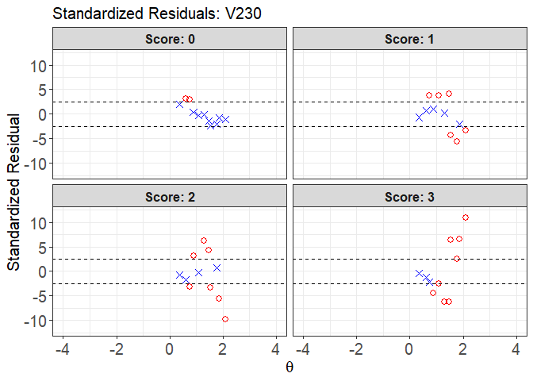

irtQ
================

<!-- README.md is generated from README.Rmd. Please edit that file -->

The goal of `irtQ` is to fit unidimensional item response theory (IRT)
models to mixture of dichotomous and polytomous data, calibrate online
item parameters (i.e., pretest and operational items), estimate
examinees abilities, and examine the IRT model-data fit on item-level in
different ways as well as provide useful functions related to IRT
analyses.

For the item parameter estimation, the marginal maximum likelihood
estimation with expectation-maximization (MMLE-EM) algorithm (Bock &
Aitkin, 1981) is used. For the online calibration, the fixed item
parameter calibration (FIPC) method (e.g., Kim, 2006) and the fixed
ability parameter calibration (FAPC) method (Ban, Hanson, Wang, Yi, &
Harris, 2001; stocking, 1988), often called Stocking’s Method A, are
provided. For the ability estimation, several popular scoring methods
(e.g., MLE, EAP, and MAP) are implemented. In terms of assessing the IRT
model-data fit, one of distinguished features of this package is that it
gives not only item fit statistics (e.g., chi-square fit statistic (X2;
e.g., Bock, 1960; Yen, 1981), likelihood ratio chi-square fit statistic
(G2; McKinley & Mills, 1985), infit and outfit statistics (Ames et al.,
2015), and S-X2 (Orlando & Thissen, 2000, 2003)) but also graphical
displays to look at residuals between the observed data and model-based
predictions (Hambleton, Swaminathan, & Rogers, 1991).

In addition, there are many useful functions such as analyzing
differential item functioning (DIF), computing asymptotic
variance-covariance matrices of item parameter estimates, importing item
and/or ability parameters from popular IRT software, running flexMIRT
(Cai, 2017) through R, generating simulated data, computing the
conditional distribution of observed scores using the Lord-Wingersky
recursion formula, computing item and test information functions,
computing item and test characteristic curve functions, and plotting
item and test characteristic curves and item and test information
functions.

## Installation

You can install the released version of irtplay from
[CRAN](https://CRAN.R-project.org) with:

``` r
install.packages("irtQ")
```

## 1. Online item calibration with the fixed item parameter calibration (FIPC) method (e.g., Kim, 2006)

The fixed item parameter calibration (FIPC) is one of useful online item
calibration methods for computerized adaptive testing (CAT) to put the
parameter estimates of pretest items on the same scale of operational
item parameter estimates without post hoc linking/scaling (Ban, Hanson,
Wang, Yi, & Harris, 2001; Chen & Wang, 2016). In FIPC, the operational
item parameters are fixed to estimate the characteristic of the
underlying latent variable prior distribution when calibrating the
pretest items. More specifically, the underlying latent variable prior
distribution of the operational items is estimated during the
calibration of the pretest items to put the item parameters of the
pretest items on the scale of the operational item parameters (Kim,
2006). In `irtQ` package, FIPC is implemented with two main steps:

1.  Prepare a response data set and the item metadata of the fixed (or
    operational) items.
2.  Implement FIPC to estimate the item parameters of pretest items
    using the `est_irt()` function.

### (1) Preparing a data set

To run the `est_irt()` function, it requires two data sets:

1.  Item metadata set (i.e., model, score category, and item parameters.
    see the desciption of the argument `x` in the function `est_irt`).
2.  Examinees’ response data set for the items. It should be a matrix
    format where a row and column indicate the examinees and the items,
    respectively. The order of the columns in the response data set must
    be exactly the same as the order of rows of the item metadata.

### (2) Estimating the pretest item parameters

When FIPC is implemented in `est_irt()` function, the pretest item
parameters are estimated by fixing the operational item parameters. To
estimate the item parameters, you need to provide the item metadata in
the argument `x` and the response data in the argument `data`.

It is worthwhile to explain about how to prepare the item metadata set
in the argument `x`. A specific form of a data frame should be used for
the argument `x`. The first column should have item IDs, the second
column should contain the number of score categories of the items, and
the third column should include IRT models. The available IRT models are
“1PLM”, “2PLM”, “3PLM”, and “DRM” for dichotomous items, and “GRM” and
“GPCM” for polytomous items. Note that “DRM” covers all dichotomous IRT
models (i.e, “1PLM”, “2PLM”, and “3PLM”) and “GRM” and “GPCM” represent
the graded response model and (generalized) partial credit model,
respectively. From the fourth column, item parameters should be
included. For dichotomous items, the fourth, fifth, and sixth columns
represent the item discrimination (or slope), item difficulty, and item
guessing parameters, respectively. When “1PLM” or “2PLM” is specified
for any items in the third column, NAs should be inserted for the item
guessing parameters. For polytomous items, the item discrimination (or
slope) parameters should be contained in the fourth column and the item
threshold (or step) parameters should be included from the fifth to the
last columns. When the number of categories differs between items, the
empty cells of item parameters should be filled with NAs. See `est_irt`
for more details about the item metadata.

Also, you should specify in the argument `fipc = TRUE` and a specific
FIPC method in the argument `fipc.method`. Finally, you should provide a
vector of the location of the items to be fixed in the argument
`fix.loc`. For more details about implementing FIPC, see the description
of the `est_irt()` function.

When implementing FIPC, you can estimate both the emprical histogram and
the scale of latent variable prior distribution by setting
`EmpHist = TRUE`. If `EmpHist = FALSE`, the normal prior distribution is
used during the item parameter estimation and the scale of the normal
prior distribution is updated during the EM cycle.

If necessary, you need to specify whether prior distributions of item
slope and guessing parameters (only for the IRT 3PL model) are used in
the arguments of `use.aprior` and `use.gprior`, respectively. If you
decide to use the prior distributions, you should specify what
distributions will be used for the prior distributions in the arguments
of `aprior` and `gprior`, respectively. Currently three probability
distributions of Beta, Log-normal, and Normal distributions are
available.

In addition, if the response data include missing values, you must
indicate the missing value in argument `missing`.

Once the `est_irt()` function has been implemented, you’ll get a list of
several internal objects such as the item parameter estimates, standard
error of the parameter estimates.

## 2. Online item calibration with the fixed ability parameter calibration method (e.g., Stocking, 1988)

In CAT, the fixed ability parameter calibration (FAPC), often called
Stocking’s Method A, is the relatively simplest and most straightforward
online calibration method, which is the maximum likelihood estimation of
the item parameters given the proficiency estimates. In CAT, FAPC can be
used to put the parameter estimates of pretest items on the same scale
of operational item parameter estimates and recalibrate the operational
items to evaluate the parameter drifts of the operational items (Chen &
Wang, 2016; Stocking, 1988). Also, FAPC is known to result in accurate,
unbiased item parameters calibration when items are randomly rather than
adaptively administered to examinees, which occurs most commonly with
pretest items (Ban et al., 2001; Chen & Wang, 2016). Using `irtQ`
package, the FAPC is implemented to calibrate the items with two main
steps:

1.  Prepare a data set for the calibration of item parameters (i.e.,
    item response data and ability estimates).
2.  Implement the FAPC to estimate the item parameters using the
    `est_item()` function.

### (1) Preparing a data set

To run the `est_item()` function, it requires two data sets:

1.  Examinees’ ability (or proficiency) estimates. It should be in the
    format of a numeric vector.
2.  Examinees’ response data set for the items. It should be in the
    format of matrix where a row and column indicate the examinees and
    the items, respectively. The order of the examinees in the response
    data set must be exactly the same as that of the examinees’ ability
    estimates.

### (2) Estimating the pretest item parameters

The `est_item()` function estimates the pretest item parameters given
the proficiency estimates. To estimate the item parameters, you need to
provide the response data in the argument `data` and the ability
estimates in the argument `score`.

Also, you should provide a string vector of the IRT models in the
argument `model` to indicate what IRT model is used to calibrate each
item. Available IRT models are “1PLM”, “2PLM”, “3PLM”, and “DRM” for
dichotomous items, and “GRM” and “GPCM” for polytomous items. “GRM” and
“GPCM” represent the graded response model and (generalized) partial
credit model, respectively. Note that “DRM” is considered as “3PLM” in
this function. If a single character of the IRT model is specified, that
model will be recycled across all items.

The `est_item()` function requires a vector of the number of score
categories for the items in the argument `cats`. For example, a
dichotomous item has two score categories. If a single numeric value is
specified, that value will be recycled across all items. If NULL and all
items are binary items (i.e., dichotomous items), it assumes that all
items have two score categories.

If necessary, you need to specify whether prior distributions of item
slope and guessing parameters (only for the IRT 3PL model) are used in
the arguments of `use.aprior` and `use.gprior`, respectively. If you
decide to use the prior distributions, you should specify what
distributions will be used for the prior distributions in the arguments
of `aprior` and `gprior`, respectively. Currently three probability
distributions of Beta, Log-normal, and Normal distributions are
available.

In addition, if the response data include missing values, you must
indicate the missing value in argument `missing`.

Once the `est_item` function has been implemented, you’ll get a list of
several internal objects such as the item parameter estimates, standard
error of the parameter estimates.

## 3. The process of evaluating the IRT model-data fit

One way to assess goodness of IRT model-data fit is through an item fit
analysis by examining the traditional item fit statistics and looking at
the discrepancy between the observed data and model-based predictions.
Using `irtQ` package, the traditional approach of evaluating the IRT
model-data fit on item-level can be implemented with three main steps:

1.  Prepare a data set for the IRT item fit analysis (i.e., item
    metadata, ability estimates, and response data).
2.  Obtain the IRT fit statistics such as the X2, G2, infit, and outfit
    statistics using the `irtfit()` function.
3.  Based on the results of IRT model fit analysis (i.e., an object of
    class `irtfit`) obtained in step 2, draw the IRT residual plots
    (i.e., raw residual and standardized residual plots) using `plot`
    method.

### (1) Preparing a data set

Before conducting the IRT model fit analysis, it is necessary to prepare
a data set. To run the `irtfit()` function, it requires three data sets:

1.  Item metadata including the item ID, number of score categories, IRT
    models, and item parameters. The item metadata should be in the
    format of data frame. You can prepare the data either by using the
    `shape_df()` function or by creating a data frame of the item
    metadata by yourself. If you have output files of item parameter
    estimates obtained from one of the IRT software such as BILOG-MG 3,
    PARSCALE 4, flexMIRT, and mirt (R package), the item metadata can be
    easily obtained using the functions of `bring.bilog()`,
    `bring.parscale()`, `bring.flexmirt()`, `bring.mirt()`. See the
    functions of `irtfit()`, `test.info()`, or `simdat()` for more
    details about the item metadata format.
2.  Examinees’ ability (or proficiency) estimates. It should be in the
    format of a numeric vector.
3.  Examinees’ response data set for the items. It should be in the
    format of matrix where a row and column indicate the examinees and
    the items, respectively. The order of the examinees in the response
    data set must be exactly the same as that of the examinees’ ability
    estimates. The order of the items in the response data set must be
    exactly the same as that of the items in the item metadata.

### (2) Computing the IRT model-data fit statistics

The `irtfit()` function computes the traditional IRT item fit statistics
such as X2, G2, infit, and outfit statistics. To calculate the X2 and G2
statistics, two methods are available to divide the ability scale into
several groups. The two methods are “equal.width” for dividing the scale
by an equal length of the interval and “equal.freq” for dividing the
scale by an equal frequency of examinees. Also, you need to specify the
location of ability point at each group (or interval) where the expected
probabilities of score categories are calculated from the IRT models.
Available locations are “average” for computing the expected probability
at the average point of examinees’ ability estimates in each group and
“middle” for computing the expected probability at the midpoint of each
group.

To use the `irtfit()` function, you need to insert the item metadata in
the argument `x`, the ability estimates in the argument `score`, and the
response data in the argument `data`. If you want to divide the ability
scale into other than ten groups, you need to specify the number of
groups in the argument `n.width`. In addition, if the response data
include missing values, you must indicate the missing value in argument
`missing`.

Once the `irtfit()` function has been implemented, you’ll get the fit
statistic results and the contingency tables for every item used to
calculate the X2 and G2 fit statistics.

### (3) Drawing the IRT residual plots

Using the saved object of class `irtfit`, you can use the `plot` method
to evaluate the IRT raw residual and standardized residual plots.

Because the `plot` method can draw the residual plots for an item at a
time, you have to indicate which item will be examined. For this, you
can specify an integer value, which is the location of the studied item,
in the argument `item.loc`.

In terms of the raw residual plot, the argument `ci.method` is used to
select a method to estimate the confidence intervals among four methods.
Those methods are “wald” for the Wald interval, which is based on the
normal approximation (Laplace, 1812), “cp” for Clopper-Pearson interval
(Clopper & Pearson, 1934), “wilson” for Wilson score interval (Wilson,
1927), and “wilson.cr” for Wilson score interval with continuity
correction (Newcombe, 1998).

## 3. Examples of implementing online calibration and evaluating the IRT model-data fit

``` r

library("irtQ")

##----------------------------------------------------------------------------
# 1. The example code below shows how to prepare
# the data sets and how to implement the fixed
# item parameter calibration (FIPC):
##----------------------------------------------------------------------------

## Step 1: prepare a data set In this example, we
## generated examinees' true proficiency
## parameters and simulated the item response
## data using the function 'simdat'.

## import the '-prm.txt' output file from
## flexMIRT
flex_sam <- system.file("extdata", "flexmirt_sample-prm.txt",
  package = "irtQ")

# select the item metadata
x <- bring.flexmirt(file = flex_sam, "par")$Group1$full_df

# generate 1,000 examinees' latent abilities from
# N(0.4, 1.3)
set.seed(20)
score <- rnorm(1000, mean = 0.4, sd = 1.3)

# simulate the response data
sim.dat <- simdat(x = x, theta = score, D = 1)

## Step 2: Estimate the item parameters fit the
## 3PL model to all dichotmous items, fit the GRM
## model to all polytomous data, fix the five 3PL
## items (1st - 5th items) and three GRM items
## (53th to 55th items) also, estimate the
## empirical histogram of latent variable
fix.loc <- c(1:5, 53:55)
(mod.fix1 <- est_irt(x = x, data = sim.dat, D = 1,
  use.gprior = TRUE, gprior = list(dist = "beta",
    params = c(5, 16)), EmpHist = TRUE, Etol = 0.001,
  fipc = TRUE, fipc.method = "MEM", fix.loc = fix.loc,
  verbose = FALSE))
#> 
#> Call:
#> est_irt(x = x, data = sim.dat, D = 1, use.gprior = TRUE, gprior = list(dist = "beta", 
#>     params = c(5, 16)), EmpHist = TRUE, Etol = 0.001, fipc = TRUE, 
#>     fipc.method = "MEM", fix.loc = fix.loc, verbose = FALSE)
#> 
#> Item parameter estimation using MMLE-EM. 
#> 36 E-step cycles were completed using 49 quadrature points.
#> First-order test: Convergence criteria are satisfied.
#> Second-order test: Solution is a possible local maximum.
#> Computation of variance-covariance matrix: 
#>   Variance-covariance matrix of item parameter estimates is obtainable.
#> 
#> Log-likelihood: -31049.92
summary(mod.fix1)
#> 
#> Call:
#> est_irt(x = x, data = sim.dat, D = 1, use.gprior = TRUE, gprior = list(dist = "beta", 
#>     params = c(5, 16)), EmpHist = TRUE, Etol = 0.001, fipc = TRUE, 
#>     fipc.method = "MEM", fix.loc = fix.loc, verbose = FALSE)
#> 
#> Summary of the Data 
#>  Number of Items: 55
#>  Number of Cases: 1000
#> 
#> Summary of Estimation Process 
#>  Maximum number of EM cycles: 500
#>  Convergence criterion of E-step: 0.001
#>  Number of rectangular quadrature points: 49
#>  Minimum & Maximum quadrature points: -6, 6
#>  Number of free parameters: 147
#>  Number of fixed items: 8
#>  Number of E-step cycles completed: 36
#>  Maximum parameter change: 0.0009203792
#> 
#> Processing time (in seconds) 
#>  EM algorithm: 4.73
#>  Standard error computation: 2.65
#>  Total computation: 7.89
#> 
#> Convergence and Stability of Solution 
#>  First-order test: Convergence criteria are satisfied.
#>  Second-order test: Solution is a possible local maximum.
#>  Computation of variance-covariance matrix: 
#>   Variance-covariance matrix of item parameter estimates is obtainable.
#> 
#> Summary of Estimation Results 
#>  -2loglikelihood: 62099.84
#>  Akaike Information Criterion (AIC): 62393.84
#>  Bayesian Information Criterion (BIC): 63115.28
#>  Item Parameters: 
#>        id  cats  model  par.1  se.1  par.2  se.2  par.3  se.3  par.4  se.4
#> 1    CMC1     2   3PLM   0.76    NA   1.46    NA   0.26    NA     NA    NA
#> 2    CMC2     2   3PLM   1.92    NA  -1.05    NA   0.18    NA     NA    NA
#> 3    CMC3     2   3PLM   0.93    NA   0.39    NA   0.10    NA     NA    NA
#> 4    CMC4     2   3PLM   1.05    NA  -0.41    NA   0.20    NA     NA    NA
#> 5    CMC5     2   3PLM   0.87    NA  -0.12    NA   0.16    NA     NA    NA
#> 6    CMC6     2   3PLM   1.47  0.15   0.61  0.09   0.07  0.03     NA    NA
#> 7    CMC7     2   3PLM   1.45  0.25   1.23  0.14   0.24  0.04     NA    NA
#> 8    CMC8     2   3PLM   0.80  0.11   0.82  0.21   0.12  0.05     NA    NA
#> 9    CMC9     2   3PLM   0.81  0.13   0.63  0.28   0.20  0.07     NA    NA
#> 10  CMC10     2   3PLM   1.55  0.21   0.16  0.14   0.18  0.05     NA    NA
#> 11  CMC11     2   3PLM   0.99  0.17  -0.01  0.33   0.32  0.08     NA    NA
#> 12  CMC12     2   3PLM   0.86  0.13   1.30  0.18   0.11  0.04     NA    NA
#> 13  CMC13     2   3PLM   1.48  0.26   1.61  0.12   0.18  0.03     NA    NA
#> 14  CMC14     2   3PLM   1.53  0.21   0.25  0.16   0.27  0.05     NA    NA
#> 15  CMC15     2   3PLM   1.53  0.18  -0.11  0.13   0.14  0.05     NA    NA
#> 16  CMC16     2   3PLM   2.16  0.22   0.02  0.07   0.08  0.03     NA    NA
#> 17  CMC17     2   3PLM   1.39  0.19   0.03  0.17   0.20  0.06     NA    NA
#> 18  CMC18     2   3PLM   1.36  0.27   1.34  0.16   0.27  0.04     NA    NA
#> 19  CMC19     2   3PLM   2.48  0.37  -0.94  0.12   0.19  0.06     NA    NA
#> 20  CMC20     2   3PLM   1.80  0.37  -1.21  0.26   0.40  0.10     NA    NA
#> 21  CMC21     2   3PLM   1.76  0.22  -0.98  0.17   0.21  0.07     NA    NA
#> 22  CMC22     2   3PLM   0.94  0.13  -0.51  0.27   0.19  0.08     NA    NA
#> 23  CMC23     2   3PLM   0.83  0.10  -0.37  0.23   0.13  0.06     NA    NA
#> 24  CMC24     2   3PLM   0.98  0.21   1.86  0.20   0.22  0.04     NA    NA
#> 25  CMC25     2   3PLM   0.63  0.09  -2.01  0.47   0.21  0.09     NA    NA
#> 26  CMC26     2   3PLM   1.13  0.14  -1.68  0.28   0.22  0.09     NA    NA
#> 27  CMC27     2   3PLM   1.19  0.14   0.01  0.16   0.14  0.05     NA    NA
#> 28  CMC28     2   3PLM   2.23  0.26  -0.13  0.09   0.15  0.04     NA    NA
#> 29  CMC29     2   3PLM   1.31  0.16  -1.32  0.22   0.19  0.08     NA    NA
#> 30  CMC30     2   3PLM   1.63  0.30   1.03  0.15   0.37  0.04     NA    NA
#> 31  CMC31     2   3PLM   1.03  0.15   0.93  0.17   0.15  0.05     NA    NA
#> 32  CMC32     2   3PLM   1.55  0.21  -0.75  0.20   0.26  0.08     NA    NA
#> 33  CMC33     2   3PLM   1.24  0.19  -1.09  0.30   0.31  0.10     NA    NA
#> 34  CMC34     2   3PLM   1.34  0.16   0.31  0.15   0.17  0.05     NA    NA
#> 35  CMC35     2   3PLM   1.24  0.15  -0.36  0.20   0.19  0.07     NA    NA
#> 36  CMC36     2   3PLM   1.06  0.17   1.05  0.17   0.15  0.05     NA    NA
#> 37  CMC37     2   3PLM   2.11  0.26  -0.29  0.11   0.16  0.05     NA    NA
#> 38  CMC38     2   3PLM   0.57  0.11  -0.30  0.55   0.26  0.10     NA    NA
#> 39   CFR1     5    GRM   2.09  0.13  -1.81  0.10  -1.14  0.07  -0.68  0.06
#> 40   CFR2     5    GRM   1.38  0.08  -0.70  0.08  -0.08  0.07   0.48  0.06
#> 41   AMC1     2   3PLM   1.25  0.18   0.62  0.16   0.18  0.05     NA    NA
#> 42   AMC2     2   3PLM   1.79  0.22  -1.61  0.18   0.17  0.07     NA    NA
#> 43   AMC3     2   3PLM   1.37  0.17   0.64  0.12   0.12  0.04     NA    NA
#> 44   AMC4     2   3PLM   0.94  0.11  -0.22  0.23   0.16  0.06     NA    NA
#> 45   AMC5     2   3PLM   1.11  0.33   2.83  0.26   0.21  0.03     NA    NA
#> 46   AMC6     2   3PLM   2.22  0.37   1.70  0.09   0.19  0.02     NA    NA
#> 47   AMC7     2   3PLM   1.16  0.13   0.02  0.14   0.10  0.04     NA    NA
#> 48   AMC8     2   3PLM   1.31  0.16   0.33  0.15   0.18  0.05     NA    NA
#> 49   AMC9     2   3PLM   1.22  0.13   0.30  0.12   0.09  0.04     NA    NA
#> 50  AMC10     2   3PLM   1.83  0.28   1.48  0.09   0.15  0.03     NA    NA
#> 51  AMC11     2   3PLM   1.68  0.22  -1.08  0.17   0.19  0.07     NA    NA
#> 52  AMC12     2   3PLM   0.91  0.13  -0.82  0.35   0.26  0.09     NA    NA
#> 53   AFR1     5    GRM   1.14    NA  -0.37    NA   0.22    NA   0.85    NA
#> 54   AFR2     5    GRM   1.23    NA  -2.08    NA  -1.35    NA  -0.71    NA
#> 55   AFR3     5    GRM   0.88    NA  -0.76    NA  -0.01    NA   0.67    NA
#>     par.5  se.5
#> 1      NA    NA
#> 2      NA    NA
#> 3      NA    NA
#> 4      NA    NA
#> 5      NA    NA
#> 6      NA    NA
#> 7      NA    NA
#> 8      NA    NA
#> 9      NA    NA
#> 10     NA    NA
#> 11     NA    NA
#> 12     NA    NA
#> 13     NA    NA
#> 14     NA    NA
#> 15     NA    NA
#> 16     NA    NA
#> 17     NA    NA
#> 18     NA    NA
#> 19     NA    NA
#> 20     NA    NA
#> 21     NA    NA
#> 22     NA    NA
#> 23     NA    NA
#> 24     NA    NA
#> 25     NA    NA
#> 26     NA    NA
#> 27     NA    NA
#> 28     NA    NA
#> 29     NA    NA
#> 30     NA    NA
#> 31     NA    NA
#> 32     NA    NA
#> 33     NA    NA
#> 34     NA    NA
#> 35     NA    NA
#> 36     NA    NA
#> 37     NA    NA
#> 38     NA    NA
#> 39  -0.24  0.05
#> 40   1.05  0.07
#> 41     NA    NA
#> 42     NA    NA
#> 43     NA    NA
#> 44     NA    NA
#> 45     NA    NA
#> 46     NA    NA
#> 47     NA    NA
#> 48     NA    NA
#> 49     NA    NA
#> 50     NA    NA
#> 51     NA    NA
#> 52     NA    NA
#> 53   1.38    NA
#> 54  -0.12    NA
#> 55   1.25    NA
#>  Group Parameters: 
#>              mu  sigma2  sigma
#> estimates  0.40    1.88   1.37
#> se         0.04    0.08   0.03

# plot the estimated empirical histogram of
# latent variable prior distribution
(emphist <- getirt(mod.fix1, what = "weights"))
#>    theta       weight
#> 1  -6.00 2.301252e-10
#> 2  -5.75 1.434596e-09
#> 3  -5.50 8.649282e-09
#> 4  -5.25 5.019868e-08
#> 5  -5.00 2.782912e-07
#> 6  -4.75 1.456751e-06
#> 7  -4.50 7.085630e-06
#> 8  -4.25 3.134808e-05
#> 9  -4.00 1.227012e-04
#> 10 -3.75 4.100603e-04
#> 11 -3.50 1.119742e-03
#> 12 -3.25 2.386354e-03
#> 13 -3.00 3.889322e-03
#> 14 -2.75 5.167720e-03
#> 15 -2.50 6.767224e-03
#> 16 -2.25 1.053445e-02
#> 17 -2.00 1.742567e-02
#> 18 -1.75 2.236173e-02
#> 19 -1.50 2.498735e-02
#> 20 -1.25 3.374293e-02
#> 21 -1.00 4.224442e-02
#> 22 -0.75 4.948939e-02
#> 23 -0.50 7.710828e-02
#> 24 -0.25 8.024288e-02
#> 25  0.00 4.752956e-02
#> 26  0.25 5.636581e-02
#> 27  0.50 8.674316e-02
#> 28  0.75 6.936382e-02
#> 29  1.00 6.035964e-02
#> 30  1.25 6.234864e-02
#> 31  1.50 5.768393e-02
#> 32  1.75 4.254008e-02
#> 33  2.00 3.148380e-02
#> 34  2.25 3.111071e-02
#> 35  2.50 2.935626e-02
#> 36  2.75 1.950494e-02
#> 37  3.00 1.019680e-02
#> 38  3.25 5.154557e-03
#> 39  3.50 2.816466e-03
#> 40  3.75 1.753617e-03
#> 41  4.00 1.282170e-03
#> 42  4.25 1.097172e-03
#> 43  4.50 1.050444e-03
#> 44  4.75 1.046478e-03
#> 45  5.00 1.004637e-03
#> 46  5.25 8.721994e-04
#> 47  5.50 6.557355e-04
#> 48  5.75 4.168380e-04
#> 49  6.00 2.220842e-04
plot(emphist$weight ~ emphist$theta, xlab = "Theta",
  ylab = "Density", type = "h")
```


``` r


##----------------------------------------------------------------------------
# 2. The example code below shows how to prepare
# the data sets and how to estimate the item
# parameters using the FAPC:
##----------------------------------------------------------------------------

## Step 1: prepare a data set In this example, we
## generated examinees' true proficiency
## parameters and simulated the item response
## data using the function 'simdat'. Because the
## true proficiency parameters are not known in
## reality, the true proficiencies would be
## replaced with the proficiency estimates for
## the calibration.

# import the '-prm.txt' output file from flexMIRT
flex_sam <- system.file("extdata", "flexmirt_sample-prm.txt",
  package = "irtQ")

# select the item metadata
x <- bring.flexmirt(file = flex_sam, "par")$Group1$full_df

# modify the item metadata so that some items
# follow 1PLM, 2PLM and GPCM
x[c(1:3, 5), 3] <- "1PLM"
x[c(1:3, 5), 4] <- 1
x[c(1:3, 5), 6] <- 0
x[c(4, 8:12), 3] <- "2PLM"
x[c(4, 8:12), 6] <- 0
x[54:55, 3] <- "GPCM"

# generate examinees' abilities from N(0, 1)
set.seed(23)
score <- rnorm(500, mean = 0, sd = 1)

# simulate the response data
data <- simdat(x = x, theta = score, D = 1)

## Step 2: Estimate the item parameters 1) item
## parameter estimation: constrain the slope
## parameters of the 1PLM to be equal
(mod1 <- est_item(x, data, score, D = 1, fix.a.1pl = FALSE,
  use.gprior = TRUE, gprior = list(dist = "beta",
    params = c(5, 17)), use.startval = FALSE))
#> Starting... 
#> Parsing input... 
#> Estimating item parameters... 
#> Estimation is finished.
#> 
#> Call:
#> est_item(x = x, data = data, score = score, D = 1, fix.a.1pl = FALSE, 
#>     use.gprior = TRUE, gprior = list(dist = "beta", params = c(5, 
#>         17)), use.startval = FALSE)
#> 
#> Fixed ability parameter calibration (Stocking's Method A). 
#> All item parameters were successfully converged. 
#> 
#> Log-likelihood: -15830.66
summary(mod1)
#> 
#> Call:
#> est_item(x = x, data = data, score = score, D = 1, fix.a.1pl = FALSE, 
#>     use.gprior = TRUE, gprior = list(dist = "beta", params = c(5, 
#>         17)), use.startval = FALSE)
#> 
#> Summary of the Data 
#>  Number of Items in Response Data: 55
#>  Number of Excluded Items: 0
#>  Number of free parameters: 162
#>  Number of Responses for Each Item: 
#>        id    n
#> 1    CMC1  500
#> 2    CMC2  500
#> 3    CMC3  500
#> 4    CMC4  500
#> 5    CMC5  500
#> 6    CMC6  500
#> 7    CMC7  500
#> 8    CMC8  500
#> 9    CMC9  500
#> 10  CMC10  500
#> 11  CMC11  500
#> 12  CMC12  500
#> 13  CMC13  500
#> 14  CMC14  500
#> 15  CMC15  500
#> 16  CMC16  500
#> 17  CMC17  500
#> 18  CMC18  500
#> 19  CMC19  500
#> 20  CMC20  500
#> 21  CMC21  500
#> 22  CMC22  500
#> 23  CMC23  500
#> 24  CMC24  500
#> 25  CMC25  500
#> 26  CMC26  500
#> 27  CMC27  500
#> 28  CMC28  500
#> 29  CMC29  500
#> 30  CMC30  500
#> 31  CMC31  500
#> 32  CMC32  500
#> 33  CMC33  500
#> 34  CMC34  500
#> 35  CMC35  500
#> 36  CMC36  500
#> 37  CMC37  500
#> 38  CMC38  500
#> 39   CFR1  500
#> 40   CFR2  500
#> 41   AMC1  500
#> 42   AMC2  500
#> 43   AMC3  500
#> 44   AMC4  500
#> 45   AMC5  500
#> 46   AMC6  500
#> 47   AMC7  500
#> 48   AMC8  500
#> 49   AMC9  500
#> 50  AMC10  500
#> 51  AMC11  500
#> 52  AMC12  500
#> 53   AFR1  500
#> 54   AFR2  500
#> 55   AFR3  500
#> 
#> Processing time (in seconds) 
#>  Total computation: 1.42
#> 
#> Convergence of Solution 
#>  All item parameters were successfully converged.
#> 
#> Summary of Estimation Results 
#>  -2loglikelihood: 31661.31
#>  Item Parameters: 
#>        id  cats  model  par.1  se.1  par.2  se.2  par.3  se.3  par.4  se.4
#> 1    CMC1     2   1PLM   1.02  0.06   1.60  0.13     NA    NA     NA    NA
#> 2    CMC2     2   1PLM   1.02    NA  -1.06  0.12     NA    NA     NA    NA
#> 3    CMC3     2   1PLM   1.02    NA   0.40  0.10     NA    NA     NA    NA
#> 4    CMC4     2   2PLM   1.02    NA  -0.25  0.10     NA    NA     NA    NA
#> 5    CMC5     2   1PLM   0.96  0.12  -0.43  0.11     NA    NA     NA    NA
#> 6    CMC6     2   3PLM   1.88  0.27   0.67  0.09   0.10  0.03     NA    NA
#> 7    CMC7     2   3PLM   0.88  0.17   1.03  0.23   0.13  0.05     NA    NA
#> 8    CMC8     2   2PLM   0.92  0.12   0.87  0.13     NA    NA     NA    NA
#> 9    CMC9     2   2PLM   1.00  0.12   0.89  0.13     NA    NA     NA    NA
#> 10  CMC10     2   2PLM   1.61  0.15   0.09  0.07     NA    NA     NA    NA
#> 11  CMC11     2   2PLM   1.07  0.12  -0.37  0.10     NA    NA     NA    NA
#> 12  CMC12     2   2PLM   0.94  0.12   1.10  0.15     NA    NA     NA    NA
#> 13  CMC13     2   3PLM   1.35  0.34   1.31  0.17   0.17  0.04     NA    NA
#> 14  CMC14     2   3PLM   1.36  0.31   0.15  0.24   0.24  0.08     NA    NA
#> 15  CMC15     2   3PLM   1.53  0.27   0.01  0.17   0.20  0.07     NA    NA
#> 16  CMC16     2   3PLM   2.10  0.25   0.04  0.08   0.10  0.04     NA    NA
#> 17  CMC17     2   3PLM   1.02  0.15  -0.41  0.22   0.16  0.07     NA    NA
#> 18  CMC18     2   3PLM   1.27  0.38   1.42  0.20   0.22  0.05     NA    NA
#> 19  CMC19     2   3PLM   2.25  0.32  -1.11  0.14   0.17  0.07     NA    NA
#> 20  CMC20     2   3PLM   1.47  0.22  -1.74  0.22   0.18  0.08     NA    NA
#> 21  CMC21     2   3PLM   1.38  0.21  -1.25  0.23   0.20  0.08     NA    NA
#> 22  CMC22     2   3PLM   0.92  0.16  -0.55  0.28   0.19  0.08     NA    NA
#> 23  CMC23     2   3PLM   1.10  0.22  -0.12  0.27   0.22  0.09     NA    NA
#> 24  CMC24     2   3PLM   1.21  0.34   1.43  0.21   0.22  0.05     NA    NA
#> 25  CMC25     2   3PLM   0.83  0.16  -1.51  0.40   0.21  0.09     NA    NA
#> 26  CMC26     2   3PLM   1.07  0.18  -2.16  0.35   0.19  0.08     NA    NA
#> 27  CMC27     2   3PLM   1.18  0.18   0.09  0.17   0.14  0.06     NA    NA
#> 28  CMC28     2   3PLM   2.19  0.31  -0.17  0.11   0.19  0.05     NA    NA
#> 29  CMC29     2   3PLM   2.48  0.54  -0.81  0.20   0.38  0.09     NA    NA
#> 30  CMC30     2   3PLM   1.88  0.45   0.69  0.15   0.34  0.05     NA    NA
#> 31  CMC31     2   3PLM   0.70  0.16   1.00  0.32   0.16  0.07     NA    NA
#> 32  CMC32     2   3PLM   1.73  0.30  -0.78  0.21   0.26  0.09     NA    NA
#> 33  CMC33     2   3PLM   1.07  0.17  -1.45  0.28   0.19  0.08     NA    NA
#> 34  CMC34     2   3PLM   1.04  0.17   0.21  0.20   0.16  0.06     NA    NA
#> 35  CMC35     2   3PLM   1.36  0.19  -0.45  0.17   0.16  0.06     NA    NA
#> 36  CMC36     2   3PLM   0.88  0.17   0.97  0.23   0.14  0.05     NA    NA
#> 37  CMC37     2   3PLM   2.13  0.26  -0.25  0.09   0.13  0.05     NA    NA
#> 38  CMC38     2   3PLM   0.87  0.17  -0.31  0.32   0.20  0.09     NA    NA
#> 39   CFR1     5    GRM   2.00  0.14  -1.88  0.12  -1.25  0.08  -0.70  0.06
#> 40   CFR2     5    GRM   1.39  0.11  -0.80  0.09  -0.13  0.07   0.60  0.08
#> 41   AMC1     2   3PLM   1.81  0.39   0.74  0.14   0.28  0.05     NA    NA
#> 42   AMC2     2   3PLM   1.70  0.25  -1.59  0.20   0.19  0.08     NA    NA
#> 43   AMC3     2   3PLM   1.30  0.25   0.68  0.16   0.16  0.05     NA    NA
#> 44   AMC4     2   3PLM   0.94  0.17  -0.18  0.26   0.18  0.07     NA    NA
#> 45   AMC5     2   3PLM   1.69  0.65   2.11  0.26   0.19  0.03     NA    NA
#> 46   AMC6     2   3PLM   2.83  0.64   1.44  0.10   0.15  0.02     NA    NA
#> 47   AMC7     2   3PLM   1.69  0.41   0.37  0.18   0.25  0.07     NA    NA
#> 48   AMC8     2   3PLM   1.65  0.29   0.39  0.14   0.20  0.05     NA    NA
#> 49   AMC9     2   3PLM   1.55  0.26   0.49  0.13   0.15  0.05     NA    NA
#> 50  AMC10     2   3PLM   2.48  0.51   1.31  0.10   0.13  0.02     NA    NA
#> 51  AMC11     2   3PLM   1.73  0.23  -1.02  0.15   0.16  0.07     NA    NA
#> 52  AMC12     2   3PLM   0.95  0.20  -0.83  0.38   0.24  0.10     NA    NA
#> 53   AFR1     5    GRM   1.14  0.10  -0.30  0.09   0.30  0.09   0.92  0.11
#> 54   AFR2     5   GPCM   1.33  0.11  -1.99  0.21  -1.31  0.15  -0.72  0.12
#> 55   AFR3     5   GPCM   0.89  0.07  -0.80  0.15   0.15  0.15   0.46  0.16
#>     par.5  se.5
#> 1      NA    NA
#> 2      NA    NA
#> 3      NA    NA
#> 4      NA    NA
#> 5      NA    NA
#> 6      NA    NA
#> 7      NA    NA
#> 8      NA    NA
#> 9      NA    NA
#> 10     NA    NA
#> 11     NA    NA
#> 12     NA    NA
#> 13     NA    NA
#> 14     NA    NA
#> 15     NA    NA
#> 16     NA    NA
#> 17     NA    NA
#> 18     NA    NA
#> 19     NA    NA
#> 20     NA    NA
#> 21     NA    NA
#> 22     NA    NA
#> 23     NA    NA
#> 24     NA    NA
#> 25     NA    NA
#> 26     NA    NA
#> 27     NA    NA
#> 28     NA    NA
#> 29     NA    NA
#> 30     NA    NA
#> 31     NA    NA
#> 32     NA    NA
#> 33     NA    NA
#> 34     NA    NA
#> 35     NA    NA
#> 36     NA    NA
#> 37     NA    NA
#> 38     NA    NA
#> 39  -0.23  0.06
#> 40   1.09  0.10
#> 41     NA    NA
#> 42     NA    NA
#> 43     NA    NA
#> 44     NA    NA
#> 45     NA    NA
#> 46     NA    NA
#> 47     NA    NA
#> 48     NA    NA
#> 49     NA    NA
#> 50     NA    NA
#> 51     NA    NA
#> 52     NA    NA
#> 53   1.35  0.13
#> 54  -0.21  0.10
#> 55   1.35  0.19
#> 
#>  Group Parameters: 
#>    mu  sigma  
#>  0.03   1.02

# 2) item parameter estimation: fix the slope
# parameters of the 1PLM to 1
(mod2 <- est_item(x, data, score, D = 1, fix.a.1pl = TRUE,
  a.val.1pl = 1, use.gprior = TRUE, gprior = list(dist = "beta",
    params = c(5, 17)), use.startval = FALSE))
#> Starting... 
#> Parsing input... 
#> Estimating item parameters... 
#> Estimation is finished.
#> 
#> Call:
#> est_item(x = x, data = data, score = score, D = 1, fix.a.1pl = TRUE, 
#>     a.val.1pl = 1, use.gprior = TRUE, gprior = list(dist = "beta", 
#>         params = c(5, 17)), use.startval = FALSE)
#> 
#> Fixed ability parameter calibration (Stocking's Method A). 
#> All item parameters were successfully converged. 
#> 
#> Log-likelihood: -15830.7
summary(mod2)
#> 
#> Call:
#> est_item(x = x, data = data, score = score, D = 1, fix.a.1pl = TRUE, 
#>     a.val.1pl = 1, use.gprior = TRUE, gprior = list(dist = "beta", 
#>         params = c(5, 17)), use.startval = FALSE)
#> 
#> Summary of the Data 
#>  Number of Items in Response Data: 55
#>  Number of Excluded Items: 0
#>  Number of free parameters: 161
#>  Number of Responses for Each Item: 
#>        id    n
#> 1    CMC1  500
#> 2    CMC2  500
#> 3    CMC3  500
#> 4    CMC4  500
#> 5    CMC5  500
#> 6    CMC6  500
#> 7    CMC7  500
#> 8    CMC8  500
#> 9    CMC9  500
#> 10  CMC10  500
#> 11  CMC11  500
#> 12  CMC12  500
#> 13  CMC13  500
#> 14  CMC14  500
#> 15  CMC15  500
#> 16  CMC16  500
#> 17  CMC17  500
#> 18  CMC18  500
#> 19  CMC19  500
#> 20  CMC20  500
#> 21  CMC21  500
#> 22  CMC22  500
#> 23  CMC23  500
#> 24  CMC24  500
#> 25  CMC25  500
#> 26  CMC26  500
#> 27  CMC27  500
#> 28  CMC28  500
#> 29  CMC29  500
#> 30  CMC30  500
#> 31  CMC31  500
#> 32  CMC32  500
#> 33  CMC33  500
#> 34  CMC34  500
#> 35  CMC35  500
#> 36  CMC36  500
#> 37  CMC37  500
#> 38  CMC38  500
#> 39   CFR1  500
#> 40   CFR2  500
#> 41   AMC1  500
#> 42   AMC2  500
#> 43   AMC3  500
#> 44   AMC4  500
#> 45   AMC5  500
#> 46   AMC6  500
#> 47   AMC7  500
#> 48   AMC8  500
#> 49   AMC9  500
#> 50  AMC10  500
#> 51  AMC11  500
#> 52  AMC12  500
#> 53   AFR1  500
#> 54   AFR2  500
#> 55   AFR3  500
#> 
#> Processing time (in seconds) 
#>  Total computation: 1.25
#> 
#> Convergence of Solution 
#>  All item parameters were successfully converged.
#> 
#> Summary of Estimation Results 
#>  -2loglikelihood: 31661.4
#>  Item Parameters: 
#>        id  cats  model  par.1  se.1  par.2  se.2  par.3  se.3  par.4  se.4
#> 1    CMC1     2   1PLM   1.00    NA   1.62  0.12     NA    NA     NA    NA
#> 2    CMC2     2   1PLM   1.00    NA  -1.08  0.11     NA    NA     NA    NA
#> 3    CMC3     2   1PLM   1.00    NA   0.40  0.10     NA    NA     NA    NA
#> 4    CMC4     2   2PLM   0.96  0.12  -0.43  0.11     NA    NA     NA    NA
#> 5    CMC5     2   1PLM   1.00    NA  -0.25  0.10     NA    NA     NA    NA
#> 6    CMC6     2   3PLM   1.88  0.27   0.67  0.09   0.10  0.03     NA    NA
#> 7    CMC7     2   3PLM   0.88  0.17   1.03  0.23   0.13  0.05     NA    NA
#> 8    CMC8     2   2PLM   0.92  0.12   0.87  0.13     NA    NA     NA    NA
#> 9    CMC9     2   2PLM   1.00  0.12   0.89  0.13     NA    NA     NA    NA
#> 10  CMC10     2   2PLM   1.61  0.15   0.09  0.07     NA    NA     NA    NA
#> 11  CMC11     2   2PLM   1.07  0.12  -0.37  0.10     NA    NA     NA    NA
#> 12  CMC12     2   2PLM   0.94  0.12   1.10  0.15     NA    NA     NA    NA
#> 13  CMC13     2   3PLM   1.35  0.34   1.31  0.17   0.17  0.04     NA    NA
#> 14  CMC14     2   3PLM   1.36  0.31   0.15  0.24   0.24  0.08     NA    NA
#> 15  CMC15     2   3PLM   1.53  0.27   0.01  0.17   0.20  0.07     NA    NA
#> 16  CMC16     2   3PLM   2.10  0.25   0.04  0.08   0.10  0.04     NA    NA
#> 17  CMC17     2   3PLM   1.02  0.15  -0.41  0.22   0.16  0.07     NA    NA
#> 18  CMC18     2   3PLM   1.27  0.38   1.42  0.20   0.22  0.05     NA    NA
#> 19  CMC19     2   3PLM   2.25  0.32  -1.11  0.14   0.17  0.07     NA    NA
#> 20  CMC20     2   3PLM   1.47  0.22  -1.74  0.22   0.18  0.08     NA    NA
#> 21  CMC21     2   3PLM   1.38  0.21  -1.25  0.23   0.20  0.08     NA    NA
#> 22  CMC22     2   3PLM   0.92  0.16  -0.55  0.28   0.19  0.08     NA    NA
#> 23  CMC23     2   3PLM   1.10  0.22  -0.12  0.27   0.22  0.09     NA    NA
#> 24  CMC24     2   3PLM   1.21  0.34   1.43  0.21   0.22  0.05     NA    NA
#> 25  CMC25     2   3PLM   0.83  0.16  -1.51  0.40   0.21  0.09     NA    NA
#> 26  CMC26     2   3PLM   1.07  0.18  -2.16  0.35   0.19  0.08     NA    NA
#> 27  CMC27     2   3PLM   1.18  0.18   0.09  0.17   0.14  0.06     NA    NA
#> 28  CMC28     2   3PLM   2.19  0.31  -0.17  0.11   0.19  0.05     NA    NA
#> 29  CMC29     2   3PLM   2.48  0.54  -0.81  0.20   0.38  0.09     NA    NA
#> 30  CMC30     2   3PLM   1.88  0.45   0.69  0.15   0.34  0.05     NA    NA
#> 31  CMC31     2   3PLM   0.70  0.16   1.00  0.32   0.16  0.07     NA    NA
#> 32  CMC32     2   3PLM   1.73  0.30  -0.78  0.21   0.26  0.09     NA    NA
#> 33  CMC33     2   3PLM   1.07  0.17  -1.45  0.28   0.19  0.08     NA    NA
#> 34  CMC34     2   3PLM   1.04  0.17   0.21  0.20   0.16  0.06     NA    NA
#> 35  CMC35     2   3PLM   1.36  0.19  -0.45  0.17   0.16  0.06     NA    NA
#> 36  CMC36     2   3PLM   0.88  0.17   0.97  0.23   0.14  0.05     NA    NA
#> 37  CMC37     2   3PLM   2.13  0.26  -0.25  0.09   0.13  0.05     NA    NA
#> 38  CMC38     2   3PLM   0.87  0.17  -0.31  0.32   0.20  0.09     NA    NA
#> 39   CFR1     5    GRM   2.00  0.14  -1.88  0.12  -1.25  0.08  -0.70  0.06
#> 40   CFR2     5    GRM   1.39  0.11  -0.80  0.09  -0.13  0.07   0.60  0.08
#> 41   AMC1     2   3PLM   1.81  0.39   0.74  0.14   0.28  0.05     NA    NA
#> 42   AMC2     2   3PLM   1.70  0.25  -1.59  0.20   0.19  0.08     NA    NA
#> 43   AMC3     2   3PLM   1.30  0.25   0.68  0.16   0.16  0.05     NA    NA
#> 44   AMC4     2   3PLM   0.94  0.17  -0.18  0.26   0.18  0.07     NA    NA
#> 45   AMC5     2   3PLM   1.69  0.65   2.11  0.26   0.19  0.03     NA    NA
#> 46   AMC6     2   3PLM   2.83  0.64   1.44  0.10   0.15  0.02     NA    NA
#> 47   AMC7     2   3PLM   1.69  0.41   0.37  0.18   0.25  0.07     NA    NA
#> 48   AMC8     2   3PLM   1.65  0.29   0.39  0.14   0.20  0.05     NA    NA
#> 49   AMC9     2   3PLM   1.55  0.26   0.49  0.13   0.15  0.05     NA    NA
#> 50  AMC10     2   3PLM   2.48  0.51   1.31  0.10   0.13  0.02     NA    NA
#> 51  AMC11     2   3PLM   1.73  0.23  -1.02  0.15   0.16  0.07     NA    NA
#> 52  AMC12     2   3PLM   0.95  0.20  -0.83  0.38   0.24  0.10     NA    NA
#> 53   AFR1     5    GRM   1.14  0.10  -0.30  0.09   0.30  0.09   0.92  0.11
#> 54   AFR2     5   GPCM   1.33  0.11  -1.99  0.21  -1.31  0.15  -0.72  0.12
#> 55   AFR3     5   GPCM   0.89  0.07  -0.80  0.15   0.15  0.15   0.46  0.16
#>     par.5  se.5
#> 1      NA    NA
#> 2      NA    NA
#> 3      NA    NA
#> 4      NA    NA
#> 5      NA    NA
#> 6      NA    NA
#> 7      NA    NA
#> 8      NA    NA
#> 9      NA    NA
#> 10     NA    NA
#> 11     NA    NA
#> 12     NA    NA
#> 13     NA    NA
#> 14     NA    NA
#> 15     NA    NA
#> 16     NA    NA
#> 17     NA    NA
#> 18     NA    NA
#> 19     NA    NA
#> 20     NA    NA
#> 21     NA    NA
#> 22     NA    NA
#> 23     NA    NA
#> 24     NA    NA
#> 25     NA    NA
#> 26     NA    NA
#> 27     NA    NA
#> 28     NA    NA
#> 29     NA    NA
#> 30     NA    NA
#> 31     NA    NA
#> 32     NA    NA
#> 33     NA    NA
#> 34     NA    NA
#> 35     NA    NA
#> 36     NA    NA
#> 37     NA    NA
#> 38     NA    NA
#> 39  -0.23  0.06
#> 40   1.09  0.10
#> 41     NA    NA
#> 42     NA    NA
#> 43     NA    NA
#> 44     NA    NA
#> 45     NA    NA
#> 46     NA    NA
#> 47     NA    NA
#> 48     NA    NA
#> 49     NA    NA
#> 50     NA    NA
#> 51     NA    NA
#> 52     NA    NA
#> 53   1.35  0.13
#> 54  -0.21  0.10
#> 55   1.35  0.19
#> 
#>  Group Parameters: 
#>    mu  sigma  
#>  0.03   1.02

# 3) item parameter estimation: fix the guessing
# parameters of the 3PLM to 0.2
(mod3 <- est_item(x, data, score, D = 1, fix.a.1pl = TRUE,
  fix.g = TRUE, a.val.1pl = 1, g.val = 0.2, use.startval = FALSE))
#> Starting... 
#> Parsing input... 
#> Estimating item parameters... 
#> Estimation is finished.
#> 
#> Call:
#> est_item(x = x, data = data, score = score, D = 1, fix.a.1pl = TRUE, 
#>     fix.g = TRUE, a.val.1pl = 1, g.val = 0.2, use.startval = FALSE)
#> 
#> Fixed ability parameter calibration (Stocking's Method A). 
#> All item parameters were successfully converged. 
#> 
#> Log-likelihood: -15916.26
summary(mod3)
#> 
#> Call:
#> est_item(x = x, data = data, score = score, D = 1, fix.a.1pl = TRUE, 
#>     fix.g = TRUE, a.val.1pl = 1, g.val = 0.2, use.startval = FALSE)
#> 
#> Summary of the Data 
#>  Number of Items in Response Data: 55
#>  Number of Excluded Items: 0
#>  Number of free parameters: 121
#>  Number of Responses for Each Item: 
#>        id    n
#> 1    CMC1  500
#> 2    CMC2  500
#> 3    CMC3  500
#> 4    CMC4  500
#> 5    CMC5  500
#> 6    CMC6  500
#> 7    CMC7  500
#> 8    CMC8  500
#> 9    CMC9  500
#> 10  CMC10  500
#> 11  CMC11  500
#> 12  CMC12  500
#> 13  CMC13  500
#> 14  CMC14  500
#> 15  CMC15  500
#> 16  CMC16  500
#> 17  CMC17  500
#> 18  CMC18  500
#> 19  CMC19  500
#> 20  CMC20  500
#> 21  CMC21  500
#> 22  CMC22  500
#> 23  CMC23  500
#> 24  CMC24  500
#> 25  CMC25  500
#> 26  CMC26  500
#> 27  CMC27  500
#> 28  CMC28  500
#> 29  CMC29  500
#> 30  CMC30  500
#> 31  CMC31  500
#> 32  CMC32  500
#> 33  CMC33  500
#> 34  CMC34  500
#> 35  CMC35  500
#> 36  CMC36  500
#> 37  CMC37  500
#> 38  CMC38  500
#> 39   CFR1  500
#> 40   CFR2  500
#> 41   AMC1  500
#> 42   AMC2  500
#> 43   AMC3  500
#> 44   AMC4  500
#> 45   AMC5  500
#> 46   AMC6  500
#> 47   AMC7  500
#> 48   AMC8  500
#> 49   AMC9  500
#> 50  AMC10  500
#> 51  AMC11  500
#> 52  AMC12  500
#> 53   AFR1  500
#> 54   AFR2  500
#> 55   AFR3  500
#> 
#> Processing time (in seconds) 
#>  Total computation: 0.7
#> 
#> Convergence of Solution 
#>  All item parameters were successfully converged.
#> 
#> Summary of Estimation Results 
#>  -2loglikelihood: 31832.52
#>  Item Parameters: 
#>        id  cats  model  par.1  se.1  par.2  se.2  par.3  se.3  par.4  se.4
#> 1    CMC1     2   1PLM   1.00    NA   1.62  0.12     NA    NA     NA    NA
#> 2    CMC2     2   1PLM   1.00    NA  -1.08  0.11     NA    NA     NA    NA
#> 3    CMC3     2   1PLM   1.00    NA   0.40  0.10     NA    NA     NA    NA
#> 4    CMC4     2   2PLM   0.96  0.12  -0.43  0.11     NA    NA     NA    NA
#> 5    CMC5     2   1PLM   1.00    NA  -0.25  0.10     NA    NA     NA    NA
#> 6    CMC6     2   3PLM   2.25  0.29   0.83  0.08   0.20    NA     NA    NA
#> 7    CMC7     2   3PLM   1.00  0.17   1.22  0.19   0.20    NA     NA    NA
#> 8    CMC8     2   2PLM   0.92  0.12   0.87  0.13     NA    NA     NA    NA
#> 9    CMC9     2   2PLM   1.00  0.12   0.89  0.13     NA    NA     NA    NA
#> 10  CMC10     2   2PLM   1.61  0.15   0.09  0.07     NA    NA     NA    NA
#> 11  CMC11     2   2PLM   1.07  0.12  -0.37  0.10     NA    NA     NA    NA
#> 12  CMC12     2   2PLM   0.94  0.12   1.10  0.15     NA    NA     NA    NA
#> 13  CMC13     2   3PLM   1.53  0.28   1.37  0.15   0.20    NA     NA    NA
#> 14  CMC14     2   3PLM   1.26  0.18   0.05  0.10   0.20    NA     NA    NA
#> 15  CMC15     2   3PLM   1.52  0.20   0.00  0.09   0.20    NA     NA    NA
#> 16  CMC16     2   3PLM   2.36  0.27   0.18  0.07   0.20    NA     NA    NA
#> 17  CMC17     2   3PLM   1.06  0.15  -0.30  0.12   0.20    NA     NA    NA
#> 18  CMC18     2   3PLM   1.16  0.23   1.38  0.19   0.20    NA     NA    NA
#> 19  CMC19     2   3PLM   2.30  0.30  -1.07  0.10   0.20    NA     NA    NA
#> 20  CMC20     2   3PLM   1.48  0.22  -1.71  0.19   0.20    NA     NA    NA
#> 21  CMC21     2   3PLM   1.38  0.19  -1.25  0.16   0.20    NA     NA    NA
#> 22  CMC22     2   3PLM   0.93  0.14  -0.52  0.15   0.20    NA     NA    NA
#> 23  CMC23     2   3PLM   1.08  0.16  -0.17  0.12   0.20    NA     NA    NA
#> 24  CMC24     2   3PLM   1.13  0.23   1.40  0.19   0.20    NA     NA    NA
#> 25  CMC25     2   3PLM   0.82  0.15  -1.55  0.28   0.20    NA     NA    NA
#> 26  CMC26     2   3PLM   1.07  0.18  -2.14  0.31   0.20    NA     NA    NA
#> 27  CMC27     2   3PLM   1.27  0.17   0.22  0.10   0.20    NA     NA    NA
#> 28  CMC28     2   3PLM   2.22  0.27  -0.15  0.07   0.20    NA     NA    NA
#> 29  CMC29     2   3PLM   1.84  0.28  -1.19  0.14   0.20    NA     NA    NA
#> 30  CMC30     2   3PLM   1.19  0.20   0.35  0.11   0.20    NA     NA    NA
#> 31  CMC31     2   3PLM   0.76  0.15   1.15  0.23   0.20    NA     NA    NA
#> 32  CMC32     2   3PLM   1.62  0.22  -0.90  0.12   0.20    NA     NA    NA
#> 33  CMC33     2   3PLM   1.07  0.16  -1.43  0.21   0.20    NA     NA    NA
#> 34  CMC34     2   3PLM   1.11  0.16   0.33  0.12   0.20    NA     NA    NA
#> 35  CMC35     2   3PLM   1.42  0.18  -0.36  0.10   0.20    NA     NA    NA
#> 36  CMC36     2   3PLM   1.00  0.17   1.15  0.18   0.20    NA     NA    NA
#> 37  CMC37     2   3PLM   2.30  0.27  -0.15  0.07   0.20    NA     NA    NA
#> 38  CMC38     2   3PLM   0.87  0.14  -0.33  0.15   0.20    NA     NA    NA
#> 39   CFR1     5    GRM   2.00  0.14  -1.88  0.12  -1.25  0.08  -0.70  0.06
#> 40   CFR2     5    GRM   1.39  0.11  -0.80  0.09  -0.13  0.07   0.60  0.08
#> 41   AMC1     2   3PLM   1.45  0.22   0.57  0.10   0.20    NA     NA    NA
#> 42   AMC2     2   3PLM   1.72  0.25  -1.57  0.16   0.20    NA     NA    NA
#> 43   AMC3     2   3PLM   1.44  0.21   0.77  0.11   0.20    NA     NA    NA
#> 44   AMC4     2   3PLM   0.96  0.15  -0.13  0.13   0.20    NA     NA    NA
#> 45   AMC5     2   3PLM   1.83  0.53   2.10  0.25   0.20    NA     NA    NA
#> 46   AMC6     2   3PLM   3.32  0.68   1.50  0.09   0.20    NA     NA    NA
#> 47   AMC7     2   3PLM   1.48  0.21   0.25  0.09   0.20    NA     NA    NA
#> 48   AMC8     2   3PLM   1.65  0.23   0.39  0.09   0.20    NA     NA    NA
#> 49   AMC9     2   3PLM   1.72  0.23   0.59  0.09   0.20    NA     NA    NA
#> 50  AMC10     2   3PLM   3.21  0.62   1.40  0.09   0.20    NA     NA    NA
#> 51  AMC11     2   3PLM   1.78  0.22  -0.96  0.11   0.20    NA     NA    NA
#> 52  AMC12     2   3PLM   0.91  0.15  -0.96  0.19   0.20    NA     NA    NA
#> 53   AFR1     5    GRM   1.14  0.10  -0.30  0.09   0.30  0.09   0.92  0.11
#> 54   AFR2     5   GPCM   1.33  0.11  -1.99  0.21  -1.31  0.15  -0.72  0.12
#> 55   AFR3     5   GPCM   0.89  0.07  -0.80  0.15   0.15  0.15   0.46  0.16
#>     par.5  se.5
#> 1      NA    NA
#> 2      NA    NA
#> 3      NA    NA
#> 4      NA    NA
#> 5      NA    NA
#> 6      NA    NA
#> 7      NA    NA
#> 8      NA    NA
#> 9      NA    NA
#> 10     NA    NA
#> 11     NA    NA
#> 12     NA    NA
#> 13     NA    NA
#> 14     NA    NA
#> 15     NA    NA
#> 16     NA    NA
#> 17     NA    NA
#> 18     NA    NA
#> 19     NA    NA
#> 20     NA    NA
#> 21     NA    NA
#> 22     NA    NA
#> 23     NA    NA
#> 24     NA    NA
#> 25     NA    NA
#> 26     NA    NA
#> 27     NA    NA
#> 28     NA    NA
#> 29     NA    NA
#> 30     NA    NA
#> 31     NA    NA
#> 32     NA    NA
#> 33     NA    NA
#> 34     NA    NA
#> 35     NA    NA
#> 36     NA    NA
#> 37     NA    NA
#> 38     NA    NA
#> 39  -0.23  0.06
#> 40   1.09  0.10
#> 41     NA    NA
#> 42     NA    NA
#> 43     NA    NA
#> 44     NA    NA
#> 45     NA    NA
#> 46     NA    NA
#> 47     NA    NA
#> 48     NA    NA
#> 49     NA    NA
#> 50     NA    NA
#> 51     NA    NA
#> 52     NA    NA
#> 53   1.35  0.13
#> 54  -0.21  0.10
#> 55   1.35  0.19
#> 
#>  Group Parameters: 
#>    mu  sigma  
#>  0.03   1.02


##----------------------------------------------------------------------------
# 3. The example code below shows how to prepare
# the data sets and how to conduct the IRT
# model-data fit analysis:
##----------------------------------------------------------------------------

## Step 1: prepare a data set for IRT In this
## example, we use the simulated mixed-item
## format CAT Data But, only items that have item
## responses more than 1,000 are assessed.

# find the location of items that have more than
# 1,000 item responses
over1000 <- which(colSums(simCAT_MX$res.dat, na.rm = TRUE) >
  1000)

# (1) item metadata
x <- simCAT_MX$item.prm[over1000, ]
dim(x)
#> [1] 113   7
print(x[1:10, ])
#>     id cats model     par.1      par.2 par.3 par.4
#> 2   V2    2  2PLM 0.9152754  1.3843593    NA    NA
#> 3   V3    2  2PLM 1.3454796 -1.2554919    NA    NA
#> 5   V5    2  2PLM 1.0862914  1.7114409    NA    NA
#> 6   V6    2  2PLM 1.1311496 -0.6029080    NA    NA
#> 7   V7    2  2PLM 1.2012407 -0.4721664    NA    NA
#> 8   V8    2  2PLM 1.3244155 -0.6353713    NA    NA
#> 10 V10    2  2PLM 1.2487125  0.1381082    NA    NA
#> 11 V11    2  2PLM 1.4413208  1.2276303    NA    NA
#> 12 V12    2  2PLM 1.2077273 -0.8017795    NA    NA
#> 13 V13    2  2PLM 1.1715456 -1.0803926    NA    NA

# (2) examinee's ability estimates
score <- simCAT_MX$score
length(score)
#> [1] 30000
print(score[1:100])
#>   [1] -0.30311440 -0.67224807 -0.73474583  1.76935738 -0.91017203 -0.28448278
#>   [7]  0.81656431 -1.66434615  0.59312008 -0.35182937  0.23129679 -0.93107524
#>  [13] -0.29971993 -0.32700449 -0.22271651  1.48912121 -0.92927809  0.43453041
#>  [19] -0.01795450 -0.28365286  0.01115173 -0.76101441  0.12144273  0.83096135
#>  [25]  1.96600585 -0.83510402 -0.40268865 -0.05605526  0.72398446 -0.16026059
#>  [31] -1.09011778  1.22126764 -0.13340360 -1.28230720 -1.05581980  0.83484173
#>  [37] -0.52136360 -0.66913590 -1.08580804  1.73214834  0.56950387  0.48016332
#>  [43] -0.03472720 -2.17577824  0.44127032  0.98913071  1.43861714 -1.08133809
#>  [49] -0.69016072  0.19325797  0.89998383  1.25383167 -1.09600809  0.50519143
#>  [55] -0.51707395 -0.39474484 -0.45031102  1.85675021  1.50768131  1.06011811
#>  [61] -0.41064797  1.10960278 -0.68853387 -0.59397660 -0.65326436  0.29147751
#>  [67] -1.86787473  1.04838050 -1.14582092  1.07395234 -0.03828693  0.08445559
#>  [73]  0.34582524  0.72300905  0.84448992 -1.86488055  0.77121937  1.66573208
#>  [79]  0.10311673 -0.50768866 -1.60992457 -0.23074682  0.16162326  0.26091160
#>  [85]  0.60682182  0.65415304 -0.69923141  1.07545766  0.24060267 -0.93542383
#>  [91]  1.24988766 -0.01826940  1.27403936  0.10985621 -1.19092047  0.79614598
#>  [97]  0.62302338 -0.89455596 -0.03472720  0.20250837

# (3) response data
data <- simCAT_MX$res.dat[, over1000]
dim(data)
#> [1] 30000   113
print(data[1:20, 1:6])
#>       Item.dc.2 Item.dc.3 Item.dc.5 Item.dc.6 Item.dc.7 Item.dc.8
#>  [1,]        NA        NA        NA        NA         0         1
#>  [2,]        NA        NA        NA        NA         0         1
#>  [3,]        NA        NA        NA        NA         1         1
#>  [4,]        NA        NA         0        NA        NA        NA
#>  [5,]        NA         1        NA         0         1         1
#>  [6,]        NA         0        NA         0         1         0
#>  [7,]        NA        NA        NA        NA        NA        NA
#>  [8,]        NA         1        NA         1         1         0
#>  [9,]        NA        NA         0        NA        NA        NA
#> [10,]        NA         0        NA         1         1         0
#> [11,]        NA        NA         0        NA        NA        NA
#> [12,]        NA         1        NA         0         1         1
#> [13,]        NA         0        NA         1         1         0
#> [14,]        NA        NA        NA        NA         1        NA
#> [15,]        NA        NA        NA         1         1         1
#> [16,]         1        NA         0        NA        NA        NA
#> [17,]        NA         0        NA         0         1         0
#> [18,]        NA        NA        NA        NA        NA        NA
#> [19,]        NA         0        NA         0         1         1
#> [20,]        NA        NA        NA        NA        NA        NA

## Step 2: Compute the IRT mode-data fit
## statistics (1) the use of 'equal.width'
fit1 <- irtfit(x = x, score = score, data = data, group.method = "equal.width",
  n.width = 11, loc.theta = "average", range.score = c(-4,
    4), D = 1, alpha = 0.05, missing = NA, overSR = 2.5)

# what kinds of internal objects does the results
# have?
names(fit1)
#> [1] "fit_stat"            "contingency.fitstat" "contingency.plot"   
#> [4] "item_df"             "individual.info"     "ancillary"          
#> [7] "call"

# show the results of the fit statistics
fit1$fit_stat[1:10, ]
#>     id      X2      G2 df.X2 df.G2 crit.val.X2 crit.val.G2 p.X2 p.G2 outfit
#> 1   V2  75.070  75.209     8    10       15.51       18.31    0    0  1.018
#> 2   V3 186.880 168.082     8    10       15.51       18.31    0    0  1.124
#> 3   V5 151.329 139.213     8    10       15.51       18.31    0    0  1.133
#> 4   V6 178.409 157.911     8    10       15.51       18.31    0    0  1.056
#> 5   V7 185.438 170.360     9    11       16.92       19.68    0    0  1.078
#> 6   V8 209.653 193.001     8    10       15.51       18.31    0    0  1.098
#> 7  V10 267.444 239.563     9    11       16.92       19.68    0    0  1.097
#> 8  V11 148.896 133.209     7     9       14.07       16.92    0    0  1.129
#> 9  V12 139.295 125.647     9    11       16.92       19.68    0    0  1.065
#> 10 V13 128.422 117.439     9    11       16.92       19.68    0    0  1.075
#>    infit     N overSR.prop
#> 1  1.016  2018       0.364
#> 2  1.090 11041       0.636
#> 3  1.111  5181       0.727
#> 4  1.045 13599       0.545
#> 5  1.059 18293       0.455
#> 6  1.075 16163       0.636
#> 7  1.073 19702       0.727
#> 8  1.083 13885       0.455
#> 9  1.051 12118       0.636
#> 10 1.059 10719       0.545

# show the contingency tables for the first item
# (dichotomous)
fit1$contingency.fitstat[[1]]
#>    total obs.freq.0 obs.freq.1 exp.freq.0 exp.freq.1 obs.prop.0 obs.prop.1
#> 1      8          5          3   6.102331   1.897669  0.6250000  0.3750000
#> 2     14          8          6   9.969510   4.030490  0.5714286  0.4285714
#> 3     60         34         26  40.253757  19.746243  0.5666667  0.4333333
#> 4    185         99         86 115.264928  69.735072  0.5351351  0.4648649
#> 5    240        115        125 138.368078 101.631922  0.4791667  0.5208333
#> 6    349        145        204 185.031440 163.968560  0.4154728  0.5845272
#> 7    325        114        211 155.483116 169.516884  0.3507692  0.6492308
#> 8    246         82        164 108.731822 137.268178  0.3333333  0.6666667
#> 9    377        139        238 154.062263 222.937737  0.3687003  0.6312997
#> 10   214         78        136  72.645447 141.354553  0.3644860  0.6355140
#>    exp.prob.0 exp.prob.1   raw.rsd.0   raw.rsd.1
#> 1   0.7627914  0.2372086 -0.13779141  0.13779141
#> 2   0.7121079  0.2878921 -0.14067932  0.14067932
#> 3   0.6708959  0.3291041 -0.10422928  0.10422928
#> 4   0.6230537  0.3769463 -0.08791853  0.08791853
#> 5   0.5765337  0.4234663 -0.09736699  0.09736699
#> 6   0.5301760  0.4698240 -0.11470327  0.11470327
#> 7   0.4784096  0.5215904 -0.12764036  0.12764036
#> 8   0.4419993  0.5580007 -0.10866594  0.10866594
#> 9   0.4086532  0.5913468 -0.03995295  0.03995295
#> 10  0.3394647  0.6605353  0.02502128 -0.02502128


# (2) the use of 'equal.freq'
fit2 <- irtfit(x = x, score = score, data = data, group.method = "equal.freq",
  n.width = 11, loc.theta = "average", range.score = c(-4,
    4), D = 1, alpha = 0.05, missing = NA)

# show the results of the fit statistics
fit2$fit_stat[1:10, ]
#>     id      X2      G2 df.X2 df.G2 crit.val.X2 crit.val.G2 p.X2 p.G2 outfit
#> 1   V2  77.967  78.144     9    11       16.92       19.68    0    0  1.018
#> 2   V3 202.035 181.832     9    11       16.92       19.68    0    0  1.124
#> 3   V5 146.383 135.908     9    11       16.92       19.68    0    0  1.133
#> 4   V6 140.038 133.287     9    11       16.92       19.68    0    0  1.056
#> 5   V7 188.814 177.526     9    11       16.92       19.68    0    0  1.078
#> 6   V8 211.279 196.328     9    11       16.92       19.68    0    0  1.098
#> 7  V10 259.669 239.292     9    11       16.92       19.68    0    0  1.097
#> 8  V11 166.427 150.419     9    11       16.92       19.68    0    0  1.129
#> 9  V12 145.789 134.690     9    11       16.92       19.68    0    0  1.065
#> 10 V13 141.283 132.270     9    11       16.92       19.68    0    0  1.075
#>    infit     N overSR.prop
#> 1  1.016  2018       0.727
#> 2  1.090 11041       0.636
#> 3  1.111  5181       0.727
#> 4  1.045 13599       0.545
#> 5  1.059 18293       0.455
#> 6  1.075 16163       0.545
#> 7  1.073 19702       0.636
#> 8  1.083 13885       0.636
#> 9  1.051 12118       0.364
#> 10 1.059 10719       0.636

# show the contingency table for the fourth item
# (polytomous)
fit2$contingency.fitstat[[4]]
#>    total obs.freq.0 obs.freq.1 exp.freq.0 exp.freq.1 obs.prop.0 obs.prop.1
#> 1   1241        967        274   997.5790   243.4210  0.7792103  0.2207897
#> 2   1243        879        364   890.2108   352.7892  0.7071601  0.2928399
#> 3   1243        784        459   817.3780   425.6220  0.6307321  0.3692679
#> 4   1219        747        472   737.4210   481.5790  0.6127974  0.3872026
#> 5   1236        705        531   693.8229   542.1771  0.5703883  0.4296117
#> 6   1243        677        566   656.2493   586.7507  0.5446500  0.4553500
#> 7   1270        662        608   625.5502   644.4498  0.5212598  0.4787402
#> 8   1230        616        614   552.4864   677.5136  0.5008130  0.4991870
#> 9   1207        553        654   486.1543   720.8457  0.4581607  0.5418393
#> 10  1233        494        739   432.6918   800.3082  0.4006488  0.5993512
#> 11  1234        465        769   324.5644   909.4356  0.3768233  0.6231767
#>    exp.prob.0 exp.prob.1    raw.rsd.0    raw.rsd.1
#> 1   0.8038510  0.1961490 -0.024640641  0.024640641
#> 2   0.7161793  0.2838207 -0.009019180  0.009019180
#> 3   0.6575849  0.3424151 -0.026852795  0.026852795
#> 4   0.6049393  0.3950607  0.007858099 -0.007858099
#> 5   0.5613454  0.4386546  0.009042942 -0.009042942
#> 6   0.5279560  0.4720440  0.016694048 -0.016694048
#> 7   0.4925592  0.5074408  0.028700633 -0.028700633
#> 8   0.4491759  0.5508241  0.051637085 -0.051637085
#> 9   0.4027790  0.5972210  0.055381721 -0.055381721
#> 10  0.3509261  0.6490739  0.049722759 -0.049722759
#> 11  0.2630181  0.7369819  0.113805214 -0.113805214

## Step 3: Draw the IRT residual plots 1. the
## dichotomous item (1) both raw and standardized
## residual plots using the object 'fit1'
plot(x = fit1, item.loc = 1, type = "both", ci.method = "wald",
  ylim.sr.adjust = TRUE)
```


    #>                   interval       point total obs.freq.0 obs.freq.1 obs.prop.0
    #> 1  [-0.1218815,0.08512996] -0.02529272     3          3          0  1.0000000
    #> 2   (0.08512996,0.2921415]  0.18431014     5          2          3  0.4000000
    #> 3     (0.2921415,0.499153]  0.39488272    14          8          6  0.5714286
    #> 4     (0.499153,0.7061645]  0.60618911    60         34         26  0.5666667
    #> 5     (0.7061645,0.913176]  0.83531169   185         99         86  0.5351351
    #> 6      (0.913176,1.120187]  1.04723712   240        115        125  0.4791667
    #> 7      (1.120187,1.327199]  1.25232143   349        145        204  0.4154728
    #> 8       (1.327199,1.53421]  1.47877397   325        114        211  0.3507692
    #> 9       (1.53421,1.741222]  1.63898436   246         82        164  0.3333333
    #> 10     (1.741222,1.948233]  1.78810197   377        139        238  0.3687003
    #> 11     (1.948233,2.155245]  2.11166019   214         78        136  0.3644860
    #>    obs.prop.1 exp.prob.0 exp.prob.1   raw.rsd.0   raw.rsd.1       se.0
    #> 1   0.0000000  0.7841844  0.2158156  0.21581559 -0.21581559 0.23751437
    #> 2   0.6000000  0.7499556  0.2500444 -0.34995561  0.34995561 0.19366063
    #> 3   0.4285714  0.7121079  0.2878921 -0.14067932  0.14067932 0.12101070
    #> 4   0.4333333  0.6708959  0.3291041 -0.10422928  0.10422928 0.06066226
    #> 5   0.4648649  0.6230537  0.3769463 -0.08791853  0.08791853 0.03563007
    #> 6   0.5208333  0.5765337  0.4234663 -0.09736699  0.09736699 0.03189453
    #> 7   0.5845272  0.5301760  0.4698240 -0.11470327  0.11470327 0.02671560
    #> 8   0.6492308  0.4784096  0.5215904 -0.12764036  0.12764036 0.02770914
    #> 9   0.6666667  0.4419993  0.5580007 -0.10866594  0.10866594 0.03166362
    #> 10  0.6312997  0.4086532  0.5913468 -0.03995295  0.03995295 0.02531791
    #> 11  0.6355140  0.3394647  0.6605353  0.02502128 -0.02502128 0.03236968
    #>          se.1  std.rsd.0  std.rsd.1
    #> 1  0.23751437  0.9086423 -0.9086423
    #> 2  0.19366063 -1.8070560  1.8070560
    #> 3  0.12101070 -1.1625362  1.1625362
    #> 4  0.06066226 -1.7181899  1.7181899
    #> 5  0.03563007 -2.4675377  2.4675377
    #> 6  0.03189453 -3.0527806  3.0527806
    #> 7  0.02671560 -4.2934941  4.2934941
    #> 8  0.02770914 -4.6064351  4.6064351
    #> 9  0.03166362 -3.4318859  3.4318859
    #> 10 0.02531791 -1.5780508  1.5780508
    #> 11 0.03236968  0.7729850 -0.7729850

    # (2) the raw residual plots using the object
    # 'fit1'
    plot(x = fit1, item.loc = 1, type = "icc", ci.method = "wald",
      ylim.sr.adjust = TRUE)


    #>                   interval       point total obs.freq.0 obs.freq.1 obs.prop.0
    #> 1  [-0.1218815,0.08512996] -0.02529272     3          3          0  1.0000000
    #> 2   (0.08512996,0.2921415]  0.18431014     5          2          3  0.4000000
    #> 3     (0.2921415,0.499153]  0.39488272    14          8          6  0.5714286
    #> 4     (0.499153,0.7061645]  0.60618911    60         34         26  0.5666667
    #> 5     (0.7061645,0.913176]  0.83531169   185         99         86  0.5351351
    #> 6      (0.913176,1.120187]  1.04723712   240        115        125  0.4791667
    #> 7      (1.120187,1.327199]  1.25232143   349        145        204  0.4154728
    #> 8       (1.327199,1.53421]  1.47877397   325        114        211  0.3507692
    #> 9       (1.53421,1.741222]  1.63898436   246         82        164  0.3333333
    #> 10     (1.741222,1.948233]  1.78810197   377        139        238  0.3687003
    #> 11     (1.948233,2.155245]  2.11166019   214         78        136  0.3644860
    #>    obs.prop.1 exp.prob.0 exp.prob.1   raw.rsd.0   raw.rsd.1       se.0
    #> 1   0.0000000  0.7841844  0.2158156  0.21581559 -0.21581559 0.23751437
    #> 2   0.6000000  0.7499556  0.2500444 -0.34995561  0.34995561 0.19366063
    #> 3   0.4285714  0.7121079  0.2878921 -0.14067932  0.14067932 0.12101070
    #> 4   0.4333333  0.6708959  0.3291041 -0.10422928  0.10422928 0.06066226
    #> 5   0.4648649  0.6230537  0.3769463 -0.08791853  0.08791853 0.03563007
    #> 6   0.5208333  0.5765337  0.4234663 -0.09736699  0.09736699 0.03189453
    #> 7   0.5845272  0.5301760  0.4698240 -0.11470327  0.11470327 0.02671560
    #> 8   0.6492308  0.4784096  0.5215904 -0.12764036  0.12764036 0.02770914
    #> 9   0.6666667  0.4419993  0.5580007 -0.10866594  0.10866594 0.03166362
    #> 10  0.6312997  0.4086532  0.5913468 -0.03995295  0.03995295 0.02531791
    #> 11  0.6355140  0.3394647  0.6605353  0.02502128 -0.02502128 0.03236968
    #>          se.1  std.rsd.0  std.rsd.1
    #> 1  0.23751437  0.9086423 -0.9086423
    #> 2  0.19366063 -1.8070560  1.8070560
    #> 3  0.12101070 -1.1625362  1.1625362
    #> 4  0.06066226 -1.7181899  1.7181899
    #> 5  0.03563007 -2.4675377  2.4675377
    #> 6  0.03189453 -3.0527806  3.0527806
    #> 7  0.02671560 -4.2934941  4.2934941
    #> 8  0.02770914 -4.6064351  4.6064351
    #> 9  0.03166362 -3.4318859  3.4318859
    #> 10 0.02531791 -1.5780508  1.5780508
    #> 11 0.03236968  0.7729850 -0.7729850

    # (3) the standardized residual plots using the
    # object 'fit1'
    plot(x = fit1, item.loc = 113, type = "sr", ci.method = "wald",
      ylim.sr.adjust = TRUE)



    #>                 interval     point total obs.freq.0 obs.freq.1 obs.freq.2
    #> 1  [0.3564295,0.5199582] 0.3564295     1          1          0          0
    #> 2  (0.5199582,0.6834869] 0.6081321     5          3          2          0
    #> 3  (0.6834869,0.8470155] 0.7400138    15          5         10          0
    #> 4   (0.8470155,1.010544] 0.8866202    55          5         15         34
    #> 5    (1.010544,1.174073] 1.0821064   133          6         40         53
    #> 6    (1.174073,1.337602] 1.2832293   260          8         37        153
    #> 7     (1.337602,1.50113] 1.4747336    98          0         23         57
    #> 8     (1.50113,1.664659] 1.5311735   306          0          7         85
    #> 9    (1.664659,1.828188] 1.7632607   418          0          0        145
    #> 10   (1.828188,1.991716] 1.8577191    69          0          0          0
    #> 11   (1.991716,2.155245] 2.1021956   263          0          0          0
    #>    obs.freq.3 obs.prop.0 obs.prop.1 obs.prop.2 obs.prop.3  exp.prob.0
    #> 1           0 1.00000000 0.00000000  0.0000000 0.00000000 0.196511833
    #> 2           0 0.60000000 0.40000000  0.0000000 0.00000000 0.130431315
    #> 3           0 0.33333333 0.66666667  0.0000000 0.00000000 0.102631449
    #> 4           1 0.09090909 0.27272727  0.6181818 0.01818182 0.077129446
    #> 5          34 0.04511278 0.30075188  0.3984962 0.25563910 0.051169395
    #> 6          62 0.03076923 0.14230769  0.5884615 0.23846154 0.032494074
    #> 7          18 0.00000000 0.23469388  0.5816327 0.18367347 0.020534959
    #> 8         214 0.00000000 0.02287582  0.2777778 0.69934641 0.017857642
    #> 9         273 0.00000000 0.00000000  0.3468900 0.65311005 0.009866868
    #> 10         69 0.00000000 0.00000000  0.0000000 1.00000000 0.007690015
    #> 11        263 0.00000000 0.00000000  0.0000000 1.00000000 0.003962699
    #>    exp.prob.1 exp.prob.2 exp.prob.3    raw.rsd.0    raw.rsd.1   raw.rsd.2
    #> 1  0.31299790  0.3472692  0.1432210  0.803488167 -0.312997903 -0.34726922
    #> 2  0.27025065  0.3900531  0.2092649  0.469568685  0.129749354 -0.39005312
    #> 3  0.24407213  0.4043226  0.2489738  0.230701885  0.422594537 -0.40432265
    #> 4  0.21379299  0.4127992  0.2962784  0.013779645  0.058934282  0.20538261
    #> 5  0.17398130  0.4120662  0.3627831 -0.006056613  0.126770584 -0.01356995
    #> 6  0.13632441  0.3983962  0.4327853 -0.001724843  0.005983284  0.19006531
    #> 7  0.10523862  0.3756891  0.4985373 -0.020534959  0.129455259  0.20594357
    #> 8  0.09707782  0.3676106  0.5174539 -0.017857642 -0.074201998 -0.08983281
    #> 9  0.06836048  0.3299158  0.5918569 -0.009866868 -0.068360484  0.01697418
    #> 10 0.05880602  0.3132481  0.6202558 -0.007690015 -0.058806016 -0.31324812
    #> 11 0.03912356  0.2690653  0.6878484 -0.003962699 -0.039123555 -0.26906531
    #>      raw.rsd.3        se.0       se.1       se.2       se.3  std.rsd.0
    #> 1  -0.14322104 0.397359953 0.46371351 0.47610220 0.35029812  2.0220663
    #> 2  -0.20926492 0.150611412 0.19860274 0.21813376 0.18191928  3.1177497
    #> 3  -0.24897378 0.078357401 0.11090564 0.12671381 0.11165000  2.9442258
    #> 4  -0.27809653 0.035974863 0.05528201 0.06638675 0.06156999  0.3830354
    #> 5  -0.10714402 0.019106171 0.03287157 0.04267975 0.04169091 -0.3169978
    #> 6  -0.19432375 0.010996190 0.02128019 0.03036171 0.03072722 -0.1568583
    #> 7  -0.31486387 0.014326112 0.03099761 0.04892172 0.05050741 -1.4333937
    #> 8   0.18189246 0.007570744 0.01692484 0.02756294 0.02856568 -2.3587698
    #> 9   0.06125317 0.004834464 0.01234350 0.02299737 0.02403956 -2.0409436
    #> 10  0.37974416 0.010516294 0.02832213 0.05583668 0.05842604 -0.7312476
    #> 11  0.31215156 0.003873963 0.01195570 0.02734578 0.02857270 -1.0229057
    #>     std.rsd.1  std.rsd.2  std.rsd.3
    #> 1  -0.6749812 -0.7294006 -0.4088547
    #> 2   0.6533110 -1.7881373 -1.1503175
    #> 3   3.8103971 -3.1908333 -2.2299488
    #> 4   1.0660662  3.0937290 -4.5167547
    #> 5   3.8565422 -0.3179482 -2.5699613
    #> 6   0.2811669  6.2600333 -6.3241558
    #> 7   4.1762987  4.2096551 -6.2340132
    #> 8  -4.3842081 -3.2591881  6.3675177
    #> 9  -5.5381760  0.7380923  2.5480159
    #> 10 -2.0763275 -5.6100775  6.4995706
    #> 11 -3.2723764 -9.8393733 10.9248190

    # 2. the polytomous item (1) both raw and
    # standardized residual plots using the object
    # 'fit1'
    plot(x = fit1, item.loc = 113, type = "both", ci.method = "wald",
      ylim.sr.adjust = TRUE)


    #>                 interval     point total obs.freq.0 obs.freq.1 obs.freq.2
    #> 1  [0.3564295,0.5199582] 0.3564295     1          1          0          0
    #> 2  (0.5199582,0.6834869] 0.6081321     5          3          2          0
    #> 3  (0.6834869,0.8470155] 0.7400138    15          5         10          0
    #> 4   (0.8470155,1.010544] 0.8866202    55          5         15         34
    #> 5    (1.010544,1.174073] 1.0821064   133          6         40         53
    #> 6    (1.174073,1.337602] 1.2832293   260          8         37        153
    #> 7     (1.337602,1.50113] 1.4747336    98          0         23         57
    #> 8     (1.50113,1.664659] 1.5311735   306          0          7         85
    #> 9    (1.664659,1.828188] 1.7632607   418          0          0        145
    #> 10   (1.828188,1.991716] 1.8577191    69          0          0          0
    #> 11   (1.991716,2.155245] 2.1021956   263          0          0          0
    #>    obs.freq.3 obs.prop.0 obs.prop.1 obs.prop.2 obs.prop.3  exp.prob.0
    #> 1           0 1.00000000 0.00000000  0.0000000 0.00000000 0.196511833
    #> 2           0 0.60000000 0.40000000  0.0000000 0.00000000 0.130431315
    #> 3           0 0.33333333 0.66666667  0.0000000 0.00000000 0.102631449
    #> 4           1 0.09090909 0.27272727  0.6181818 0.01818182 0.077129446
    #> 5          34 0.04511278 0.30075188  0.3984962 0.25563910 0.051169395
    #> 6          62 0.03076923 0.14230769  0.5884615 0.23846154 0.032494074
    #> 7          18 0.00000000 0.23469388  0.5816327 0.18367347 0.020534959
    #> 8         214 0.00000000 0.02287582  0.2777778 0.69934641 0.017857642
    #> 9         273 0.00000000 0.00000000  0.3468900 0.65311005 0.009866868
    #> 10         69 0.00000000 0.00000000  0.0000000 1.00000000 0.007690015
    #> 11        263 0.00000000 0.00000000  0.0000000 1.00000000 0.003962699
    #>    exp.prob.1 exp.prob.2 exp.prob.3    raw.rsd.0    raw.rsd.1   raw.rsd.2
    #> 1  0.31299790  0.3472692  0.1432210  0.803488167 -0.312997903 -0.34726922
    #> 2  0.27025065  0.3900531  0.2092649  0.469568685  0.129749354 -0.39005312
    #> 3  0.24407213  0.4043226  0.2489738  0.230701885  0.422594537 -0.40432265
    #> 4  0.21379299  0.4127992  0.2962784  0.013779645  0.058934282  0.20538261
    #> 5  0.17398130  0.4120662  0.3627831 -0.006056613  0.126770584 -0.01356995
    #> 6  0.13632441  0.3983962  0.4327853 -0.001724843  0.005983284  0.19006531
    #> 7  0.10523862  0.3756891  0.4985373 -0.020534959  0.129455259  0.20594357
    #> 8  0.09707782  0.3676106  0.5174539 -0.017857642 -0.074201998 -0.08983281
    #> 9  0.06836048  0.3299158  0.5918569 -0.009866868 -0.068360484  0.01697418
    #> 10 0.05880602  0.3132481  0.6202558 -0.007690015 -0.058806016 -0.31324812
    #> 11 0.03912356  0.2690653  0.6878484 -0.003962699 -0.039123555 -0.26906531
    #>      raw.rsd.3        se.0       se.1       se.2       se.3  std.rsd.0
    #> 1  -0.14322104 0.397359953 0.46371351 0.47610220 0.35029812  2.0220663
    #> 2  -0.20926492 0.150611412 0.19860274 0.21813376 0.18191928  3.1177497
    #> 3  -0.24897378 0.078357401 0.11090564 0.12671381 0.11165000  2.9442258
    #> 4  -0.27809653 0.035974863 0.05528201 0.06638675 0.06156999  0.3830354
    #> 5  -0.10714402 0.019106171 0.03287157 0.04267975 0.04169091 -0.3169978
    #> 6  -0.19432375 0.010996190 0.02128019 0.03036171 0.03072722 -0.1568583
    #> 7  -0.31486387 0.014326112 0.03099761 0.04892172 0.05050741 -1.4333937
    #> 8   0.18189246 0.007570744 0.01692484 0.02756294 0.02856568 -2.3587698
    #> 9   0.06125317 0.004834464 0.01234350 0.02299737 0.02403956 -2.0409436
    #> 10  0.37974416 0.010516294 0.02832213 0.05583668 0.05842604 -0.7312476
    #> 11  0.31215156 0.003873963 0.01195570 0.02734578 0.02857270 -1.0229057
    #>     std.rsd.1  std.rsd.2  std.rsd.3
    #> 1  -0.6749812 -0.7294006 -0.4088547
    #> 2   0.6533110 -1.7881373 -1.1503175
    #> 3   3.8103971 -3.1908333 -2.2299488
    #> 4   1.0660662  3.0937290 -4.5167547
    #> 5   3.8565422 -0.3179482 -2.5699613
    #> 6   0.2811669  6.2600333 -6.3241558
    #> 7   4.1762987  4.2096551 -6.2340132
    #> 8  -4.3842081 -3.2591881  6.3675177
    #> 9  -5.5381760  0.7380923  2.5480159
    #> 10 -2.0763275 -5.6100775  6.4995706
    #> 11 -3.2723764 -9.8393733 10.9248190

    # (2) the raw residual plots using the object
    # 'fit1'
    plot(x = fit1, item.loc = 113, type = "icc", ci.method = "wald",
      layout.col = 2, ylim.sr.adjust = TRUE)


    #>                 interval     point total obs.freq.0 obs.freq.1 obs.freq.2
    #> 1  [0.3564295,0.5199582] 0.3564295     1          1          0          0
    #> 2  (0.5199582,0.6834869] 0.6081321     5          3          2          0
    #> 3  (0.6834869,0.8470155] 0.7400138    15          5         10          0
    #> 4   (0.8470155,1.010544] 0.8866202    55          5         15         34
    #> 5    (1.010544,1.174073] 1.0821064   133          6         40         53
    #> 6    (1.174073,1.337602] 1.2832293   260          8         37        153
    #> 7     (1.337602,1.50113] 1.4747336    98          0         23         57
    #> 8     (1.50113,1.664659] 1.5311735   306          0          7         85
    #> 9    (1.664659,1.828188] 1.7632607   418          0          0        145
    #> 10   (1.828188,1.991716] 1.8577191    69          0          0          0
    #> 11   (1.991716,2.155245] 2.1021956   263          0          0          0
    #>    obs.freq.3 obs.prop.0 obs.prop.1 obs.prop.2 obs.prop.3  exp.prob.0
    #> 1           0 1.00000000 0.00000000  0.0000000 0.00000000 0.196511833
    #> 2           0 0.60000000 0.40000000  0.0000000 0.00000000 0.130431315
    #> 3           0 0.33333333 0.66666667  0.0000000 0.00000000 0.102631449
    #> 4           1 0.09090909 0.27272727  0.6181818 0.01818182 0.077129446
    #> 5          34 0.04511278 0.30075188  0.3984962 0.25563910 0.051169395
    #> 6          62 0.03076923 0.14230769  0.5884615 0.23846154 0.032494074
    #> 7          18 0.00000000 0.23469388  0.5816327 0.18367347 0.020534959
    #> 8         214 0.00000000 0.02287582  0.2777778 0.69934641 0.017857642
    #> 9         273 0.00000000 0.00000000  0.3468900 0.65311005 0.009866868
    #> 10         69 0.00000000 0.00000000  0.0000000 1.00000000 0.007690015
    #> 11        263 0.00000000 0.00000000  0.0000000 1.00000000 0.003962699
    #>    exp.prob.1 exp.prob.2 exp.prob.3    raw.rsd.0    raw.rsd.1   raw.rsd.2
    #> 1  0.31299790  0.3472692  0.1432210  0.803488167 -0.312997903 -0.34726922
    #> 2  0.27025065  0.3900531  0.2092649  0.469568685  0.129749354 -0.39005312
    #> 3  0.24407213  0.4043226  0.2489738  0.230701885  0.422594537 -0.40432265
    #> 4  0.21379299  0.4127992  0.2962784  0.013779645  0.058934282  0.20538261
    #> 5  0.17398130  0.4120662  0.3627831 -0.006056613  0.126770584 -0.01356995
    #> 6  0.13632441  0.3983962  0.4327853 -0.001724843  0.005983284  0.19006531
    #> 7  0.10523862  0.3756891  0.4985373 -0.020534959  0.129455259  0.20594357
    #> 8  0.09707782  0.3676106  0.5174539 -0.017857642 -0.074201998 -0.08983281
    #> 9  0.06836048  0.3299158  0.5918569 -0.009866868 -0.068360484  0.01697418
    #> 10 0.05880602  0.3132481  0.6202558 -0.007690015 -0.058806016 -0.31324812
    #> 11 0.03912356  0.2690653  0.6878484 -0.003962699 -0.039123555 -0.26906531
    #>      raw.rsd.3        se.0       se.1       se.2       se.3  std.rsd.0
    #> 1  -0.14322104 0.397359953 0.46371351 0.47610220 0.35029812  2.0220663
    #> 2  -0.20926492 0.150611412 0.19860274 0.21813376 0.18191928  3.1177497
    #> 3  -0.24897378 0.078357401 0.11090564 0.12671381 0.11165000  2.9442258
    #> 4  -0.27809653 0.035974863 0.05528201 0.06638675 0.06156999  0.3830354
    #> 5  -0.10714402 0.019106171 0.03287157 0.04267975 0.04169091 -0.3169978
    #> 6  -0.19432375 0.010996190 0.02128019 0.03036171 0.03072722 -0.1568583
    #> 7  -0.31486387 0.014326112 0.03099761 0.04892172 0.05050741 -1.4333937
    #> 8   0.18189246 0.007570744 0.01692484 0.02756294 0.02856568 -2.3587698
    #> 9   0.06125317 0.004834464 0.01234350 0.02299737 0.02403956 -2.0409436
    #> 10  0.37974416 0.010516294 0.02832213 0.05583668 0.05842604 -0.7312476
    #> 11  0.31215156 0.003873963 0.01195570 0.02734578 0.02857270 -1.0229057
    #>     std.rsd.1  std.rsd.2  std.rsd.3
    #> 1  -0.6749812 -0.7294006 -0.4088547
    #> 2   0.6533110 -1.7881373 -1.1503175
    #> 3   3.8103971 -3.1908333 -2.2299488
    #> 4   1.0660662  3.0937290 -4.5167547
    #> 5   3.8565422 -0.3179482 -2.5699613
    #> 6   0.2811669  6.2600333 -6.3241558
    #> 7   4.1762987  4.2096551 -6.2340132
    #> 8  -4.3842081 -3.2591881  6.3675177
    #> 9  -5.5381760  0.7380923  2.5480159
    #> 10 -2.0763275 -5.6100775  6.4995706
    #> 11 -3.2723764 -9.8393733 10.9248190

    # (3) the standardized residual plots using the
    # object 'fit1'
    plot(x = fit1, item.loc = 113, type = "sr", ci.method = "wald",
      layout.col = 4, ylim.sr.adjust = TRUE)


    #>                 interval     point total obs.freq.0 obs.freq.1 obs.freq.2
    #> 1  [0.3564295,0.5199582] 0.3564295     1          1          0          0
    #> 2  (0.5199582,0.6834869] 0.6081321     5          3          2          0
    #> 3  (0.6834869,0.8470155] 0.7400138    15          5         10          0
    #> 4   (0.8470155,1.010544] 0.8866202    55          5         15         34
    #> 5    (1.010544,1.174073] 1.0821064   133          6         40         53
    #> 6    (1.174073,1.337602] 1.2832293   260          8         37        153
    #> 7     (1.337602,1.50113] 1.4747336    98          0         23         57
    #> 8     (1.50113,1.664659] 1.5311735   306          0          7         85
    #> 9    (1.664659,1.828188] 1.7632607   418          0          0        145
    #> 10   (1.828188,1.991716] 1.8577191    69          0          0          0
    #> 11   (1.991716,2.155245] 2.1021956   263          0          0          0
    #>    obs.freq.3 obs.prop.0 obs.prop.1 obs.prop.2 obs.prop.3  exp.prob.0
    #> 1           0 1.00000000 0.00000000  0.0000000 0.00000000 0.196511833
    #> 2           0 0.60000000 0.40000000  0.0000000 0.00000000 0.130431315
    #> 3           0 0.33333333 0.66666667  0.0000000 0.00000000 0.102631449
    #> 4           1 0.09090909 0.27272727  0.6181818 0.01818182 0.077129446
    #> 5          34 0.04511278 0.30075188  0.3984962 0.25563910 0.051169395
    #> 6          62 0.03076923 0.14230769  0.5884615 0.23846154 0.032494074
    #> 7          18 0.00000000 0.23469388  0.5816327 0.18367347 0.020534959
    #> 8         214 0.00000000 0.02287582  0.2777778 0.69934641 0.017857642
    #> 9         273 0.00000000 0.00000000  0.3468900 0.65311005 0.009866868
    #> 10         69 0.00000000 0.00000000  0.0000000 1.00000000 0.007690015
    #> 11        263 0.00000000 0.00000000  0.0000000 1.00000000 0.003962699
    #>    exp.prob.1 exp.prob.2 exp.prob.3    raw.rsd.0    raw.rsd.1   raw.rsd.2
    #> 1  0.31299790  0.3472692  0.1432210  0.803488167 -0.312997903 -0.34726922
    #> 2  0.27025065  0.3900531  0.2092649  0.469568685  0.129749354 -0.39005312
    #> 3  0.24407213  0.4043226  0.2489738  0.230701885  0.422594537 -0.40432265
    #> 4  0.21379299  0.4127992  0.2962784  0.013779645  0.058934282  0.20538261
    #> 5  0.17398130  0.4120662  0.3627831 -0.006056613  0.126770584 -0.01356995
    #> 6  0.13632441  0.3983962  0.4327853 -0.001724843  0.005983284  0.19006531
    #> 7  0.10523862  0.3756891  0.4985373 -0.020534959  0.129455259  0.20594357
    #> 8  0.09707782  0.3676106  0.5174539 -0.017857642 -0.074201998 -0.08983281
    #> 9  0.06836048  0.3299158  0.5918569 -0.009866868 -0.068360484  0.01697418
    #> 10 0.05880602  0.3132481  0.6202558 -0.007690015 -0.058806016 -0.31324812
    #> 11 0.03912356  0.2690653  0.6878484 -0.003962699 -0.039123555 -0.26906531
    #>      raw.rsd.3        se.0       se.1       se.2       se.3  std.rsd.0
    #> 1  -0.14322104 0.397359953 0.46371351 0.47610220 0.35029812  2.0220663
    #> 2  -0.20926492 0.150611412 0.19860274 0.21813376 0.18191928  3.1177497
    #> 3  -0.24897378 0.078357401 0.11090564 0.12671381 0.11165000  2.9442258
    #> 4  -0.27809653 0.035974863 0.05528201 0.06638675 0.06156999  0.3830354
    #> 5  -0.10714402 0.019106171 0.03287157 0.04267975 0.04169091 -0.3169978
    #> 6  -0.19432375 0.010996190 0.02128019 0.03036171 0.03072722 -0.1568583
    #> 7  -0.31486387 0.014326112 0.03099761 0.04892172 0.05050741 -1.4333937
    #> 8   0.18189246 0.007570744 0.01692484 0.02756294 0.02856568 -2.3587698
    #> 9   0.06125317 0.004834464 0.01234350 0.02299737 0.02403956 -2.0409436
    #> 10  0.37974416 0.010516294 0.02832213 0.05583668 0.05842604 -0.7312476
    #> 11  0.31215156 0.003873963 0.01195570 0.02734578 0.02857270 -1.0229057
    #>     std.rsd.1  std.rsd.2  std.rsd.3
    #> 1  -0.6749812 -0.7294006 -0.4088547
    #> 2   0.6533110 -1.7881373 -1.1503175
    #> 3   3.8103971 -3.1908333 -2.2299488
    #> 4   1.0660662  3.0937290 -4.5167547
    #> 5   3.8565422 -0.3179482 -2.5699613
    #> 6   0.2811669  6.2600333 -6.3241558
    #> 7   4.1762987  4.2096551 -6.2340132
    #> 8  -4.3842081 -3.2591881  6.3675177
    #> 9  -5.5381760  0.7380923  2.5480159
    #> 10 -2.0763275 -5.6100775  6.4995706
    #> 11 -3.2723764 -9.8393733 10.9248190
